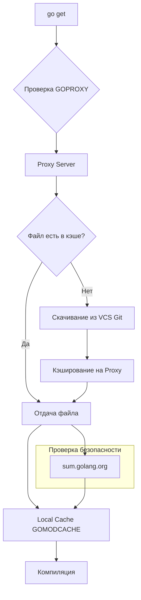

В экосистемах npm или Maven центральный репозиторий представляет собой сложную базу данных, хранящую метаданные, зависимости и бинарные файлы. В Go пошли другим путем. Go Proxy — это не база данных, а простое **хранилище файлов**, доступное по HTTP.

Эта простота — залог надежности и скорости. Понимание того, как работает прокси и кэширование, критически важно для настройки быстрого и стабильного CI/CD.

## Протокол Go Proxy

Когда вы выполняете `go get`, клиент не всегда клонирует Git-репозиторий. Если настроен прокси (по умолчанию `https://proxy.golang.org`), Go взаимодействует с ним по простому HTTP протоколу.

Прокси предоставляет три типа файлов для каждой версии модуля:

1.  **`.info`**: JSON-файл с метаданными (имя версии, время создания).
2.  **`.mod`**: Файл `go.mod` этой версии.
3.  **`.zip`**: Архив с исходным кодом модуля.

Запросы выглядят предсказуемо:
```bash
GET https://proxy.golang.org/github.com/gin-gonic/gin/@v/v1.9.1.info
GET https://proxy.golang.org/github.com/gin-gonic/gin/@v/v1.9.1.mod
GET https://proxy.golang.org/github.com/gin-gonic/gin/@v/v1.9.1.zip
```

> [!info] Под капотом
> Прокси-серверу не нужно знать, что такое Git, Mercurial или SVN. Он просто отдает статику. Это позволяет легко кэшировать ответы через CDN (Content Delivery Network) вроде Fastly или Cloudflare, что делает скачивание зависимостей молниеносным в любой точке мира.

## Архитектура скачивания



### 1. Immutability (Неизменяемость)
Самое важное свойство прокси: **однажды опубликованная версия никогда не меняется**. Если `v1.0.0` попала на `proxy.golang.org`, она остается там навсегда, даже если автор удалил репозиторий на GitHub или перезаписал тег. Это гарантирует воспроизводимость сборки (Build Reproducibility). Вы можете собрать проект пятилетней давности, даже если оригинальный код исчез.

### 2. Lazy Fetching (Ленивое получение)
Публичный прокси Go не сканирует весь GitHub. Он скачивает модуль из VCS только тогда, когда приходит первый запрос от клиента.

## Локальный кэш (`GOMODCACHE`)

После того как файл `.zip` скачан с прокси, он распаковывается и сохраняется в локальном кэше на вашей машине (`go env GOMODCACHE`).

Структура директории: `$GOMODCACHE/<path>/<module>@<version>/`.

*   **Read-only файлы**: Go устанавливает права "только для чтения" на файлы в кэше. Это защита от случайного изменения кода зависимости разработчиком.
*   **Глобальность**: Кэш глобален для системы. Если у вас есть два проекта, использующие `gin@v1.9.1`, они используют один и тот же набор файлов на диске.

> [!warning] Ловушка / Gotcha
> Иногда кэш может "загрязниться" или повредиться.
> *   `go clean -modcache`: Полностью удаляет кэш модулей. Это безопасный способ "начать с чистого листа".
> *   В Docker-сборках важно монтировать `GOMODCACHE` как volume. Если вы скачиваете зависимости внутри контейнера и не сохраняете слой кэша, каждый билд будет тянуть их из интернета заново, что замедляет CI в десятки раз.

## Переменная `GOPROXY`

Вы можете управлять цепочкой прокси через переменную `GOPROXY`. Значения перечисляются через запятую.

*   `https://proxy.golang.org,direct`: Сначала попробуй публичный прокси. Если не найдено (404/410), иди напрямую в VCS (Git).
*   `https://proxy.golang.org,https://proxy.golang.cn,direct`: Цепочка резервных прокси.
*   `direct`: Не использовать прокси, всегда идти в VCS.
*   `off`: Запретить скачивание модулей из интернета. Используется для проверки того, что все зависимости уже есть в кэше (полезно для air-gapped сред).

> [!tip] Собеседование
> **Вопрос:** Почему Go скачивает `.zip` архивы вместо клонирования Git-репозиториев?
> **Ответ:**
> 1. **Скорость**: Клонирование тянет всю историю коммитов (`.git` папка), что может быть гигабайтами. Zip-архив содержит только нужные файлы.
> 2. **Инструментарий**: Клиенту не нужен установленный `git` (или `hg`, `svn`). Достаточно HTTP-клиента.
> 3. **Безопасность**: Прокси фильтрует вредоносные файлы (например, symbolic links, ведущие за пределы архива), которые могут быть в репозитории.

## Checksum Database (`sum.golang.org`)

Прокси отдает файлы, но как мы знаем, что их не подменили "человек посередине" или админ прокси-сервера?

Параллельно с прокси работает **Checksum Database** (`sum.golang.org`).
*   Это прозрачный лог (Transparency Log) всех хешей всех известных Go модулей.
*   После скачивания `.zip` с прокси, Go спрашивает `sum.golang.org`: "Какой должен быть хеш у этого модуля?".
*   Если хеши не совпадают, сборка прерывается.

Это защищает даже от компрометации самого публичного прокси.

## Итог

1.  **Go Proxy** — это простое HTTP-хранилище файлов (`.info`, `.mod`, `.zip`).
2.  Прокси обеспечивает **неизменяемость** версий (даже если репо удален).
3.  Локальный кэш (`GOMODCACHE`) глобален и переиспользуется между проектами.
4.  Всегда используйте кэширование слоев с `GOMODCACHE` в Docker для ускорения CI.

Мы разобрались, как управлять зависимостями для одного модуля. Но что если мы разрабатываем несколько модулей одновременно в одном репозитории (Monorepo)? В следующей статье мы изучим механизм Workspaces: [[17. Workspaces. go work]].