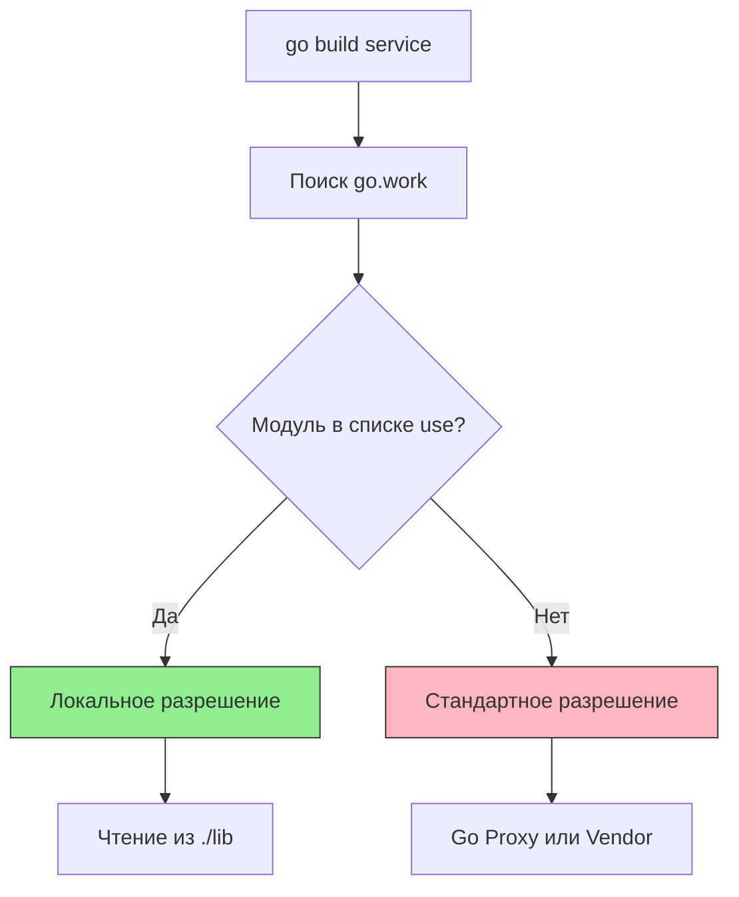

До появления Go 1.18 работа с несколькими модулями одновременно (например, когда вы разрабатываете библиотеку и сервис, который её использует) была головной болью. Приходилось использовать директиву `replace` в `go.mod`, указывая путь к локальной папке. Это приводило к тому, что файл `go.mod` засорялся локальными путями, которые приходилось удалять перед коммитом, чтобы не сломать CI/CD.

Механизм **Workspaces** (рабочие области) и файл `go.work` решили эту проблему, предоставив элегантный способ работы с монорепозиториями и мульти-модульными проектами.

## Проблема: Мульти-модульная разработка

Представьте структуру проекта:
```text
my-project/
├── service/      # Основной сервис (модуль)
│   └── go.mod
└── lib/          # Внутренняя библиотека (модуль)
    └── go.mod
```

Сервис `service` импортирует `lib`. Если вы хотите поправить код в `lib` и тут же увидеть изменения в `service` без публикации новой версии `lib` на GitHub, вам раньше нужно было писать в `service/go.mod`:
```go
replace github.com/myorg/lib => ../lib
```

Если вы забыли убрать эту строку перед `git push`, пайплайн упал бы, так как на сервере нет папки `../lib`.

## Решение: `go.work`

Workspaces позволяют определить "корневой" уровень для разработки, не меняя содержимое `go.mod` файлов внутри модулей.

Файл `go.work` создается в корневой директории проекта. Он говорит тулчейну: "Эти модули являются частью одной рабочей области, и их следует разрешать локально относительно этого файла".

```go
go 1.22

use (
    ./service
    ./lib
)
```

Теперь, когда `service` импортирует `github.com/myorg/lib`, Go проверяет файл `go.work`, видит, что этот модуль включен в `use`, и направляет запрос в локальную папку `./lib`, игнорируя сетевой прокси и версии в `go.mod`.



> [!info] Под капотом
> При наличии `go.work` в текущей директории или родительских, Go переходит в режим "Workspace mode".
> Команда `go list -m` покажет ваши локальные модули с суффиксом `(workspace)`. Это позволяет работать с несколькими версиями Go на одной машине (через `toolchain` директиву в `go.work`) и унифицировать версию Go для всех подмодулей.

## Команды управления

Управление рабочей областью происходит через CLI:

*   **Инициализация:**
    ```bash
    go work init ./service ./lib
    ```
    Создает `go.work` и добавляет указанные модули.

*   **Добавление модуля:**
    ```bash
    go work use ./newmodule
    ```
    Добавляет новую строку `use` в файл. Если директории нет, строка будет закомментирована (удобно для временно удаленных модулей).

*   **Синхронизация:**
    ```bash
    go work sync
    ```
    Обновляет `go.work` в соответствии с состоянием файловой системы и версиями в модулях.

## Связь с Vendor и CI/CD

Workspaces прекрасно работают с вендорингом. Команда `go work vendor` создаст директорию `vendor/` в корне проекта, собрав туда зависимости всех модулей, перечисленных в `use`.

Это критически важно для CI/CD в монорепозиториях. Вы можете настроить пайплайн так, чтобы он запускал сборку с флагом `-workfile=off` (игнорировать workspace) для проверки "внешнего" вида проекта, или использовать `go.work` для сборки всей системы целиком.

> [!warning] Ловушка / Gotcha
> **Коммитить или нет `go.work`?**
> Это зависит от вашей стратегии:
> *   **Для Monorepo:** Да, коммитьте `go.work`. Это часть структуры проекта, позволяющая разработчикам клонировать репо и сразу работать со всеми подмодулями без лишних настроек.
> *   **Для ad-hoc разработки:** Если вы просто временно подключили локальную версию чужой библиотеки для отладки, добавьте `go.work` в `.gitignore`, чтобы не засорять репозиторий.

## Переменная `GOWORK`

Вы можете принудительно указать, какой файл workspace использовать, или отключить его:
```bash
# Принудительно использовать конкретный файл
export GOWORK=/path/to/custom.work

# Отключить workspace mode (вернуться к старому поведению)
export GOWORK=off
```
Это полезно в сложных CI-скриптах, где нужно переключаться между контекстами сборки.

> [!tip] Собеседование
> **Вопрос:** В чем разница между `replace` в `go.mod` и `use` в `go.work`?
> **Ответ:**
> *   `replace` меняет структуру зависимостей конкретного модуля. Это "хирургическое" вмешательство, которое видит любой, кто скачает этот `go.mod`.
> *   `use` — это инструкция для верхнеуровневого dev-окружения. Она позволяет работать с несколькими модулями как с единым целым, не меняя их внутренние `go.mod` файлы. Это безопаснее для коммитов, так как `go.mod` остается "чистым" для публикации.

## Итог

1.  **Workspaces** (`go.work`) — инструмент для локальной разработки мульти-модульных проектов и монорепозиториев.
2.  Они заменяют собой необходимость в `replace` директивах внутри `go.mod`.
3.  Управляются через команды `go work init/use/sync`.
4.  Безопасны для коммита в монорепозиториях, но могут быть проигнорированы в сторонних проектах.

Мы настроили структуру проекта и управление зависимостями. Теперь перейдем к обеспечению качества кода. В следующей статье мы разберем главный инструмент статического анализа в индустрии: [[18. Линтеры. golangci lint]].