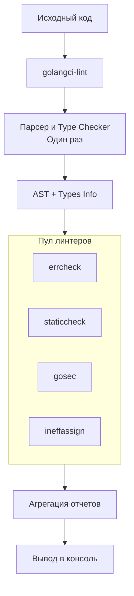

## Стандарт индустрии: Почему не просто go vet

В предыдущих статьях мы разобрали `go vet` — встроенный инструмент поиска ошибок. Он незаменим, но консервативен. Он найдет гарантированные баги, но промолчит о плохом стиле, потенциальных уязвимостях, неиспользуемых переменных или неэффективном коде.

Для полноценного контроля качества кода (Quality Gate) разработчики используют набор статических анализаторов (линтеров). Но запускать их по отдельности (`staticcheck`, `errcheck`, `golint`, `gosec`) долго и неудобно. Каждому нужен свой бинарник, конфигурация и способ вывода ошибок.

Здесь на сцену выходит **golangci-lint**. Это не линтер, это **мета-раннер** (агрегатор), который объединяет десятки линтеров в один быстрый и удобный инструмент. Это де-факто стандарт в Go-индустрии.

## Как это работает: Скорость через оптимизацию

Главная техническая проблема запуска множества линтеров — дублирование работы. Каждый анализатор должен распарсить исходный код, построить AST (Абстрактное Синтаксическое Дерево) и загрузить информацию о типах. Если запустить 10 линтеров отдельно, вы распарсите код 10 раз.

`golangci-lint` решает эту проблему радикально. Он реализует архитектуру **shared parsing**.

1.  **Единственный проход**: `golangci-lint` парсит исходный код и строит AST ровно один раз.
2.  **Распределение**: Это дерево передается всем включенным линтерам одновременно.
3.  **Кэширование**: Результаты анализа и парсинга кэшируются между запусками, что делает повторные проверки мгновенными.



> [!info] Под капотом
> `golangci-lint` написан на Go и использует те же внутренние пакеты, что и сам Go тулчейн (`go/parser`, `go/types`). Он умеет запускать линтеры конкурентно (в горутинах), что на многоядерных машинах дает огромный прирост скорости по сравнению с последовательным запуском. Также он проглатывает паники внутри линтеров — если один сторонний линтер упадет, это не остановит весь процесс проверки.

## Основные линтеры в составе

Из коробки `golangci-lint` включает более 50 линтеров, но по умолчанию включены только некоторые. Самые важные из них:

1.  **`errcheck`**: Самый критичный для Go. Проверяет, обрабатываете ли вы ошибки. В Go игнорирование ошибки (не взять второй return) — частый источник багов.
2.  **`staticcheck`**: Набор проверок, которые ловят баги и неэффективный код (например, `fmt.Sprintf` без форматирования).
3.  **`ineffassign`**: Находит переменные, которым присвоено значение, но которые никогда не используются.
4.  **`gosec`**: Сканирует код на проблемы безопасности (хардкод паролей, слабая криптография, SQL-инъекции).
5.  **`govet`**: Встроенный `go vet` тоже включен в пул.
6.  **`revive`**: Быстрая альтернатива устаревшему `golint`, проверяющая стиль кода (комментарии к экспортируемым функциям, naming conventions).

> [!warning] Ловушка / Gotcha
> Не включайте "все подряд". Конфигурация `enable-all: true` — плохая практика. Это замедлит линтинг и завалит вас предупреждениями из сторонних библиотек или легаси-кода. Всегда формируйте свой набор линтеров явно (`enable: [...]`).

## Использование

Установка производится через `go install` (или через бинарник релиза на GitHub):

```bash
go install github.com/golangci/golangci-lint/cmd/golangci-lint@latest
```

Запуск в корне проекта:
```bash
golangci-lint run
```

Эта команда:
1.  Найдет файл конфигурации (`.golangci.yml`, `.golangci.yaml` или `golangci.yml`).
2.  Скомпилирует линтеры (если нужно).
3.  Запустит проверку по всем `.go` файлам проекта.

Интеграция с IDE (VSCode, GoLand) работает "из коробки": редактор запускает `golangci-lint` в фоне и подчеркивает проблемы прямо в редакторе, используя диагностический протокол LSP или нативные плагины.

## golangci-lint vs go vet

| Характеристика | `go vet` | `golangci-lint` |
| :--- | :--- | :--- |
| **Тип** | Официальный инструмент. | Агрегатор сторонних и официальных инструментов. |
| **Цель** | Найти очевидные ошибки компиляции. | Найти ошибки, дыры в безопасности, плохой стиль. |
| **Расширяемость** | Нет (только писать свой чекер). | Да (можно включать сотни готовых чекеров). |
| **Конфигурация** | Флаги командной строки. | YAML-файл `.golangci.yml`. |
| **Использование** | Всегда включен в `go test`. | Отдельный шаг в CI/CD и IDE. |

> [!tip] Собеседование
> **Вопрос:** Зачем нам `golangci-lint`, если есть `go vet` и IDE?
> **Ответ:** `go vet` ловит только подмножество проблем. IDE (GoLand) использует инспекции, но они часто зависят от настроек конкретного разработчика. `golangci-lint` позволяет зафиксировать **единый стандарт качества** для всей команды в виде файла конфигурации в репозитории. Это гарантирует, что код, прошедший проверку у одного разработчика, пройдет её и у другого, и в CI.

## Итог

1.  **golangci-lint** — агрегатор линтеров, ставший стандартом индустрии.
2.  Его преимущество — **скорость** благодаря кэшированию и единому парсингу AST.
3.  Включает критически важные чекеры: `errcheck`, `staticcheck`, `gosec`.
4.  Конфигурируется через YAML-файл, что позволяет унифицировать стиль команды.

Мы познакомились с инструментом. Теперь нужно научиться настраивать его под конкретные нужды проекта, отключать ложные срабатывания и настраивать исключения. В следующей статье разбираем: [[19. Конфигурация линтеров]].