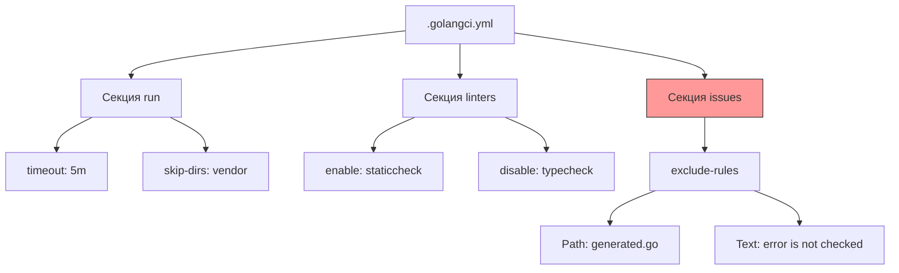

## Тонкая настройка: От хаоса к порядку

Использовать `golangci-lint` с настройками по умолчанию — хорошее начало, но в реальном продакшене вам неизбежно потребуется адаптировать его под специфику проекта. Вам придется столкнуться с легаси-кодом, сгенерированными файлами и специфическими правилами команды.

Конфигурация линтеров — это баланс между строгостью и скоростью разработки. Слишком строгий линтер душит продуктивность, слишком мягкий пропускает баги.

## Файл `.golangci.yml`

По умолчанию `golangci-lint` ищет файл конфигурации в корне проекта. Имя файла может быть разным, но стандартом де-факто является `.golangci.yml`.

Структура файла обычно состоит из нескольких ключевых секций:
1.  `run`: Общие настройки запуска (таймауты, пути).
2.  `linters`: Включение и выключение конкретных анализаторов.
3.  `linters-settings`: Глубокая настройка поведения конкретных линтеров.
4.  `issues`: Правила игнорирования (exclusions).



## Стратегия включения линтеров

Существует два подхода к конфигурации списка линтеров:
1.  **Blacklist** (`disable-all: false`): Включены все, кроме явно запрещенных.
2.  **Whitelist** (`disable-all: true`): Включены только те, что вы явно разрешили.

> [!warning] Ловушка / Gotcha
> **Всегда используйте подход Whitelist.**
> ```yaml
> linters:
>   disable-all: true
>   enable:
>     - errcheck
>     - gosimple
>     - govet
>     - staticcheck
>     - ineffassign
>     - revive
> ```
> При обновлении версии `golangci-lint` могут появиться новые линтеры. В режиме Blacklist они включатся автоматически и могут "завалить" ваш CI, даже если вы их не планировали использовать. Whitelist гарантирует стабильность вашего пайплайна.

## Настройка игнорирования (`issues`)

Самая частая проблема при внедрении линтера в существующий проект — тысячи ошибок в легаси-коде или в автогенерированных файлах (например, protobuf). Править всё сразу невозможно, а блокировать разработку нельзя.

### 1. Исключение путей (Global)
Можно сказать линтеру игнорировать целые директории.
```yaml
run:
  skip-dirs:
    - vendor
    - legacy/pkg
    - third_party
```

### 2. Исключение файлов (`exclude-rules`)
Для сгенерированного кода (например, `.pb.go`) лучше использовать правила исключений.

```yaml
issues:
  exclude-rules:
    # Исключить проверки для сгенерированных Protobuf файлов
    - path: \.pb\.go$
      linters:
        - revive
        - errcheck
    
    # Исключить определенные ошибки в тестах
    - path: _test\.go$
      text: "SA1019:" # Игнорировать использование deprecated функций в тестах
```

### 3. Инлайн-игнорирование
Для разовых исключений в коде используются комментарии `//nolint`.
```go
//nolint:errcheck // Это безопасно, так как мы игнорируем ошибку записи в закрытый канал
_ = ch.Send(data)
```
Однако злоупотребление этим — плохой тон. Если вы часто используете `//nolint`, скорее всего, вы пытаетесь обойти проблему, а не решить её.

> [!tip] Собеседование
> **Вопрос:** Как внедрить линтер в проект с 5-летней историей, не ломая CI?
> **Ответ:** Используйте `issues.exclude-rules` для временного игнорирования легаси-папок или установите `max-issues-per-linter: 0` и `max-same-issues: 0`, чтобы видеть все ошибки. Но лучше всего работает стратегия "новый код — новые правила". Вы настраиваете линтер на блокировку (fail CI), но исключаете все текущие ошибки через конфиг. Весь новый код должен проходить линтер, а старый рефакторится постепенно.

## Глубокая настройка (`linters-settings`)

Некоторые линтеры имеют свои внутренние конфигурации. Самые полезные примеры:

### `govet`: Включение.shadow
По умолчанию `go vet` не проверяет затенение переменных (variable shadowing), хотя это частый источник багов. В `golangci-lint` это можно включить.

```yaml
linters-settings:
  govet:
    enable:
      - shadow
```
Теперь линтер предупредит, если вы случайно объявили переменную с тем же именем во внутренней области видимости.

### `errcheck`: Проверка type assertions
Стандартный `errcheck` проверяет только return-значения. Но ошибки могут возникать и при type assertion (`val, ok := i.(int)`). Можно заставить линтер проверять это.

```yaml
linters-settings:
  errcheck:
    check-type-assertions: true
```

### `revive`: Замена `golint`
`revive` — современный, быстрый и гибкий заменитель устаревшего `golint`. Он позволяет настраивать severity (ошибка или предупреждение) для каждого правила.

```yaml
linters-settings:
  revive:
    rules:
      - name: var-naming
        severity: warning
        arguments: [["ID", "HTTP"]]
```

## Секция `run`: Таймауты

Линтинг большого монорепозитория может занять время. По умолчанию таймаут составляет 1 минуту. Для больших проектов этого может не хватить.

```yaml
run:
  timeout: 5m
  concurrency: 4 # Количество потоков для анализа
```

Если `golangci-lint` падает по таймауту в CI, увеличьте этот параметр. Но помните, что слишком долгий линтинг сигнализирует о проблемах с кодом (например, огромные файлы) или слабом CI-агенте.

## Итог

1.  Используйте **Whitelist** (`disable-all: true`) для предсказуемости обновлений.
2.  Фильтруйте сгенерированный код через `exclude-rules` по маске пути.
3.  Настраивайте severity через `revive` или другие линтеры.
4.  Контролируйте время выполнения через секцию `run`.

Мы настроили автоматическую проверку качества кода. Теперь нужно упаковать эти знания в понятные сценарии сборки, чтобы разработчику не приходилось помнить сотни флагов. В следующей статье разберем классический инструмент автоматизации: [[20. Makefile для Go проектов]].