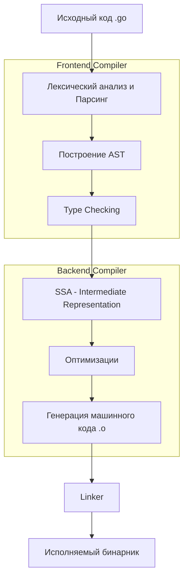

## Архитектура go toolchain: От исходника до бинарника

Когда вы набираете в терминале `go build`, запускается сложный конвейер, который за доли секунды преобразует текстовые файлы в оптимизированный машинный код. В отличие от языков с интерпретаторами или тяжелыми IDE, Go следует философии Unix: программа должна делать одну вещь, но делать её хорошо. Однако в случае Go эти маленькие программы скрыты за фасадом единой команды `go`.

Понимание того, как устроен этот конвейер, критически важно для Senior-инженера. Это позволяет диагностировать странные ошибки сборки, оптимизировать время компиляции в больших монорепозиториях и писать более эффективный код, понимая ограничения компилятора.

## Команда `go` как диспетчер

Команда `go` — это не компилятор. Это CLI-диспетчер (driver), который координирует работу целого зоопарка утилит, скрытых в директории `$GOROOT/pkg/tool/<os>_<arch>/`.

Если вы заглянете туда, то увидите настоящий инструментальный цех:
*   `compile` — компилятор (преобразует `.go` в объектные файлы `.o`).
*   `link` — линкер (собирает объектные файлы в исполняемый бинарник).
*   `asm` — ассемблер (для работы с платформенно-зависимым кодом).
*   `vet` — статический анализатор.
*   `cover` — инструмент для анализа покрытия тестами.
*   `cgo` — мост между Go и C.

> [!info] Под капотом
> Вы можете вызывать эти инструменты напрямую через `go tool <name>`. Например, `go tool compile -S main.go` сгенерирует ассемблерный листинг. Это часто используется для отладки производительностив или проверки того, как компилятор оптимизировал ваш код (например, встроил функцию или нет).

## Фазы компиляции: Жизненный цикл Go-кода

Процесс сборки в Go можно разделить на логические этапы. Знание этих этапов помогает понять, где именно возникла ошибка или почему сборка тормозит.

### 1. Frontend: Парсинг и AST
Первая фаза не отличается от других компилируемых языков. Лексер разбивает код на токены, парсер строит **Абстрактное Синтаксическое Дерево (AST)**.
*   Именно здесь ловятся синтаксические ошибки (не хватает скобки, неверное объявление переменной).
*   В Go эта фаза очень быстрая благодаря относительно простой и строгой грамматике языка.

### 2. Type Checking (Проверка типов)
После построения AST компилятор проходит по дереву и проверяет типы. Go — статически типизированный язык, поэтому все несовпадения типов должны быть выявлены здесь.
*   Здесь же работает механизм вывода типов (type inference).
*   Проверяется корректность импортов (но сами импорты еще не загружаются с диска, это делает отдельная подсистема).

### 3. Intermediate Representation (IR) и SSA
Это сердце компилятора Go. Вместо того чтобы генерировать машинный код сразу для разных архитектур (x86, ARM, RISC-V), Go компилирует код в промежуточное представление, называемое **SSA (Static Single Assignment)**.

Особенность SSA в том, что каждой переменной значение присваивается ровно один раз. Это сильно упрощает и делает детерминированными многие оптимизации:
*   **Dead code elimination**: Удаление кода, который никогда не выполнится.
*   **Inlining**: Вставка тела функции вместо её вызова.
*   **Escape Analysis**: Анализ того, нужно ли переменную в куче или она может жить на стеке.

> [!tip] Собеседование
> **Вопрос:** Как посмотреть SSA-код моей функции?
> **Ответ:** Используйте `GOSSAFUNC=main go build`. Это сгенерирует HTML-файл, в котором можно пошагово просмотреть все фазы оптимизации от сырого SSA до финального машинного кода. Это мощнейший инструмент для понимания того, что компилятор делает с вашим кодом.

### 4. Backend: Генерация машинного кода
После оптимизаций на уровне SSA, бэкенд опускается до конкретной архитектуры процессора. Он преобразует абстрактные инструкции SSA в реальные инструкции процессора ( машинный код), сохраняя результат в объектные файлы (`.o`).

Важно: в Go компиляция пакетов происходит **параллельно**. Компилятор Go запускает отдельные процессы компиляции для каждого пакета (горутины внутри процесса `go build`). Это возможно благодаря строгому запрету циклических зависимостей — граф зависимостей всегда ациклический.

## Линкер (Linker): Сборка пазла

После того как все пакеты скомпилированы в объектные файлы, в игру вступает линкер (`link`). Его задача — разрешить все символьные ссылки. Если пакет `A` вызывает функцию `Foo` из пакета `B`, линкер должен подставить правильный адрес памяти вместо символа `Foo`.

В Go линкер делает больше, чем классические Unix-линкеры:
1.  **Рантайм**: Он вшивает в бинарник весь Go Runtime (планировщик, GC, стеки).
2.  **Версионирование**: Учитывает информацию о версиях модулей для трассировки стека.
3.  **DWARF**: Добавляет отладочную информацию (удалить её можно флагом `-ldflags "-s -w"`).

> [!warning] Ловушка / Gotcha
> **Скорость линкера.**
> В старых версиях Go линкер был узким местом, так как он однопоточный (в отличие от компилятора). В больших проектах время линковки могло занимать значительную часть сборки. В последних версиях (Go 1.20+) были внесены улучшения (параллелизация частей линковки, улучшенный loader), но линкер все еще фаза, где параллелизм компиляции схлопывается в одну точку.

## Кэширование: Почему Go собирается мгновенно

Одной из главных фич Go toolchain является контентно-адресуемый кэш.

Архитектура кэша такова: входными данными для компиляции являются не файлы, а **хеши содержимого**. Если файл не менялся, и его зависимости не менялись, результат компиляции берется из кэша (`$GOCACHE`).

Это радикально меняет подход к сборке:
1.  **Инкрементальная сборка:** `go build` проверяет хеши. Если пакет не менялся, он не перекомпилируется.
2.  **Глобальный кэш:** Если вы используете одну и ту же версию библиотеки в разных проектах, она компилируется один раз и переиспользуется.

Кэш хранится в директории, которую можно узнать командой `go env GOCACHE`. Очистка кэша (`go clean -cache`) иногда требуется, если кэш поврежден или вы подозреваете баг в инструментарии.

## Инструменты интроспекции

Go toolchain предоставляет доступ к внутренней кухне через команду `go tool`. Senior-разработчик должен владеть этими инструментами для глубокого анализа:

*   `go tool objdump`: Дизассемблирование бинарника. Полезно для проверки, сработал ли инлайнинг.
*   `go tool nm`: Просмотр таблицы символов (список всех функций и переменных в бинарнике).
*   `go tool pprof`: Профилирование CPU и памяти (мы разберем его в разделе профилирования).
*   `go tool trace`: Визуализация работы планировщика и GC (для анализа конкурентности).

## Итог

Архитектура Go toolchain спроектирована для скорости и повторяемости:
1.  **Параллельная компиляция** пакетов благодаря ациклическому графу зависимостей.
2.  **SSA (Static Single Assignment)** как промежуточный слой для мощных оптимизаций.
3.  **Контент-адресуемый кэш** делает повторные сборки практически мгновенными.
4.  **Единый драйвер `go`** скрывает сложность, но позволяет заглянуть внутрь через `go tool`.

Теперь, когда мы понимаем общую архитектуру, в следующей статье мы перейдем к практике работы с командой `go build` и разберем, как управлять флагами компиляции, версионированием и уменьшением размера бинарника. Переходим к статье: [[3. go build. Сборка бинарников]].