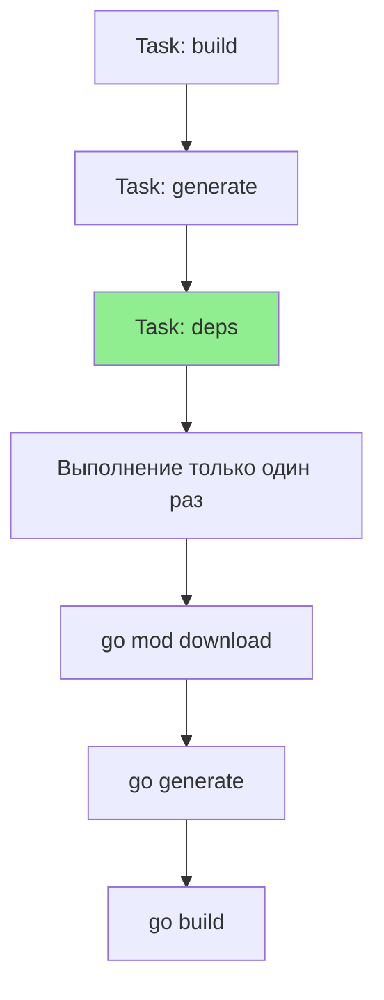

В предыдущей статье мы разобрали `Makefile` — классический стандарт автоматизации. Но у него есть два фундаментальных недостатка, которые в 2024 году доставляют много боли:
1.  **Синтаксис**: Табы против пробелов, странные правила экранирования, отсутствие нативной поддержки YAML/JSON-подобных структур.
2.  **Кроссплатформенность**: `Make` — это Unix-утилита. На Windows она работает только через WSL, Cygwin или MinGW, что превращает настройку среды для новых разработчиков в квест.

**Taskfile** (go-task/task) — это современная альтернатива, написанная на Go. Она решает проблемы Make, сохраняя его идеологию декларативных целей и задач. Для Go-разработчика это особенно удобно, так как Taskfile — это просто бинарник на Go, который легко устанавливается через `go install`.

## YAML вместо Make-синтаксиса

Вместо архаичного синтаксиса с табами, Taskfile использует YAML. Это делает конфигурацию читаемой и понятной для любого разработчика, знакомого с Docker Compose или Kubernetes.

Пример `Taskfile.yml`:

```yaml
version: '3'

vars:
  APP_NAME: myapp
  VERSION:
    sh: git describe --tags --always --dirty

tasks:
  build:
    desc: "Сборка бинарника"
    cmds:
      - go build -ldflags "-X main.Version={{.VERSION}}" -o bin/{{.APP_NAME}} ./cmd/app
    sources:
      - ./**/*.go
    generates:
      - bin/{{.APP_NAME}}

  test:
    desc: "Запуск тестов"
    cmds:
      - go test -race -coverprofile=coverage.out ./...

  lint:
    desc: "Запуск линтеров"
    cmds:
      - golangci-lint run
```

> [!info] Под капотом
> Taskfile использует движок шаблонов Go (template engine). Вы можете использовать переменные `{{.VAR}}`, функции (например, `now | date "2006-01-02"`), условные операторы и циклы прямо внутри YAML. Это дает мощь скриптового языка без необходимости писать сложные bash-one-liners.

## Умное управление зависимостями

Taskfile умеет строить граф зависимостей (DAG — Directed Acyclic Graph), как и Make. Если задача А зависит от задачи Б, Taskfile выполнит их в правильном порядке, а если несколько задач зависят от одной общей — она выполнится только один раз.

```yaml
tasks:
  deps:
    desc: "Установка зависимостей"
    cmds:
      - go mod download

  generate:
    desc: "Генерация кода"
    deps: [deps] # Зависимость
    cmds:
      - go generate ./...

  build:
    desc: "Сборка"
    deps: [generate] # Зависимость
    cmds:
      - go build -o bin/app .
```



## Кроссплатформенность: Решение проблемы Windows

Это киллер-фича Taskfile. В `Makefile` вам часто приходится писать shell-команды (`rm -rf`, `cp`, `find`), которых нет в Windows CMD/PowerShell.

Taskfile имеет встроенные "кроссплатформенные" функции. Вместо вызова `rm -rf bin/`, вы пишете:

```yaml
cmds:
  - task: clean # Встроенная задача или команда

# Или использование спец. синтаксиса для удаления файлов
cmds:
  - cmd: rm -rf bin/
    platforms: [linux, darwin] # Только для Unix
  - cmd: cmd /c rmdir /s /q bin
    platforms: [windows] # Для Windows
```
Но чаще всего Taskfile позволяет использовать Go-стиль для путей и встроенные модули для работы с файловой системой, что абстрагирует ОС.

## Переменные окружения и `.env`

В современном бэкенде конфигурация часто хранится в `.env` файлах. Make требует сторонних утилит или хаков для их чтения. Taskfile поддерживает `.env` **нативно** из коробки.

```yaml
version: '3'

env:
  # Загрузить переменные из файла
  .env:

tasks:
  run:
    cmds:
      - go run ./cmd/app
```

Это позволяет использовать Taskfile не только для сборки, но и для управления окружением запуска локальных сервисов (docker-compose up, миграции БД).

## Сравнение: Make vs Task

| Характеристика | Makefile | Taskfile |
| :--- | :--- | :--- |
| **Синтаксис** | Свой DSL (табы, зависимости). | YAML (читаемый, привычный). |
| **Windows** | Требует WSL/Cygwin. | Нативная поддержка (один бинарник). |
| **Шаблоны** | Слабые, через shell. | Мощные Go Templates. |
| **Документация** | `make help` надо писать руками. | `task --list` выводит `desc` автоматически. |
| **Переменные** | Строки, shell-вызов. | YAML vars + dynamic vars (`sh`). |

> [!warning] Ловушка / Gotcha
> YAML чувствителен к отступам. Неправильный пробел в Taskfile сломает парсинг так же легко, как таб в Makefile. Используйте_editorconfig_ или настройку IDE, чтобы принудительно ставить 2 или 4 пробела для YAML.

## Интеграция и установка

Установка через Go:
```bash
go install github.com/go-task/task/v3/cmd/task@latest
```

Справка по задачам (выводится автоматически из полей `desc`):
```bash
task --list
* build:    Сборка бинарника
* test:     Запуск тестов
* lint:     Запуск линтеров
```

> [!tip] Собеседование
> **Вопрос:** Когда стоит выбрать Taskfile вместо Makefile?
> **Ответ:** Если ваша команда работает на смешанных ОС (macOS + Windows) или если сложность скриптов сборки выросла настолько, что Makefile стал нечитаемым набором bash-команд. Taskfile лучше структурирует задачи и нативно поддерживает современные практики (`.env`, YAML).

## Итог

1.  **Taskfile** — современная, кроссплатформенная альтернатива Make на Go.
2.  Использует **YAML** и **Go Templates**, что привычнее для современного разработчика.
3.  Поддерживает `.env` файлы и автоматическую генерацию справки (`task --list`).
4.  Идеально подходит для Go-проектов, так как устанавливается через `go install`.

Мы настроили автоматизацию сборки. Теперь переходим к среде исполнения — контейнеризации. В следующей статье разберем основы Docker для Go: [[22. Docker. Основы для Go]].