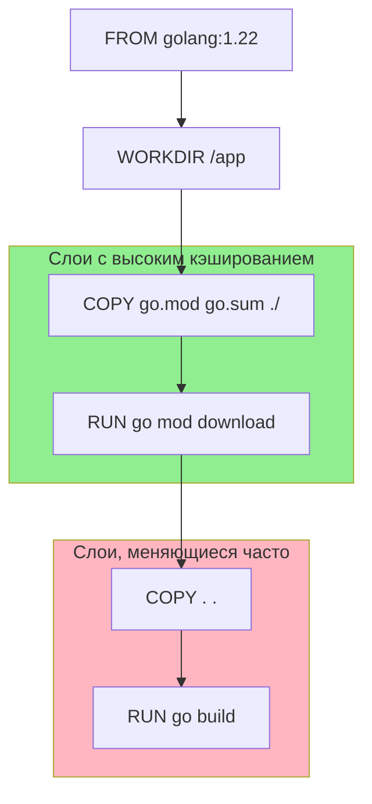

## Контейнеризация: Идеальная пара для Go

Если для Python или Node.js Docker — это способ упаковать интерпретатор и виртуальное окружение, то для Go Docker — это способ упаковать **один бинарный файл**. Это фундаментальное отличие делает Go одним из самых удобных языков для контейнеризации.

Go-приложения не требуют установки рантайма (как JRE или Python) в контейнер. Они взаимодействуют с ядром ОС напрямую через системные вызовы. Это позволяет использовать экстремально легковесные образы, что критически важно для облачной экономики и скорости деплоя.

## Dockerfile: Первые шаги

Простейший `Dockerfile` для Go-приложения выглядит так:

```dockerfile
# Используем официальный образ компилятора
FROM golang:1.22

# Устанавливаем рабочую директорию
WORKDIR /app

# Копируем исходный код
COPY . .

# Собираем приложение
RUN go build -o main ./cmd/app

# Указываем команду запуска
CMD ["./main"]
```

Однако такой подход имеет два критических недостатка:
1.  **Размер образа**: Базовый образ `golang` весит более 1 ГБ (содержит компилятор, исходники, git). В продакшене вам нужен только бинарник.
2.  **Безопасность**: Компилятор и исходный код в контейнере — это лишняя поверхность для атак.

> [!tip] Собеседование
> **Вопрос:** Почему не стоит использовать образ `golang` в продакшене?
> **Ответ:** Образ `golang` предназначен для *сборки* (build image). Он содержит инструменты разработки. В продакшене (runtime image) должен находиться только скомпилированный бинарник и минимальный набор системных библиотек. Решение — Multi-stage builds (тема следующей статьи), но даже в рамках базового подхода лучше копировать бинарник в пустой образ.

## Кэширование слоев: Оптимизация сборки

Docker работает послойно. Каждая инструкция (`RUN`, `COPY`) создает новый слой. Если слой не изменился, Docker использует кэшированную версию.

Самая дорогая операция в Go-сборке — это скачивание зависимостей (`go mod download`). Чтобы не скачивать их заново при каждом изменении строки кода, нужно правильно структурировать Dockerfile.

**Правильный порядок:**
1.  Скопировать **только** файлы `go.mod` и `go.sum`.
2.  Скачать зависимости.
3.  Скопировать исходный код.
4.  Собрать проект.



Если вы поменяете код в `main.go`, Docker начнет выполнение с шага `COPY . .`, так как предыдущие слои (копирование go.mod и скачивание модулей) останутся в кэше. Это сокращает время сборки с минут до секунд.

## Механическая симпатия: Go и Scratch

Go умеет компилировать статические бинарники. Это означает, что они не зависят от внешних динамических библиотек (`.so` / `.dll`), кроме, возможно, `libc` (glibc).

Флаг `-tags netgo` (или отключение CGO) позволяет собрать бинарник, который работает даже в пустом образе `scratch`. `scratch` — это специальный Docker-образ, который абсолютно пуст. В нем нет ни оболочки (shell), ни пакетного менеджера, ни библиотек.

Это делает контейнер максимально безопасным: если злоумышленник получит доступ к контейнеру, ему нечем будет воспользоваться (нет `ls`, `cat`, `sh`).

> [!warning] Ловушка / Gotcha
> **SSL сертификаты и DNS.**
> Если ваше приложение делает HTTPS-запросы во внешний мир (например, обращается к API), пустой образ `scratch` вызовет ошибку `x509: certificate signed by unknown authority`.
> 
> В Go библиотека SSL использует системное хранилище сертификатов. В `scratch` его нет.
> **Решение:** Нужно явно скопировать файл сертификатов в образ:
> ```dockerfile
> COPY --from=alpine:latest /etc/ssl/certs/ca-certificates.crt /etc/ssl/certs/
> ```
> Или использовать образ `alpine`, где они уже есть.

## CGO_ENABLED=0: Статическая компиляция

Чтобы бинарник запустился в `scratch`, нужно отключить CGO (C Go). CGO позволяет Go вызывать C-код, но это привязывает бинарник к системному `libc` (которого в scratch нет).

```bash
# Сборка полностью статического бинарника
RUN CGO_ENABLED=0 go build -a -installsuffix cgo -o main ./cmd/app
```

Флаг `-a` заставляет пересобрать все зависимости, чтобы гарантировать статическую линковку.

| Тип сборки | Зависимости | Образ ОС | Размер бинарника | Сложность |
| :--- | :--- | :--- | :--- | :--- |
| **Default (CGO)** | glibc, pthread | Ubuntu/Debian | Маленький | Низкая |
| **Static (No CGO)** | Нет (только Syscalls) | Scratch | Чуть больше | Средняя |

> [!info] Под капотом
> В Go рантайм (scheduler, netpoller) использует системные вызовы ОС (Linux Syscalls) напрямую. Если вы компилируете без CGO, ваше приложение общается с ядром Linux напрямую, минуя прослойку `libc`. Это делает Go-бинарники удивительно портабельными.

## Итог

1.  Go идеально подходит для Docker благодаря статической компиляции.
2.  Оптимизируйте Dockerfile для кэширования: сначала `go.mod`, потом исходники.
3.  Используйте `scratch` или `alpine` для минимизации размера и поверхности атак.
4.  Помните про SSL сертификаты при использовании `scratch`.

Мы научились писать базовый Dockerfile. Однако в реальной жизни мы не хотим тянуть компилятор в продакшен-образ. В следующей статье мы разберем технику, которая стала стандартом индустрии: [[23. Multi stage сборки Docker]].