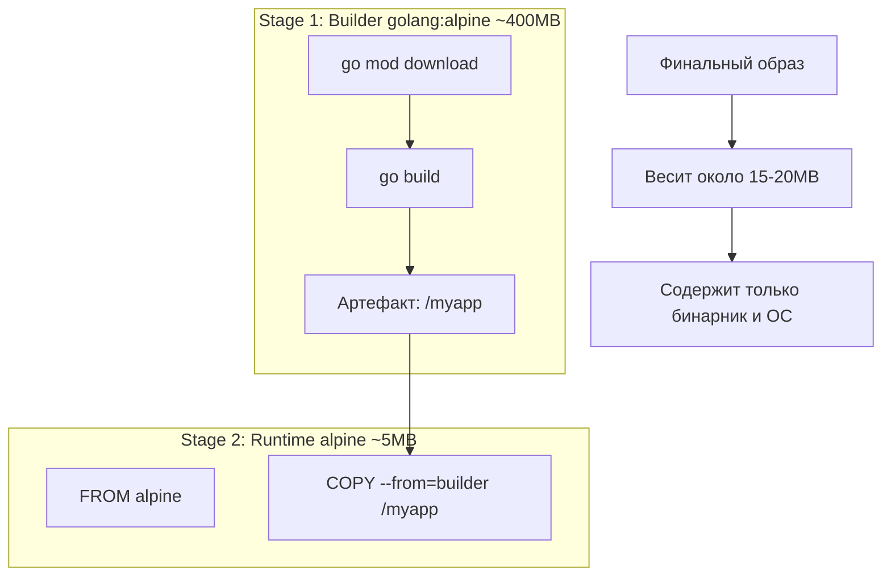

В предыдущей статье мы столкнулись с дилеммой: образ `golang` весит больше гигабайта, а нам нужно запустить всего один бинарник весом в 10 мегабайт. Классический подход "Builder Pattern" предлагал использовать два `Dockerfile` и скрипты для копирования артефактов, но это было сложно и ненадежно.

С появлением **Multi-stage builds** (Go 1.16+ / Docker 17.05+) мы получили возможность описать весь процесс сборки и упаковки в одном файле, используя принцип "одного бинарника".

## Концепция: Разделяй и властвуй

Multi-stage build позволяет использовать несколько инструкций `FROM` в одном Dockerfile. Каждая инструкция `FROM` начинает новый **этап** (stage) сборки. Вы можете копировать артефакты из одного этапа в другой, выбрасывая всё лишнее.

Для Go это идеальный сценарий:
1.  **Stage 1 (Builder)**: Полный образ с компилятором, Git, зависимостями. Здесь происходит сборка.
2.  **Stage 2 (Runtime)**: Пустой или минималистичный образ (Alpine/Distroless). Сюда копируется только бинарник.

```dockerfile
# --- Stage 1: Builder ---
FROM golang:1.22-alpine AS builder

# Устанавливаем git (нужен для go get в частных случаях) и ca-certificates
RUN apk add --no-cache git ca-certificates tzdata

WORKDIR /app

# Кэшируем зависимости
COPY go.mod go.sum ./
RUN go mod download

# Копируем исходники и собираем
COPY . .
# Важная часть: отключаем CGO для статической линковки
RUN CGO_ENABLED=0 GOOS=linux go build -ldflags="-s -w" -o /myapp ./cmd/app

# --- Stage 2: Runtime ---
FROM alpine:latest

# Устанавливаем сертификаты и timezone данные (для работы с HTTPS и временем)
RUN apk --no-cache add ca-certificates tzdata

WORKDIR /root/

# Копируем бинарник из первого этапа
COPY --from=builder /myapp .

# Копируем статику или конфиги при необходимости
# COPY --from=builder /app/static ./static

CMD ["./myapp"]
```

> [!info] Под капотом
> Когда Docker видит `COPY --from=builder`, он не монтирует файловую систему предыдущего этапа. Он обращается к внутреннему кэшу слоев, где хранится результат работы этапа `builder`. Это гарантирует, что в финальный образ не попадут временные файлы, кэш модулей или исходный код, если вы явно их не скопировали.

## Визуализация процесса



## Сравнение базовых образов для Runtime

Выбор базового образа для второго этапа — это баланс между удобством и безопасностью.

| Образ | Размер | Shell | glibc | Безопасность | Комментарий |
| :--- | :--- | :--- | :--- | :--- | :--- |
| **golang:1.22** | ~1.2 GB | Да | Да | Низкая | Никогда не используйте в runtime. |
| **alpine:latest** | ~5 MB | Да `sh` | musl | Средняя | Требует `CGO_ENABLED=0`. Ошибки DNS/Timezone решаются установкой пакетов. |
| **scratch** | 0 MB | Нет | - | Максимальная | Самый безопасный. Нет shell, нельзя сделать `exec -it`. |
| **distroless** | ~2 MB | Нет | glibc | Очень высокая | От Google. Есть варианты с `debug` тегом (busybox). |

> [!warning] Ловушка / Gotcha
> **Alpine и DNS.**
> Alpine Linux использует `musl libc` вместо стандартной `glibc`. Это может вызывать проблемы с DNS-резолвингом в Kubernetes (особенно с `ndots:5`). Go бинарник, скомпилированный с `CGO_ENABLED=0`, статически слинкован и использует чистые syscall'ы, поэтому он работает на Alpine без проблем. Но если вы используете CGO (например, для SQLite), вы **обязаны** собирать бинарник внутри Alpine-контейнера на этапе builder, иначе бинарник не запустится.

## Distroless: Золотой стандарт продакшена

Google предлагает семейство образов `gcr.io/distroless/static` или `gcr.io/distroless/base`. Они созданы специально для статически слинкованных бинарников (как Go).

Они содержат:
*   CA сертификаты.
*   Базовые файлы `passwd` и `group`.
*   `tzdata`.

И **не содержат**:
*   Shell (sh, bash).
*   Пакетного менеджера (apk, apt).
*   Любых других утилит.

Если хакер взломает приложение, он окажется в пустой файловой системе без возможности запустить `ls` или `curl`.

```dockerfile
# Runtime stage with Distroless
FROM gcr.io/distroless/static-debian12:latest

COPY --from=builder /myapp /

CMD ["/myapp"]
```

> [!tip] Собеседование
> **Вопрос:** Как вы будете дебажить контейнер на базе `scratch` или `distroless`, если там нет shell?
> **Ответ:**
> 1. **Ephemeral container (K8s):** Использовать `kubectl debug -it <pod> --image=busybox --target=<container>`. Это присоединит контейнер с инструментами к тому же namespace процесса.
> 2. **Debug build:** Использовать debug-версию образа `distroless:debug`, которая содержит `busybox` shell, для staging окружений.

## Итог

1.  **Multi-stage builds** — обязательный стандарт для Go.
2.  Используйте псевдонимы (`AS builder`) для ясного копирования файлов.
3.  Копируйте `go.mod` отдельно для кэширования слоев.
4.  В продакшене предпочтите `distroless` или `scratch` для минимизации поверхности атак.

Мы научились собирать идеальный контейнер. Теперь давайте глубже разберем, как именно минимизировать размер образов и почему `scratch` не всегда панацея. Следующая статья: [[24. Минимизация образов. scratch, distroless]].