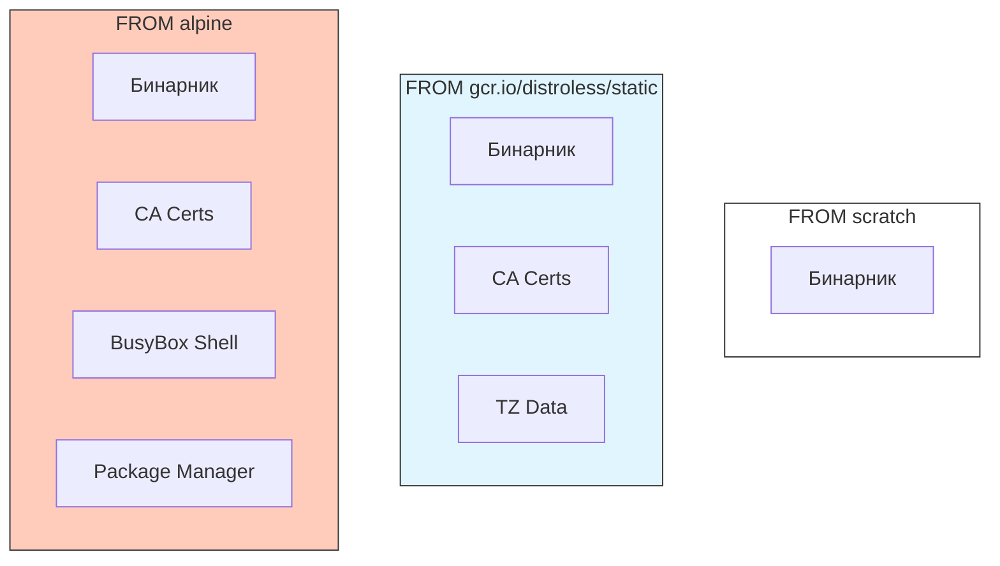

В мире контейнеризации размер имеет значение. Меньше размер — быстрее деплой, меньше атакуемая поверхность, ниже затраты на хранение и трафик. Если для Java или Python минимальный порог — это сотни мегабайт (JRE, glibc, интерпретатор), то Go позволяет зайти на территорию "невесомых" контейнеров.

Мы переходим от вопроса "Как собрать?" к вопросу "Что оставить?". Цель — оставить в контейнере только машинный код вашего приложения.

## `scratch`: Абсолютный ноль

`scratch` — это зарезервированное имя в Docker. Это "пустой" образ. В нем нет ни одного файла. Нет операционной системы, нет shell (`/bin/sh`), нет библиотек, даже `/dev/null` там нет, пока вы его не создадите.

Это идеальная цель для Go-приложения, если у вас полностью статический бинарник.

### Требования к бинарнику
Чтобы запуститься в `scratch`, ваш бинарник должен быть **полностью статическим**. Он не должен зависеть от динамических библиотек (`.so` файлов).

В Go это достигается отключением CGO:
```bash
CGO_ENABLED=0 go build -a -installsuffix cgo -o main .
```

### Готы и проблемы `scratch`

1.  **SSL/TLS Сертификаты**:
    Go делает HTTPS запросы. Для проверки сертификатов сервера ему нужен локальный набор корневых сертификатов (CA Bundle).
    *   В Ubuntu/Alpine они лежат в `/etc/ssl/certs`.
    *   В `scratch` этой папки нет.
    *   **Результат**: `x509: certificate signed by unknown authority`.
    *   **Решение**: Копировать файл `ca-certificates.crt` из сборочного этапа.

2.  **Timezone Data**:
    Если вы используете `time.LoadLocation("Europe/Moscow")`, Go обращается к системным данным часовых поясов (обычно `/usr/share/zoneinfo`).
    *   В `scratch` их нет.
    *   **Результат**: Паника или UTC по умолчанию.
    *   **Решение**: Копировать `zoneinfo.zip` из Go или установить `tzdata` в билдере.

Пример правильного Dockerfile для Scratch:
```dockerfile
FROM golang:1.22-alpine AS builder
RUN apk add --no-cache ca-certificates tzdata
WORKDIR /app
COPY . .
RUN CGO_ENABLED=0 go build -o main .

# --- Final Stage ---
FROM scratch
# Копируем сертификаты (путь может отличаться в зависимости от базы билдера)
COPY --from=builder /etc/ssl/certs/ca-certificates.crt /etc/ssl/certs/
# Копируем данные таймзон (опционально)
COPY --from=builder /usr/share/zoneinfo /usr/share/zoneinfo
# Копируем бинарник
COPY --from=builder /app/main /main

ENTRYPOINT ["/main"]
```

## `distroless`: Безопасность "из коробки"

Google создал проект **distroless** специально для языков, компилируемых в бинарники (Go, Rust, Java). Это промежуточное звено между `scratch` и `alpine`.

Distroless образы:
1.  Содержат **CA сертификаты** и **tzdata**.
2.  Содержат минимальный набор файлов `/etc` (passwd, group) для корректной работы прав.
3.  **Не содержат** Shell, пакетного менеджера или любых других утилит.



### Почему `distroless` лучше `scratch`?
Вам не нужно вручную копировать сертификаты и заботиться о пользователе. Образ `gcr.io/distroless/static-debian12` уже настроен.

Также в `distroless` предустановлен пользователь `nonroot`, что позволяет следовать best practices безопасности — не запускать процесс от `root`.

```dockerfile
FROM golang:1.22 AS builder
WORKDIR /app
COPY . .
RUN CGO_ENABLED=0 go build -o main .

# Используем distroless
FROM gcr.io/distroless/static-debian12:latest

# Копируем бинарник
COPY --from=builder /app/main /

# Запускаем от имени nonroot (UID 65532)
USER nonroot:nonroot

ENTRYPOINT ["/main"]
```

> [!info] Под капотом
> В Kubernetes и Docker запуск от `root` (по умолчанию) — это риск. Если злоумышленник взломает приложение, он получит root-доступ внутри контейнера. Хотя контейнеры изолированы, уязвимости ядра (container escape) позволяют выбраться на хост-систему. Запуск через `USER nonroot` — это слой защиты. В `scratch` пользователя нет, поэтому там процесс всегда запускается от root (UID 0), если только вы не создали `/etc/passwd` вручную. Distroless решает это автоматически.

## Размер имеет значение: Сравнение

| Образ | Размер (сжатый) | Shell | Certs | Уровень безопасности |
| :--- | :--- | :--- | :--- | :--- |
| `golang:1.22` | ~800 MB | Да | Да | Низкий (лишние инструменты) |
| `alpine:latest` | ~5 MB | Да (`sh`) | Да | Средний (musl libc векторы атак) |
| `distroless/static` | ~2 MB | Нет | Да | Высокий |
| `scratch` | 0 MB | Нет | Нет | Максимальный (но требует ручной настройки) |

> [!warning] Ловушка / Gotcha
> **Отладка в Distroless.**
> Так как нет shell, вы не можете сделать `kubectl exec -it <pod> -- sh`. Как же дебажить?
> 1. Используйте логи (`kubectl logs`).
> 2. Используйте `debug` образы: `gcr.io/distroless/static:debug`. Они содержат `busybox` shell.
> 3. Используйте `kubectl debug` (ephemeral containers) — добавить временный контейнер с инструментами в тот же pod.

## Итог

1.  **Scratch** — идеален для параноиков и экстремалов. Нулевая поверхность атак, но требует ручного управления сертификатами.
2.  **Distroless** — лучший выбор для продакшена. Баланс между безопасностью (нет shell) и удобством (есть сертификаты).
3.  Всегда запускайте контейнеры от имени не-root пользователя (`USER nonroot`).
4.  Для отладки используйте debug-версии образов или инструменты оркестратора.

Мы собрали минимальный образ. Однако скорость его пересборки при изменении кода все еще может страдать, если не настроить кэширование слоев правильно. В следующей статье мы разберем техники эффективного кэширования: [[25. Кэширование сборки Docker]].