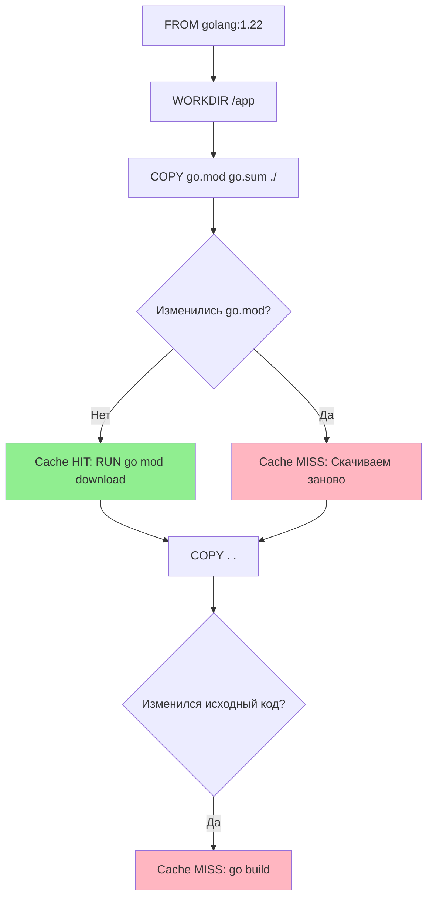

Скорость сборки Docker-образов — это не просто удобство разработчика, это прямой финансовый показатель в CI/CD. Если ваш пайплайн собирает образ 10 минут вместо 30 секунд, вы платите за лишнее время работы CI-раннеров и замедляете цикл поставки (Time to Market).

Docker использует послойную архитектуру. Каждая инструкция в `Dockerfile` (`RUN`, `COPY`, `ADD`) создает новый слой файловой системы. Ключ к быстрой сборке — **инвалидация кэша**. Нужно понимать, когда Docker решает, что кэш устарел и слой нужно пересобрать.

## Правила инвалидации кэша

Docker следует простому алгоритму:
1.  Если инструкция `Dockerfile` изменилась (например, `go build` на `go build -v`), кэш инвалидируется.
2.  Если файлы, копируемые инструкцией `COPY`, изменились (их чексумма отличается), кэш инвалидируется.
3.  **Критически важно**: Если кэш инвалидирован на текущем шаге, он **автоматически инвалидируется для всех последующих шагов**.



> [!warning] Ловушка / Gotcha
> Самая частая ошибка новичков — поставить `COPY . .` в самое начало Dockerfile.
> ```dockerfile
> # ОШИБКА
> COPY . .
> RUN go mod download
> ```
> В этом случае `go mod download` будет запускаться каждый раз, когда вы поменяете хоть одну букву в `main.go`, так как кэш сломается на шаге `COPY`. Зависимости будут скачиваться постоянно, превращая сборку в пытку.

## Правильный Dockerfile для Go

Идиоматичный Dockerfile для Go всегда разделяет этап получения зависимостей и этап копирования исходного кода.

```dockerfile
# 1. Базовый слой (кэшируется почти всегда)
FROM golang:1.22-alpine AS builder

# 2. Рабочая директория
WORKDIR /app

# 3. Сначала копируем ТОЛЬКО манифест зависимостей
COPY go.mod go.sum ./

# 4. Скачиваем зависимости
# Этот слой будет кэшироваться, пока не поменяется go.mod
RUN go mod download

# 5. Только ПОСЛЕ этого копируем исходный код
COPY . .

# 6. Сборка
RUN CGO_ENABLED=0 go build -o /myapp ./cmd/app
```

Теперь, если вы поправите бизнес-логику, Docker:
1.  Пропустит `go mod download` (Cache HIT), так как `go.sum` не менялся.
2.  Выполнит только `COPY . .` и `go build`.

## Продвинутый уровень: BuildKit и Cache Mounts

Даже при правильном порядке слоев есть проблема: директория кэша Go (`$GOMODCACHE` и `GOCACHE`) живет внутри слоя контейнера. Если слой инвалидируется, кэш теряется.

Современный Docker (с включенным BuildKit) позволяет использовать **внешние кэш-тома** (cache mounts) во время сборки. Это работает так же, как volume для контейнера, но на этапе сборки образа.

Для этого нужно включить BuildKit: `DOCKER_BUILDKIT=1`.

```dockerfile
# syntax=docker/dockerfile:1.4
FROM golang:1.22-alpine AS builder

WORKDIR /app

# Монтируем кэш Go Modules в специальный том
# Он не попадет в финальный образ, но сохранится между сборками на машине
RUN --mount=type=cache,target=/go/pkg/mod \
    --mount=type=cache,target=/root/.cache/go-build \
    go mod download

COPY . .

# Используем тот же кэш для сборки
RUN --mount=type=cache,target=/go/pkg/mod \
    --mount=type=cache,target=/root/.cache/go-build \
    CGO_ENABLED=0 go build -o /myapp ./cmd/app
```

> [!info] Под капотом
> Флаг `--mount=type=cache` говорит Docker-демону: "Не создавай новую папку внутри этого слоя, а примонтируй существующую именованную директорию с хоста (или volume)".
> Это позволяет переиспользовать скачанные модули даже при полном изменении `Dockerfile` или пересоздании контейнеров сборки. Это "Mechanical Sympathy" к дисковой подсистеме и сети.

## Кэширование в CI/CD

На локальной машине кэш Docker живет в папке `/var/lib/docker`. В CI (GitHub Actions, GitLab CI) раннеры часто эфемерны (создаются и удаляются после задачи). Это значит, что кэш слоев Docker по умолчанию теряется после каждого билда.

Чтобы ускорить CI, нужно сохранять кэш во внешнее хранилище.

1.  **Action Cache (GitHub Actions)**: Сохранять слои Docker в кэш экшена.
    ```yaml
    - uses: actions/cache@v3
      with:
        path: /tmp/.buildx-cache
        key: ${{ runner.os }}-go-build-${{ hashFiles('**/go.sum') }}
    ```
2.  **Registry Cache**: Использовать Docker Registry как хранилище кэша.
    ```bash
    docker buildx build \
      --cache-from type=registry,ref=myrepo/cache:builder \
      --cache-to type=registry,ref=myrepo/cache:builder,mode=max .
    ```
    Это позволяет не тянуть весь образ, а скачивать только метаданные слоев для проверки попадания в кэш.

> [!tip] Собеседование
> **Вопрос:** Вы изменили одну строчку в README.md, и CI начал пересобирать весь образ. В чем проблема и как исправить?
> **Ответ:** В `COPY . .`. Команда копирует все файлы, включая README. Изменение любого файла меняет чексумму слоя, ломая кэш для всех последующих шагов.
> **Решение:** Добавить README в `.dockerignore`. Этот файл исключает ненужные файлы из контекста сборки, предотвращая инвалидацию кэша при их изменении.

## `.dockerignore`: Забытый герой

Файл `.dockerignore` в корне проекта работает как `.gitignore`, но для Docker-демона. Он уменьшает размер контекста сборки и предотвращает лишние инвалидации кэша.

Что там должно быть всегда:
```text
.git
.env
bin/
README.md
docker-compose*.yml
Dockerfile
```

## Итог

1.  **Порядок слоев критичен**: `go.mod` скачивается первым, исходники копируются последними.
2.  Используйте **BuildKit** (`--mount=type=cache`) для сохранения кэша компилятора и модулей между сборками.
3.  Не забывайте про `.dockerignore`, чтобы не ломать кэш изменениями в несвязанных файлах.
4.  В CI настраивайте `cache-from` для хранения слоев в реестре или артефактах.

Мы научились быстро и эффективно собирать образы. Теперь пора перейти к процессам, которые управляют этим циклом автоматически. Следующий раздел открывает статья: [[26. CI_CD. Общие принципы]].