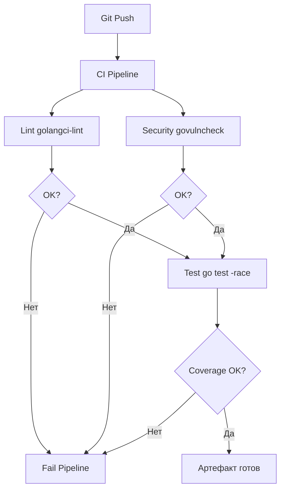

## CI/CD. Общие принципы

До этого момента мы говорили о локальных инструментах: как собрать, как протестировать, как упаковать в Docker. Однако в современной разработке ценность кода определяется не тем, как он работает на ноутбуке автора, а тем, как он попадает в продакшн.

**CI/CD** (Continuous Integration / Continuous Delivery) — это конвейер, который превращает исходный код в работающий сервис. Для Go-разработчика понимание этого процесса критически важно, так как Go дает уникальные преимущества в скорости и простоте этого цикла.

## Непрерывная интеграция (CI)

Цель CI — убедиться, что каждый коммит, попадающий в общую ветку, безопасен и не ломает существующий функционал. Это "защитный барьер" кодовой базы.

В мире Go цикл CI выглядит специфически быстро благодаря скорости компиляции.

### Основные этапы CI
1.  **Lint (Статический анализ)**: Самый дешевый этап. Если код не проходит `golangci-lint`, нет смысла тратить ресурсы на компиляцию.
2.  **Build (Сборка)**: Компиляция проекта. Здесь мы проверяем, что код вообще собирается.
3.  **Test (Тестирование)**: Запуск юнит-тестов. В Go обязательно включение `-race` (детектор гонок данных).
4.  **Security Scan**: Проверка известных уязвимостей в зависимостях (`govulncheck`).

> [!info] Под капотом
> CI-система — это, по сути, автоматизированный исполнитель скриптов. Она запускает ровно те команды, которые вы прописали в `Makefile` или конфиге, но в стерильной среде (эфемерный контейнер). Если ваш проект работает локально, но падает в CI, в 99% случаев это проблема окружения: разница в версиях Go, отсутствие переменных окружения или hardcoded-пути.

## Непрерывная доставка (CD)

Если CI отвечает за качество кода, то CD отвечает за доставку этого кода пользователям. Различают два понятия:
*   **Continuous Delivery**: Код всегда готов к деплою, но деплой запускается вручную (нажатие кнопки).
*   **Continuous Deployment**: Каждый успешный коммит в `main` автоматически деплоится в продакшн.

Для Go артефактом доставки обычно является **Docker-образ**.

### Принципы надежного CD:
1.  **Иммутабельность (Immutability)**: Один и тот же артефакт (бинарник или Docker-образ) проходит через все среды (Dev -> Stage -> Prod). Не пересобирайте образ для прода! Тот, что тестировали в Stage, должен уйти в Prod.
2.  **Версионирование**: Каждому артефакту должен быть присвоен уникальный тег (обычно Git SHA или SemVer). Не используйте тег `latest` для деплоя — это путь к аду отладки.
3.  **Rollback**: Процесс отката должен быть тривиальным. Если вы используете Kubernetes, это просто смена тега образа в манифесте на предыдущий.

> [!warning] Ловушка / Gotcha
> **Secrets Management.**
> Никогда не храните секреты (API ключи, пароли от БД) в коде или Docker-образе. В CI/CD секреты должны пробрасываться через защищенные переменные окружения системы (GitHub Secrets, GitLab Variables) и монтироваться в контейнер при запуске, а не при сборке.

## "Shift Left": Тестирование раньше

В традиционных моделях тестирование происходило перед релизом. В современной разработке мы сдвигаем проверки "влево" — ближе к моменту написания кода.

1.  **Pre-commit hooks**: Линтер запускается до коммита.
2.  **CI Pipeline**: Тесты запускаются до мержа в основную ветку.
3.  **Staging**: Интеграционные тесты запускаются автоматически.

Это снижает стоимость исправления багов. Ошибка, найденная на этапе линтера, стоит копейки, ошибка в продакшене — миллионы (или репутацию).

## Go и CI/CD: Естественное преимущество

Почему Go считается "языком для Cloud Native"?
1.  **Скорость**: Сборка и тесты проходят в разы быстрее, чем на Java или C++. Это снижает время обратной связи (Feedback Loop) с 20 минут до 2-3 минут.
2.  **Статический бинарник**: Упрощает артефакты. Вам не нужно настраивать `virtualenv`, тянуть `node_modules` или устанавливать JRE. Один файл — одна точка отказа.
3.  **Кросс-компиляция**: Собрать бинарник под Linux, находясь на Windows-раннере, можно одной переменной окружения (`GOOS=linux`). Не нужны сложные кросс-компиляторы C++.

## Итог

1.  **CI** — это автоматическая проверка качества кода при каждом пуше.
2.  **CD** — это автоматическая доставка проверенного кода в среду исполнения.
3.  Главный принцип: **Fail Fast** (ошибаться быстро) и **Build Once** (собирать один раз).
4.  Go идеально подходит для CI/CD благодаря быстрой сборке и простым артефактам.

Теперь, когда мы понимаем общие принципы, пора перейти к конкретным инструментам. В следующей статье мы разберем самый популярный CI-сервис для Open Source и не только: [[27. GitHub Actions для Go]].