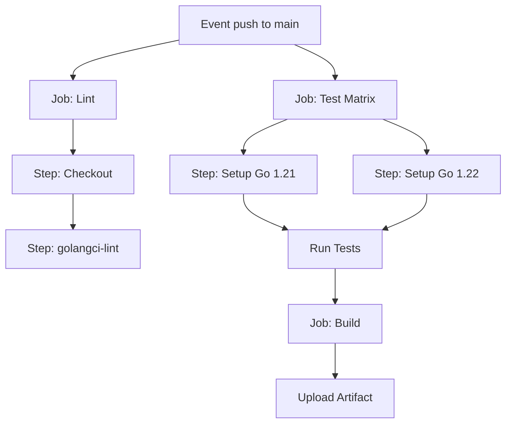

GitHub Actions (GHA) — это стандарт де-факто для Open Source проектов и многих коммерческих стартапов. Его главное преимущество — нативная интеграция с репозиторием и богатая экосистема готовых действий (Actions). Вам не нужно настраивать отдельные серверы: GitHub предоставляет виртуальные машины (Runners) с предустановленным софтом.

Для Go-разработчика GitHub Actions предлагает удобный инструментарий для настройки пайплайнов "из коробки".

## Архитектура Workflow

Конфигурация GHA строится вокруг файла `.github/workflows/ci.yml`. Основные сущности:
1.  **Events (Триггеры)**: Что запускает пайплайн (push, pull_request, tag).
2.  **Jobs (Задания)**:独立ные单元 выполнения, которые могут跑ать параллельно.
3.  **Steps (Шаги)**: Последовательные команды внутри Job.



## Ключевой Action: `setup-go`

Сердцем любого Go-пайплайна в GHA является экшен `actions/setup-go`. Он не просто устанавливает Go, но и интегрируется с встроенным кэшированием GitHub.

```yaml
- uses: actions/setup-go@v5
  with:
    go-version: '1.22'
    cache: true # Включает умное кэширование go mod
```

> [!info] Под капотом
> При включении `cache: true`, экшен использует `actions/cache` под капотом. Он кэширует директории, возвращаемые командой `go env GOMODCACHE` и `go env GOCACHE`. Ключом кэша выступает хеш файла `go.sum`. Это означает, что при добавлении новой зависимости кэш инвалидируется, но для того же набора библиотек `go test` отработает мгновенно, так как всё уже скачано.

## Production-Ready Pipeline

Ниже приведен пример полноценного пайплайна, включающего линтинг, тестирование на матрице версий и сборку.

```yaml
name: Go CI

on:
  push:
    branches: [ "main" ]
  pull_request:
    branches: [ "main" ]

jobs:
  lint:
    runs-on: ubuntu-latest
    steps:
      - uses: actions/checkout@v4
      
      - uses: actions/setup-go@v5
        with:
          go-version: '1.22'
          
      - name: Run golangci-lint
        uses: golangci/golangci-lint-action@v6
        # Этот action сам скачает и запустит линтер
        # Он также кэширует сам бинарник линтера

  test:
    strategy:
      matrix:
        go-version: ['1.21', '1.22'] # Матричное тестирование
        os: ['ubuntu-latest', 'macos-latest']
    runs-on: ${{ matrix.os }}
    
    steps:
      - uses: actions/checkout@v4
      
      - uses: actions/setup-go@v5
        with:
          go-version: ${{ matrix.go-version }}
          
      - name: Run Tests
        run: go test -race -coverprofile=coverage.out -v ./...

      - name: Upload Coverage
        uses: codecov/codecov-action@v4
        with:
          file: ./coverage.out

  build:
    needs: [lint, test] # Запустить только после успешного lint и test
    runs-on: ubuntu-latest
    steps:
      - uses: actions/checkout@v4
      
      - uses: actions/setup-go@v5
        with:
          go-version: '1.22'
          
      - name: Build
        run: go build -v -o bin/app ./cmd/app
        
      - name: Upload Artifact
        uses: actions/upload-artifact@v4
        with:
          name: app-binary
          path: bin/app
```

> [!warning] Ловушка / Gotcha
> **Checkout Depth.**
> `actions/checkout` по умолчанию клонирует репозиторий с глубиной 1 (`--depth 1`). Это быстрее, но ломает некоторые команды, которые пытаются прочитать историю Git (например, `git describe --tags` для версии).
> Решение: добавьте `fetch-depth: 0`.
> ```yaml
> - uses: actions/checkout@v4
>   with:
>     fetch-depth: 0 # Полная история для версионирования
> ```

## Матричное тестирование (Matrix Strategy)

Go развивается быстро. Если вы разрабатываете библиотеку для Open Source, вы должны гарантировать её работу на последних двух версиях Go. GHA позволяет определить матрицу, которая автоматически развернет одну джобу в несколько.

```yaml
strategy:
  matrix:
    go: ['1.21', '1.22']
```
GHA запустит тесты параллельно для обеих версий. Это бесплатная проверка обратной совместимости.

## Интеграция с Dependabot

Для Go проектов критически важна безопасность зависимостей. GitHub позволяет настроить Dependabot для автоматического создания PR на обновление `go.mod`.

`.github/dependabot.yml`:
```yaml
version: 2
updates:
  - package-ecosystem: "gomod"
    directory: "/"
    schedule:
      interval: "weekly"
```
Dependabot сам разберется с версиями и создаст Pull Request, который ваш новый CI-пайплайн автоматически проверит.

## Итог

1.  **GitHub Actions** — нативное и мощное решение для Go.
2.  Используйте `actions/setup-go` с флагом `cache: true` для ускорения сборки.
3.  Для линтинга используйте готовый `golangci/golangci-lint-action`.
4.  Применяйте **Matrix Strategy** для тестирования библиотек на разных версиях Go.

Мы настроили CI для самого популярного хостинга. Однако в энтерпрайз-сегменте часто встречается GitLab. В следующей статье разберем его специфику: [[28. GitLab CI для Go]].