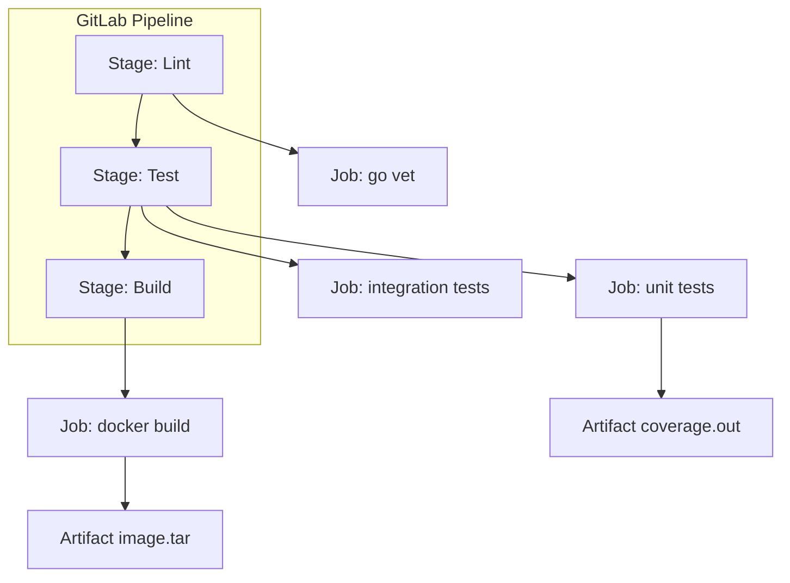

Если GitHub Actions — это стандарт для Open Source и стартапов, то **GitLab CI/CD** — это тяжеловес энтерпрайза и self-hosted инфраструктуры. Главная архитектурная разница: GitLab CI использует модель **Pull-based**. Runner (агент) опрашивает сервер GitLab на наличие задач, а не сервер пытается "протолкнуть" задачу куда-то.

Это дает энтерпрайзам полный контроль: раннеры могут стоять за файрволами, на мощных "железных" серверах или в Kubernetes-кластерах компании.

## Концепция `.gitlab-ci.yml`

Конфигурация описывается в одном YAML-файле в корне проекта. Структура строится вокруг понятий **Stages** (этапы) и **Jobs** (задачи).



> [!info] Под капотом
> GitLab Runner может использовать разные исполнители (Executors). Самые популярные:
> *   **Shell**: Команды выполняются прямо на хосте. Быстро, но "грязно" (загрязнение среды).
> *   **Docker**: Каждая джоба запускается в чистом контейнере (например, `golang:1.22`). Стандарт де-факто.
> *   **Kubernetes**: Каждая джоба — это Pod в кластере. Идеально для автомасштабирования (Autoscaling).

## Кэширование и Артефакты

В GitLab CI есть четкое разделение, которое новички часто путают.

1.  **Cache** (Кэш): Предназначен для ускорения **последующих** запусков пайплайна. Обычно используется для зависимостей (`go mod`).
    *   Привязан к ветке или ключу.
    *   Хранится на Runner'е (S3, локальный диск).
    *   Не гарантируется сохранность (может быть удален).

2.  **Artifacts** (Артефакты): Результаты работы джобы, которые нужно передать **следующей** стадии или скачать пользователю.
    *   Бинарники, отчеты покрытия, Docker-образы.
    *   Гарантированно сохраняются на сервере GitLab.

Пример правильного кэширования Go-модулей:

```yaml
variables:
  GOPATH: $CI_PROJECT_DIR/.go

cache:
  key:
    files:
      - go.sum
  paths:
    - .go/pkg/mod/

stages:
  - test

unit_tests:
  stage: test
  image: golang:1.22
  script:
    - go test -race -coverprofile=coverage.out ./...
  artifacts: # Сохраняем отчет для следующей джобы или просмотра в UI
    paths:
      - coverage.out
    expire_in: 1 week
```

## Docker-in-Docker (DinD) vs Kaniko

Сборка Docker-образов в GitLab CI — это отдельная тема с точки зрения безопасности и архитектуры.

### Вариант 1: Docker-in-Docker (DinD)
Классический подход, когда контейнер с Docker-клиентом запускает Docker-демон внутри другого контейнера.
```yaml
services:
  - docker:dind
build:
  image: docker:latest
  script:
    - docker login -u $CI_REGISTRY_USER -p $CI_REGISTRY_PASSWORD $CI_REGISTRY
    - docker build -t $CI_REGISTRY_IMAGE:$CI_COMMIT_SHA .
    - docker push $CI_REGISTRY_IMAGE:$CI_COMMIT_SHA
```
**Проблема**: Требует привилегированный режим (`privileged: true`), что создает дыру в безопасности (container escape risk).

### Вариант 2: Kaniko (Рекомендуемый)
Kaniko от Google умеет собирать образы **без** Docker-демона и без root-прав. Это стандарт безопасности в энтерпрайзе.

```yaml
build:
  stage: build
  image:
    name: gcr.io/kaniko-project/executor:debug
    entrypoint: [""]
  script:
    - /kaniko/executor
      --context "${CI_PROJECT_DIR}"
      --dockerfile "${CI_PROJECT_DIR}/Dockerfile"
      --destination "${CI_REGISTRY_IMAGE}:${CI_COMMIT_TAG}"
```

> [!warning] Ловушка / Gotcha
> При использовании Kaniko вы не можете использовать инструкции `COPY --from=builder`, если базовый образ недоступен или требует аутентификации, без предварительного конфигурирования `.docker/config.json` для Kaniko. Однако Kaniko поддерживает кэширование слоев в удаленном репозитории (remote cache), что часто работает стабильнее локального кэша Docker.

## Развертывание (Environments)

GitLab CI имеет встроенную поддержку сред (Environments) и возможность "ручного Approval" (кнопка "Play" в UI). Это критически важно для CD.

```yaml
deploy_prod:
  stage: deploy
  script:
    - ./deploy.sh production
  environment:
    name: production
    url: https://prod.myapp.com
  when: manual # Требует ручного нажатия кнопки
  only:
    - main
```

Это позволяет реализовать стратегию "один клик до продакшена" с полной историей деплоев и возможностью отката (Rollback) прямо из интерфейса GitLab.

## Итог

1.  **GitLab CI** — мощный инструмент для self-hosted инфраструктуры.
2.  Используйте `cache` для `go mod`, `artifacts` — для бинарников и отчетов.
3.  Для сборки Docker в энтерпрайзе предпочитайте **Kaniko** вместо DinD ради безопасности.
4.  Используйте `environment` и `when: manual` для управления релизами.

Мы настроили пайплайны сборки. Однако автоматически запускать тесты мало — нужно следить за их качеством и стабильностью. В следующей статье разберем, как правильно внедрить тестирование в поток CI: [[29. Тестирование в CI]].