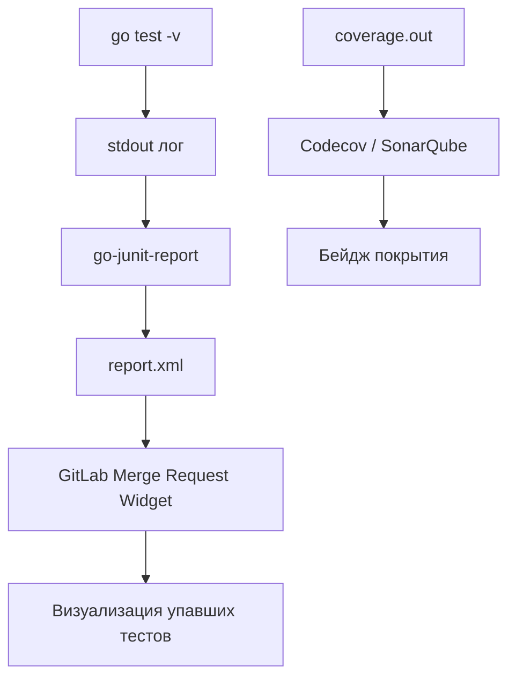

Запуск тестов локально — это проверка того, что разработчик не сломал всё своими руками. Запуск тестов в CI — это гарантия того, что код работает в чистой, воспроизводимой среде и корректно взаимодействует с остальной кодовой базой.

Для Go-проектов тестирование в CI имеет свою специфику, связанную с детектором гонок, генерацией отчетов и управлением интеграционными тестами.

## Базовая команда: Все флаги важны

Простого `go test` в CI недостаточно. Команда должна быть максимально строгой.

```bash
go test -race -coverprofile=coverage.out -covermode=atomic -v ./...
```

Разберем флаги:
*   **`-race`**: Обязательный флаг для CI. Включает детектор гонок данных. Да, это замедляет тесты в 2-5 раз, но цена пропущенной гонки данных в продакшене несравнимо выше. Локально разработчики часто забывают его включить, поэтому CI — ваш последний рубеж обороны.
*   **`-coverprofile`**: Записывает статистику покрытия кода тестами в файл. Это нужно для отправки отчета в Codecov или SonarQube.
*   **`-covermode=atomic`**: Обязателен при использовании `-race`. Гарантирует корректный подсчет покрытия при конкурентном выполнении тестов.
*   **`-v`**: Verbose output. В CI логи — это единственный способ понять, что пошло не так. Без этого флага при падении вы увидите только "FAIL", но не контекст.

> [!warning] Ловушка / Gotcha
> **Кэширование тестов.**
> Go кэширует результаты тестов. Если вы запускаете `go test` дважды без изменений кода, он может выдать `ok  github.com/user/pkg  (cached)`.
> В CI это обычно не является проблемой, так как раннеры эфемерны. Однако, если вы используете самохостинг (self-hosted runners) с персистентным кэшем, и ваши тесты зависят от внешнего состояния (БД, файловая система), кэш может "соврать". Принудительно отключить кэш можно флагом `-count=1`.

## Формат отчетов: JUnit XML

Go выводит результат тестов в свой формат. Однако системы CI (GitLab, GitHub Actions, Jenkins) и инструменты анализа качества лучше всего понимают формат **JUnit XML**.

Чтобы Go сгенерировал JUnit XML, нужен конвертер. Стандарт индустрии — `go-junit-report`.

```bash
# Установка конвертера
go install github.com/jstemmer/go-junit-report/v2@latest

# Запуск тестов, парсинг вывода и сохранение в XML
go test -v -race ./... 2>&1 | go-junit-report -set-exit-code -out report.xml
```

Этот `report.xml` можно загрузить в GitLab CI как артефакт или в GitHub Actions через соответствующие Action. Это позволит визуализировать упавшие тесты прямо в интерфейсе Merge Request.



## Интеграционные тесты и Service Containers

Юнит-тесты быстрые, но интеграционные требуют баз данных, брокеров сообщений и кэшей. В CI нельзя полагаться на то, что PostgreSQL "где-то там установлен". Окружение должно быть детерминированным.

GitHub Actions и GitLab CI поддерживают концепцию **Service Containers**. Это Docker-контейнеры, которые запускаются параллельно с вашим тестовым контейнером и доступны по сетевому алиасу.

Пример для GitHub Actions:
```yaml
jobs:
  integration-test:
    runs-on: ubuntu-latest
    
    services:
      postgres:
        image: postgres:15
        env:
          POSTGRES_PASSWORD: secret
        ports:
          - 5432:5432
        options: >-
          --health-cmd pg_isready
          --health-interval 10s
          
    steps:
      - uses: actions/checkout@v4
      - uses: actions/setup-go@v5
        with: { go-version: '1.22' }
        
      - name: Run Integration Tests
        env:
          DB_HOST: localhost
          DB_PORT: 5432
        run: go test -race -tags=integration ./...
```

> [!info] Под капотом
> Платформа создает общую Docker-сеть для контейнера раннера и сервис-контейнера. Это позволяет обращаться к базе по имени хоста (`postgres` или `localhost`, в зависимости от конфигурации). Опция `--health-cmd` критична: CI дождется, пока база станет "healthy", прежде чем запускать тесты, избавляя вас от `connection refused` ошибок при старте.

## Разделение Юнит и Интеграционных тестов

В больших проектах интеграционные тесты могут выполняться очень долго. Их нецелесообразно запускать на каждый коммит в ветку фичи. Используйте **Build Tags** для разделения.

Файл интеграционного теста:
```go
//go:build integration

package db_test
// ...
```

Команды в CI:
1.  **Fast Feedback (Push/MR):** `go test -race ./...` (тег `integration` исключен, бегут только юнит-тесты).
2.  **Nightly Build / Main Branch:** `go test -race -tags=integration ./...` (бегут все тесты).

## Flaky Tests (Тесты-хлопушки)

Тесты, которые иногда падают без видимых причин (flaky tests), — бич CI. В Go они часто возникают из-за неправильной работы с временем (`time.Sleep`), отсутствия таймаутов в сетевых вызовах или реальных гонок данных, которые не ловит `-race`.

В CI можно реализовать механизм автоповтора, но это "лечение симптомов", а не болезни.

```yaml
# GitLab CI example
test:
  script:
    - go test -race ./...
  retry:
    max: 2
    when:
      - script_failure # Повторить, если упал скрипт (тест)
```

Однако, Senior-подход заключается в анализе причин. Если тест упал, CI должен сохранить логи и дамп состояния (если возможно), а разработчик должен исправить тест, а не просто перезапустить пайплайн.

## Итог

1.  Всегда используйте `-race` и `-coverprofile` в CI.
2.  Конвертируйте вывод тестов в **JUnit XML** для красивой интеграции с UI.
3.  Используйте **Service Containers** для изолированных интеграционных тестов.
4.  Разделяйте наборы тестов через Build Tags (`-tags=integration`), чтобы ускорить цикл обратной связи.

Тесты подтвердили корректность логики. Но код может быть рабочим, но "плохим" (неидиоматичным, небезопасным). В следующей статье мы настроим автоматические "ворота качества": [[30. Линтинг и quality gates]].