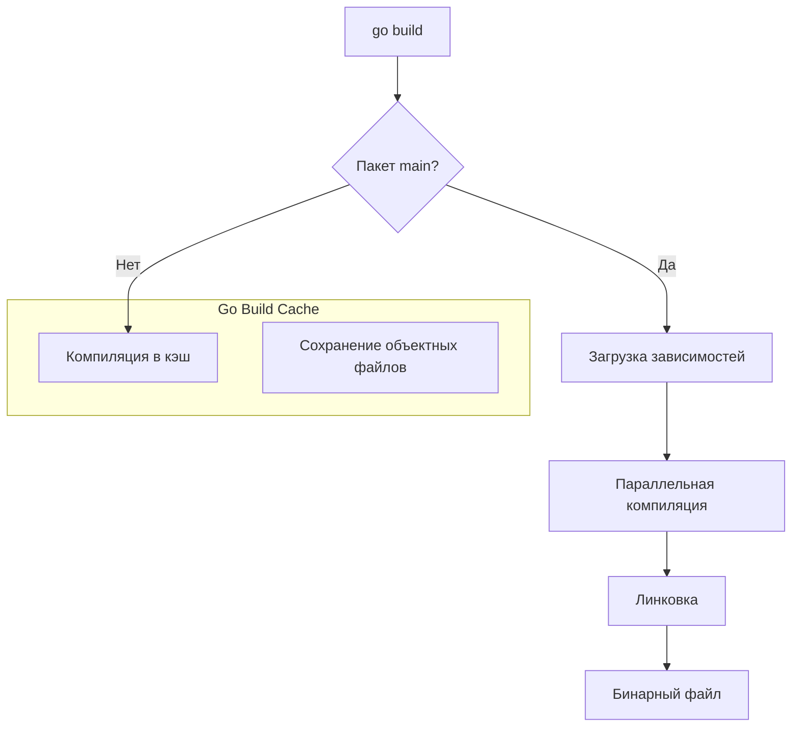

Команда `go build` — это сердце процесса разработки. Она запускает полный цикл компиляции и линковки, превращая исходный код в готовый к исполнению бинарный файл. Для разработчика, привыкшего к `javac` + `jar` или `gcc` с ручным указанием библиотек, `go build` кажется магией: одна команда, и на выходе готовый `.exe` или ELF-бинарник.

Однако за этой простотой скрывается мощный механизм управления зависимостями, кэшированием и флагами компиляции.

## Базовый синтаксис и поведение

Если выполнить `go build` без аргументов в директории с файлом `main.go`, компилятор соберет текущий пакет. Если это пакет `main`, он создаст исполняемый файл. Имя бинарника по умолчанию совпадает с именем директории (для пакетов не `main` файл просто компилируется и кэшируется, артефакт в текущую папку не кладется).

```bash
# Собрать main.go в бинарник main (или main.exe на Windows)
go build main.go

# Собрать пакет в текущей директории в бинарник myapp
go build -o myapp .

# Собрать конкретный пакет из $GOPATH или go.mod
go build github.com/myuser/myproject/cmd/server
```

> [!warning] Ловушка / Gotcha
> Многие новички путают `go build` и `go install`.
> *   `go build` собирает бинарник и кладет его в текущую директорию (или туда, куда указал `-o`).
> *   `go install` компилирует бинарник и перемещает его в `$GOBIN` (или `$GOPATH/bin`), делая его доступным глобально в терминале. Подробнее об этом мы поговорим в статье [[5. go install и установка CLI]].

## Архитектура сборки: Как это работает

Когда вы запускаете `go build`, происходит следующая последовательность действий:

1.  **Чтение `go.mod`**: Определяются версии всех зависимостей.
2.  **Построение графа зависимостей**: Go рекурсивно обходит импорты.
3.  **Проверка кэша**: Для каждого пакета проверяется, есть ли он в кэше (`$GOCACHE`). Если хеш исходников совпадает с кэшем, компиляция пропускается.
4.  **Компиляция**: Параллельная компиляция пакетов (`.go` -> `.o`).
5.  **Линковка**: Объединение всех `.o` файлов в один бинарник.



## Флаги компиляции и линковщика

Сила `go build` раскрывается через передачу флагов компилятору (`gcflags`) и линкеру (`ldflags`). Это уровень Senior, позволяющий контролировать поведение бинарника на этапе сборки.

### 1. Внедрение версии (Version Injection)

В Go принято не хранить версию в коде константой, а внедрять её на этапе сборки (CI/CD). Это делается через линкер.

```go
package main

var (
    version = "dev" // значение по умолчанию
    commit  = "none"
    date    = "unknown"
)

func main() {
    fmt.Printf("Version: %s, Commit: %s, Built: %s\n", version, commit, date)
}
```

Сборка с подстановкой значений:

```bash
go build -ldflags "-X main.version=1.0.0 -X main.commit=$(git rev-parse HEAD) -X main.date=$(date +%Y-%m-%d)"
```

> [!tip] Собеседование
> **Вопрос:** Как передать значение переменной в Go-программу на этапе компиляции, а не через конфиг?
> **Ответ:** Использовать флаг линкера `-ldflags "-X <package_path>.<var_name>=<value>"`. Это стандартный подход для CLI-утилит и микросервисов.

### 2. Уменьшение размера бинарника (`-s -w`)

Go бинарники статически линкуются, поэтому они содержат много метаинформации (DWARF символы для отладки). В продакшене эта информация часто не нужна.

```bash
# Убираем таблицу символов и DWARF (DWARF - формат отладочной информации)
go build -ldflags "-s -w"
```

Это может уменьшить размер бинарника на 20-30%. Для экстремального сжатия используют утилиту UPX, но это увеличивает время старта программы (распаковка в память).

### 3. Отключение инлайнинга (`-l`)

Иногда для отладки производительности или предотвращения странных багов (редко) нужно запретить компилятору встраивать функции.

```bash
go build -gcflags="-l" # отключить инлайнинг
```

## TrimPath: Чистота и безопасность

По умолчанию Go бинарники содержат полные пути к файлам исходного кода машины, на которой происходила сборка (например, `/home/john/projects/app/main.go`). Это неудобно для воспроизводимости и может быть проблемой безопасности.

Флаг `-trimpath` удаляет все пути файловой системы из бинарника, оставляя только относительные пути модулей.

```bash
go build -trimpath
```

> [!info] Под капотом
> При использовании `-trimpath` сообщения об ошибках (panic) будут выглядеть чище, например `main.go:15` вместо `/home/user/go/src/app/main.go:15`. Это также критично для воспроизводимых сборок (Reproducible Builds), когда один и тот же исходный код, скомпилированный разными людьми на разных машинах, должен давать бит-в-бит идентичный бинарник.

## Build Tags (Теги сборки)

Go позволяет условно включать или исключать файлы из сборки в зависимости от тегов. Это мощнее, чем `#ifdef` в C/C++.

Файл `config_prod.go`:
```go
//go:build prod

package main

const ConfigValue = "Production Settings"
```

Файл `config_dev.go`:
```go
//go:build !prod

package main

const ConfigValue = "Dev Settings"
```

Сборка:
```bash
# Соберет config_prod.go, игнорируя config_dev.go
go build -tags prod
```

Это часто используется для интеграции C-кода (CGO), разных реализаций под разные ОС или включения фич фичатоглом.

## Кросс-компиляция

Go уникален тем, что кросс-компиляция встроена в тулчейн и работает "из коробки". Вам не нужны кросс-компиляторы (как arm-linux-gnueabihf-gcc для C++). Достаточно установить две переменные окружения:

*   `GOOS` (Operating System): linux, windows, darwin (macOS), freebsd.
*   `GOARCH` (Architecture): amd64, arm64, arm, 386.

```bash
# Сборка для Linux x64
GOOS=linux GOARCH=amd64 go build -o bin/app_linux .

# Сборка для Windows 32-bit
GOOS=windows GOARCH=386 go build -o bin/app_windows.exe .
```

Список поддерживаемых комбинаций можно посмотреть командой `go tool dist list`.

## Итог

1.  **`go build`** — это не просто компиляция, а оркестрация всего процесса от разрешения зависимостей до линковки.
2.  **`-ldflags`** позволяет внедрять метаданные (версия, git-коммит) и урезать размер бинарника.
3.  **`-trimpath`** делает сборки воспроизводимыми и скрывает пути файловой системы.
4.  **Build Tags** (`//go:build`) предоставляют мощный механизм условной компиляции.

Мы научились собирать бинарники. Но процесс компиляции может занимать время. Для локальной разработки есть более быстрый способ проверить код, который мы разберем в следующей статье: [[4. go run и быстрый цикл разработки]].