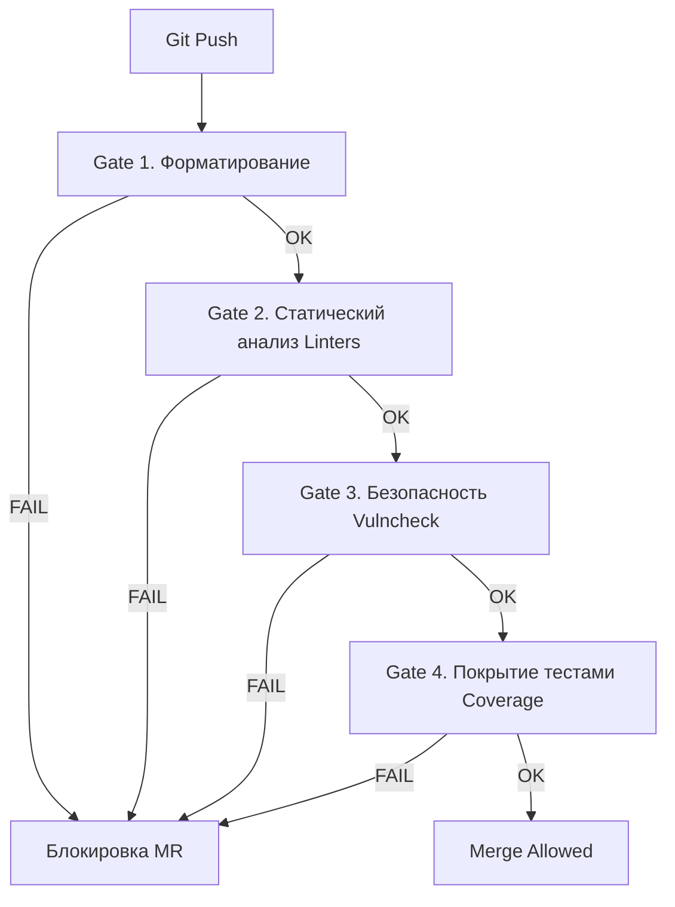

Тесты проверяют логику: "Если нажать кнопку А, загорится лампочка Б". Но они молчат о качестве самого кода. Слишком сложные функции, дублирование логики, игнорирование ошибок или использование небезопасных функций — всё это может пройти тесты, но создать технический долг или уязвимость.

**Quality Gates (Ворота качества)** — это набор критериев, которые код должен удовлетворить, чтобы быть допущенным к слиянию (Merge) или деплою. Если код не проходит "ворота", CI пайплайн падает, блокируя продвижение изменений.

## Уровни защиты

Quality Gates обычно работают последовательно. Мы идем от самого быстрого и очевидного к сложному анализу.



## Gate 1: Форматирование

В Go споров о стиле нет, но проверка нужна, чтобы разработчик не забыл запустить `gofmt`. В CI это часто реализуют через простой diff.

```bash
# Проверка: если gofmt изменил файлы, выводим их список и падаем
if [ -n "$(gofmt -l .)" ]; then
  echo "Following files are not formatted:"
  gofmt -d .
  exit 1
fi
```

Это самый быстрый фильтр, который отсекает "грязный" код.

## Gate 2: Статический анализ (Linting)

Здесь вступает в силу `golangci-lint`. Но запускать его "в лоб" на весь проект в каждом Pull Request неэффективно для больших монорепозиториев.

### Инкрементальный линтинг
Чтобы ускорить процесс и не ругаться на легаси-код, который вы не меняли, используйте флаг `--new-from-rev`. Он анализирует только изменения относительно целевой ветки (например, `main`).

```bash
# Анализировать только изменения в текущем Pull Request
golangci-lint run --new-from-rev=HEAD~1
```

> [!warning] Ловушка / Gotcha
> Инкрементальный линтинг не гарантирует целостность всего проекта. Его стоит использовать в PR-пайплайнах для быстрой обратной связи. Для ночных сборок (Nightly builds) или перед релизом обязательно запускайте полный линтинг всего проекта (`golangci-lint run ./...`).

## Gate 3: Безопасность (Security Scanning)

Создание защищенного ПО требует отдельных шагов сканирования.

### 1. `govulncheck`
Официальный инструмент от Go Team, появившийся в Go 1.18. Он проверяет ваш код и зависимости на наличие известных уязвимостей (CVE), используя базу данных уязвимостей Go.

```bash
# Установка и запуск
go install golang.org/x/vuln/cmd/govulncheck@latest
govulncheck ./...
```

Если `govulncheck` находит проблему, CI должен упасть. Это спасает от использования версий библиотек с критическими дырами.

### 2. `gosec`
Входит в набор `golangci-lint`, но часто выделяется в отдельный шаг для настройки строгих правил. Ищет небезопасные практики: использование слабой криптографии (MD5), хардкод секретов, SQL-инъекции через конкатенацию строк.

## Gate 4: Покрытие тестами (Coverage Thresholds)

Мы генерируем `coverage.out` при тестировании, но как использовать эти данные? Нужно установить порог (threshold). Если покрытие падает ниже порога — ворота закрываются.

Инструменты вроде **Codecov** или **SonarQube** делают это из коробки. Вы настраиваете правило: "Общее покрытие не должно падать ниже 70%".

В простом скрипте это можно проверить так:
```bash
# Проверка общего покрытия (порог 80%)
go tool cover -func=coverage.out | grep total | awk '{if ($3+0 < 80.0) exit 1}'
```

> [!tip] Собеседование
> **Вопрос:** Стоит ли стремиться к 100% покрытию кода тестами?
> **Ответ:** Нет. 100% покрытие часто означает, что разработчики пишут бесполезные тесты просто ради метрики, либо тратят время на тестирование геттеров/сеттеров.
> Здоровый подход:
> 1. Установить минимальный барьер (например, 60-70%).
> 2. Блокировать MR, если покрытие **снижается** (diff coverage).
> 3. Требовать 100% покрытия только для критических бизнес-модулей и алгоритмов.

## Интеграция с SonarQube

В энтерпрайзе стандартом является интеграция с **SonarQube**. Это платформа непрерывной инспекции кода. Она объединяет покрытие, дубликаты кода, сложность (Cyclomatic Complexity) и потенциальные баги в единый статус Quality Gate.

Настроив SonarQube в CI, вы получаете декларативный способ блокировки:
```yaml
# Пример шага в CI
- name: SonarQube Scan
  uses: sonarsource/sonarqube-scan-action@master
  env:
    SONAR_TOKEN: ${{ secrets.SONAR_TOKEN }}
```

Если SonarQube скажет "Failed", скрипт упадет, и Merge Request не будет смержен.

## Итог

1.  **Quality Gates** — это автоматические защитные барьеры.
2.  Строго разделяйте проверки: формат, баги (lint), безопасность (vulncheck), качество (coverage).
3.  Используйте инкрементальный анализ (`--new-from-rev`) для скорости в PR.
4.  `govulncheck` — обязательный инструмент для защиты от CVE.

Мы настроили жесткий контроль качества кода. Теперь, когда код прошел все проверки, его нужно подготовить к передаче пользователям. В следующей статье мы разберем создание пайплайна релиза: [[31. Release pipeline и versioning]].