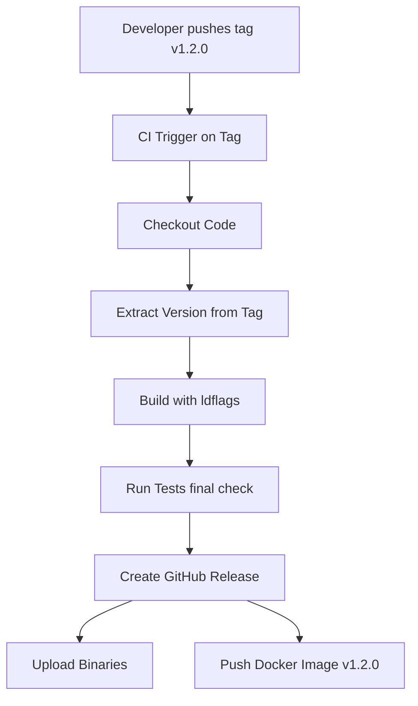

Пройдя все стадии линтинга, тестирования и сборки, мы подошли к финальной черте. Код готов покинуть уютную среду CI и отправиться к пользователям. Но превращение набора файлов в "Релиз" — это процесс, требующий строгих правил именования и автоматизации.

Ручной релиз ("собрал бинарник на ноутбуке и залил на FTP") — это табу для Senior-инженера. Релиз должен быть **воспроизводимым**, **аудируемым** и **автоматическим**.

## SemVer: Контракт с пользователем

В статье [[13. Versioning. SemVer и совместимость]] мы разобрали теорию. На практике релиз-пайплайн обязан строго следовать ей, чтобы не сломать экосистему зависимостей.

*   **MAJOR (v2.0.0)**: Сломали API.
*   **MINOR (v1.1.0)**: Добавили фичи, совместимость сохранена.
*   **PATCH (v1.0.1)**: Исправили баги.

В Go версия программы обычно внедряется в бинарник на этапе компиляции через `-ldflags`. Однако в релиз-пайплайне источником правды должен быть **Git Tag**.



## GoReleaser: Стандарт индустры

Вместо написания сложных bash-скриптов для сборки под разные платформы (Linux, Windows, macOS) и загрузки артефактов, сообщество Go приняло инструмент **GoReleaser**. Это де-факто стандарт для распространения Go-бинарников.

Он делает всю грязную работу:
1.  Собирает бинарники под разные OS/Arch (Cross-compilation).
2.  Создает архивы (tar.gz, zip).
3.  Генерирует чек-суммы (SHA256).
4.  Создает Homebrew formula (для установки на macOS через `brew`).
5.  Публикует релиз на GitHub/GitLab.
6.  Собирает и пушит Docker-образы.

Пример `.goreleaser.yml`:

```yaml
# Настройка сборки
builds:
  - env:
      - CGO_ENABLED=0
    goos:
      - linux
      - windows
      - darwin
    goarch:
      - amd64
      - arm64
    ldflags:
      - -s -w -X main.version={{.Version}} -X main.commit={{.Commit}} -X main.date={{.Date}}

# Настройка Docker
dockers:
  - image_templates:
      - "myuser/myapp:{{.Version}}"
      - "myuser/myapp:latest"
    dockerfile: Dockerfile

# Настройка релиза на GitHub
release:
  github:
    owner: myuser
    name: myapp
```

> [!info] Под капотом
> GoReleaser использует возможности Go по кросс-компиляции. Он запускает `go build` с разными переменными окружения `GOOS` и `GOARCH` параллельно. Это позволяет собрать 10-20 бинарников за секунды на одной Linux-машине, не нуждаясь в маках или винде.

## Стратегия тегирования Docker-образов

Всегда публикуйте Docker-образы с несколькими тегами. Никогда не используйте только `latest` в продакшене.

1.  **Immutable Tag (v1.2.0)**: Полная версия. Этот тег никогда не должен перезаписываться. Ссылка на конкретный артефакт.
2.  **Rolling Tag (v1.2)**: Обновляется при выходе минорных патчей (v1.2.1 заменит v1.2). Удобно для автоматических обновлений, но рискованно.
3.  **Latest**: Последняя стабильная версия. Используется только для разработки или демо.

Пример пайплайна в GitLab CI для тегирования:
```yaml
rules:
  - if: $CI_COMMIT_TAG # Запускать только при создании тега
script:
  - docker build -t $CI_REGISTRY_IMAGE:$CI_COMMIT_TAG .
  - docker tag $CI_REGISTRY_IMAGE:$CI_COMMIT_TAG $CI_REGISTRY_IMAGE:latest
  - docker push --all-tags $CI_REGISTRY_IMAGE
```

## Автоматизация Changelog

Пользователям (и вам самим) важно знать, что изменилось. Changelog не должен писаться руками в последний момент.

Популярные подходы:
1.  **Conventional Commits**: Если ваши коммиты называются `feat: add user login` или `fix: memory leak`, инструменты вроде `standard-version` или `semantic-release` могут автоматически сгенерировать `CHANGELOG.md` и поднять версию в `go.mod` (хотя Go модули обычно управляются тегами).
2.  **Git Log**: Простая генерация списка изменений из истории коммитов (`git log v1.0.0..v1.1.0 --oneline`).

GoReleaser умеет генерировать changelog автоматически, фильтруя коммиты и группируя их.

## Защита веток и тегов

На уровне настроек репозитория (GitHub/GitLab) включите **Protected Tags**.
*   Разрешите создание тегов, начинающихся с `v*`, только пользователям с правами `Maintainer` или `Admin`.
*   Это защитит проект от случайного создания `v2.0.0` разработчиком, который просто хотел проверить что-то.

> [!warning] Ловушка / Gotcha
> **Отозвать релиз нельзя.**
> В Go (и Go Modules) publicadoe tag — это навсегда. Если вы опубликовали `v1.0.0`, а потом нашли баг и удалили тег на GitHub, но пересоздали его с другим кодом (например `v1.0.0` -> delete -> new `v1.0.0`), вы сломаете всем кэши. Go Proxy закэшировал первую версию и будет отдавать её.
> Если релиз сломан, выпускайте патч `v1.0.1`. Никогда не меняйте уже опубликованные версии.

## Итог

1.  **Релиз** — это автоматизированный процесс, триггером которого является Git Tag.
2.  Используйте **GoReleaser** для кросс-компиляции, архивации и публикации.
3.  Внедряйте версию через `-ldflags` прямо из Git-тега.
4.  Защищайте теги на уровне репозитория.
5.  Никогда не перезаписывайте существующие версии.

Мы научились выпускать релизы. Однако за красивым словом "кросс-компиляция" скрывается механика работы Go с разными операционными системами и архитектурами. В следующей статье мы заглянем под капот этого процесса: [[32. Кросс компиляция Go]].