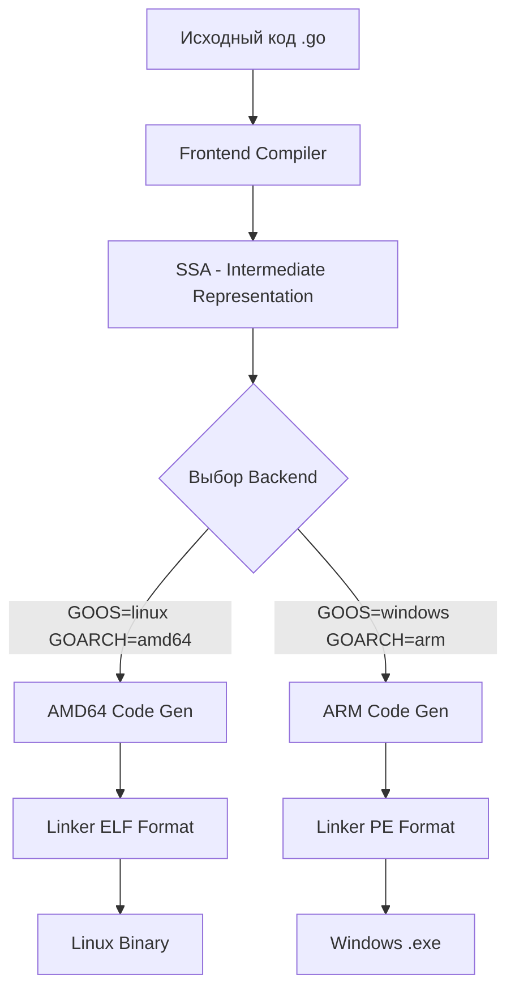

Одной из "киллер-фич" Go, которая выделяет его среди конкурентов (C++, Rust, Java), является встроенная, мгновенная кросс-компиляция. Вы можете сидеть за MacBook на архитектуре Apple Silicon (ARM64) и одной командой собрать бинарник, который запустится на сервере Linux (AMD64) или на старом ПК с Windows (386).

Вам не нужно устанавливать сложные тулчейны, компиляторы C для целевой платформы или виртуальные машины. Весь "зоопарк" архитектур уже зашит в стандартный дистрибутив Go.

## Как это работает (Under the hood)

Компилятор Go написан на Go (с версии 1.5). Он имеет модульную архитектуру, где фронтенд (парсинг, тайп-чекинг) отделен от бэкенда (генерация машинного кода).

Когда вы запускаете сборку, Go выбирает нужный бэкенд на основе переменных окружения `GOOS` и `GOARCH`. Этот бэкенд знает, как генерировать инструкции для конкретного процессора (x86, ARM, RISC-V) и в каком формате упаковать исполняемый файл (ELF для Linux, Mach-O для macOS, PE для Windows).



> [!info] Под капотом
> В директории `$GOROOT/pkg/tool/<host_os>_<host_arch>/` лежат исполняемые файлы компилятора (`compile`) и линкера (`link`).
> Интересно, что сам компилятор умеет генерировать код для любых платформ, независимо от того, на какой платформе он запущен. "Кросс-компилятор" — это дефолтное состояние Go.

## Переменные окружения `GOOS` и `GOARCH`

Это главные рычаги управления. Они определяют целевую операционную систему и архитектуру процессора.

*   **GOOS** (Operating System): `linux`, `windows`, `darwin` (macOS), `freebsd`.
*   **GOARCH** (Architecture): `amd64` (x86-64), `arm64` (AArch64), `arm` (32-bit ARM).

Посмотреть полный список поддерживаемых комбинаций можно командой:
```bash
go tool dist list
# Вывод:
# linux/amd64
# linux/arm64
# windows/amd64
# darwin/arm64
# ...
```

Пример сборки для Linux и Windows одновременно:
```bash
# Сборка для Linux (стандартный сервер)
GOOS=linux GOARCH=amd64 go build -o bin/app_linux .

# Сборка для Windows (утилита для пользователя)
GOOS=windows GOARCH=amd64 go build -o bin/app_windows.exe .
```

> [!warning] Ловушка / Gotcha
> Обратите внимание: если вы собираете под Windows, вы **обязаны** сами указать расширение `.exe` в флаге `-o`. Go создаст файл без расширения, если вы не укажете, но Windows требует `.exe` для запуска. Go не добавляет его автоматически, чтобы не ломать скрипты в Linux/macOS.

## Файловая система: Операционная система в коде

Go кросс-компиляция работает не только на уровне инструкций CPU, но и на уровне API.
Пакет `os` и `syscall` в стандартной библиотеке используют механизм **"File System Stubs"**.

Когда вы компилируете код с `GOOS=windows`, Go использует файлы с суффиксом `_windows.go` (например, `syscall_windows.go`), а файлы `_unix.go` игнорируются. Это позволяет стандартной библиотеке "притворяться" родной для любой ОС, предоставляя корректные пути к файлам (`/` vs `\`), работу с процессами и атрибуты файлов.

## Главная проблема: CGO

Кросс-компиляция работает идеально, пока вы не используете **CGO** (вызов C-кода из Go).

Если ваш код использует `import "C"` или зависит от C-библиотек (например, SQLite, Git bindings, OpenSSL), вам нужен C-компилятор для целевой платформы.
*   На macOS вы вряд ли найдете легко `gcc` для Linux ARM64.
*   Поэтому стандартная кросс-компиляция с CGO — это боль.

Решения:
1.  **Отключить CGO**: `CGO_ENABLED=0`. Это делает ваш бинарник полностью статическим и переносимым, но вы теряете доступ к C-библиотекам.
2.  **Сборка в Docker**: Запустить контейнер с целевой платформой (например, `golang:1.22-alpine-arm64`) и собрать там. Это "нативная" сборка внутри эмулируемой среды.
3.  **Zig CC**: Использовать Zig в качестве C-компилятора. Zig умеет кросс-компилировать C-код из коробки.
    ```bash
    CC="zig cc -target aarch64-linux-musl" CGO_ENABLED=1 GOOS=linux GOARCH=arm64 go build .
    ```

> [!tip] Собеседование
> **Вопрос:** Почему в Go кросс-компиляция простая, а в C++ сложная?
> **Ответ:** В C++ стандартная библиотека и рантайм жестко привязаны к ОС и архитектуре. Вам нужно собирать `libc`, `libstdc++` и системные заголовки для каждой платформы отдельно.
> В Go рантайм (scheduler, GC, map, slice) написан на Go. При кросс-компиляции Go просто перекомпилирует сам свой рантайм под целевую платформу. Это делает его самодостаточным и не зависящим от системных библиотек хоста.

## Итог

1.  Go имеет встроенную кросс-компиляцию через переменные `GOOS` и `GOARCH`.
2.  Компилятор содержит бэкенды для всех популярных платформ.
3.  Для Windows не забывайте добавлять суффикс `.exe`.
4.  **CGO_ENABLED=0** — условие безпроблемной кросс-компиляции.
5.  Для CGO-проектов используйте Docker или Zig.

Мы научились собирать под разные ОС. В следующей статье мы рассмотрим практические аспекты одновременной сборки под множество архитектур: [[33. Сборка под разные платформы]].