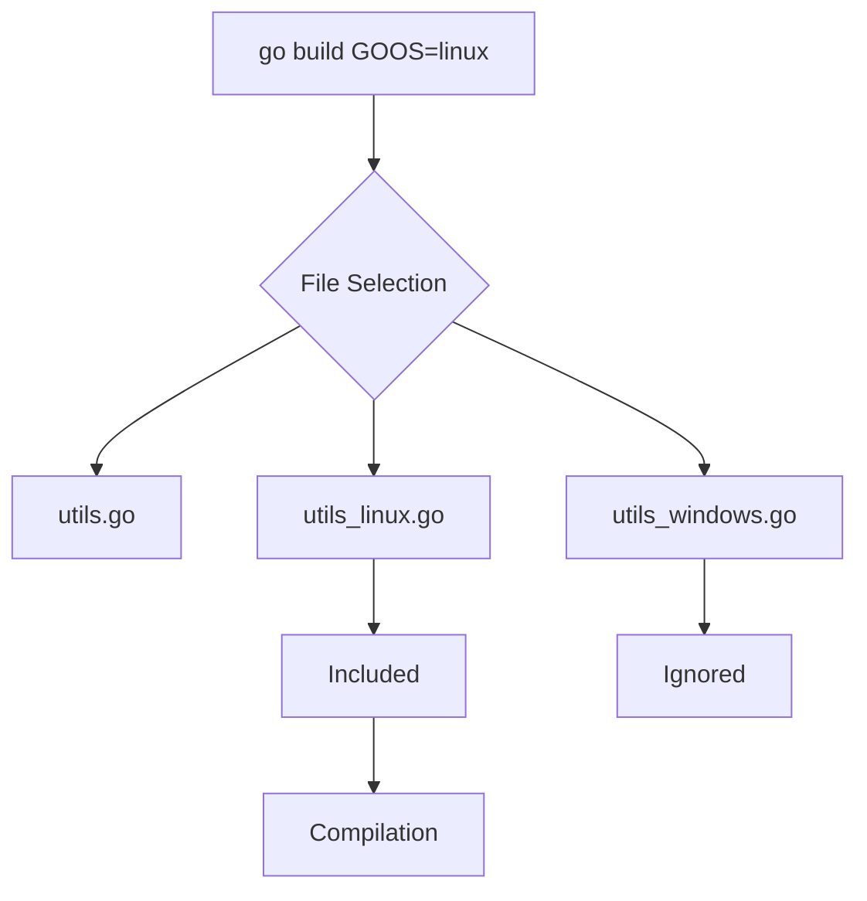

## От теории к практике: Матрица сборки

В предыдущей статье мы научились собирать бинарник для конкретной платформы, выставляя переменные окружения. Однако в реальном релизном цикле нам нужно получить сразу несколько артефактов: бинарник для Linux-сервера, утилиту для macOS-разработчика и клиент для Windows-пользователя.

Процесс одновременной сборки под все целевые платформы требует стратегии именования файлов, управления платформо-зависимым кодом и использования правильных инструментов.

## Стратегия именования артефактов

Главная проблема — коллизия имен. Если вы просто запустите `go build -o app` для Linux, а потом для Windows, второй файл перезапишет первый (или выдаст ошибку).

Стандарт индустрии — включать OS и Architecture в имя файла.
Формат: `<app>-<version>-<os>-<arch>[.exe]`

Пример скрипта сборки на Bash:
```bash
VERSION=$(git describe --tags --always)
APP_NAME="myapp"

PLATFORMS=("linux/amd64" "linux/arm64" "darwin/amd64" "darwin/arm64" "windows/amd64")

for PLATFORM in "${PLATFORMS[@]}"; do
    IFS='/' read -r GOOS GOARCH <<< "$PLATFORM"
    
    OUTPUT_NAME="${APP_NAME}-${VERSION}-${GOOS}-${GOARCH}"
    if [ "$GOOS" = "windows" ]; then
        OUTPUT_NAME+=".exe"
    fi
    
    echo "Building for $GOOS/$GOARCH..."
    env GOOS="$GOOS" GOARCH="$GOARCH" go build -ldflags="-s -w" -o "bin/$OUTPUT_NAME" ./cmd/app
done
```

Этот подход часто используется в `Makefile`, но инструменты вроде **GoReleaser** (см. [[31. Release pipeline и versioning]]) автоматизируют это через YAML-конфигурацию.

## Платформо-зависимый код: Build Tags

Иногда код для Linux и Windows должен отличаться не только поверхностно (слэши в путях), а фундаментально (например, работа с реестром Windows или `syscall.Sigterm` на Linux). Go предоставляет два механизма для этого.

### 1. Суффиксы файлов (Implicit)
Go автоматически включает файлы с суффиксом `_<GOOS>` или `_<GOARCH>` при сборке.

Структура:
```text
sound.go          // Общий интерфейс
sound_linux.go    // Реализация через ALSA/PulseAudio (только для linux)
sound_windows.go  // Реализация через WinAPI (только для windows)
sound_darwin.go   // Реализация через CoreAudio (только для darwin)
```

При `GOOS=linux` файл `sound_windows.go` будет полностью проигнорирован компилятором.

### 2. Явные теги сборки (`//go:build`)
Если логика выбора сложнее (например, "только Linux на ARM" или "FreeBSD или NetBSD"), используются Build Tags.

Файл `server_linux_arm.go`:
```go
//go:build linux && arm

package server

// Этот код скомпилируется только если GOOS=linux И GOARCH=arm
```

Файл `log_unix.go`:
```go
//go:build darwin || linux || freebsd

package log

// Этот код скомпилируется для любой UNIX-подобной системы
```



> [!warning] Ловушка / Gotcha
> Не злоупотребляйте платформо-зависимым кодом. Чем больше `#if defined` (аналог в Go), тем сложнее поддерживать код. Старайтесь максимально использовать стандартную библиотеку `os` и `syscall`, которые абстрагируют различия.

## Docker Multi-Platform: Buildx

Современные реестры (Docker Hub, GHCR) поддерживают манифест-листы (Manifest Lists). Это позволяет одному тегу образа (например, `myapp:latest`) указывать на разные образы для AMD64 и ARM64.

Для сборки таких образов используется `docker buildx`.

```bash
# Создаем и используем билдер
docker buildx create --name mybuilder --use

# Собираем и пушим сразу под 2 архитектуры
docker buildx build \
  --platform linux/amd64,linux/arm64 \
  -t myuser/myapp:latest \
  --push .
```

### Как это работает?
1.  **Native Node**: Если ваш CI-раннер на ARM64, он соберет ARM64-образ нативно, а AMD64 — через эмуляцию (QEMU).
2.  **Cross-Compilation**: В `Dockerfile` можно использовать аргументы `TARGETOS` и `TARGETARCH`, которые Docker передает автоматически.

```dockerfile
# Dockerfile для multi-platform
ARG TARGETOS TARGETARCH

RUN GOOS=$TARGETOS GOARCH=$TARGETARCH go build -o /app ./cmd/app
```

В этом случае Docker запускает компиляцию Go внутри контейнера, передавая правильные значения OS/ARCH для каждого слоя образа. Это медленнее, чем нативная сборка, но проще в настройке (не требует эмуляции всего рантайма).

> [!tip] Собеседование
> **Вопрос:** В чем разница между сборкой Docker-образа через QEMU и через кросс-компиляцию Go?
> **Ответ:**
> *   **QEMU**: Эмулирует целевой процессор. Всё, что происходит внутри `RUN`, работает через прослойку. Это медленно (в 10-50 раз), но позволяет запускать любой Linux-бинар (не только Go).
> *   **Кросс-компиляция Go**: Использует способность Go компилировать код под другую архитектуру без эмуляции. Это очень быстро. В `Dockerfile` мы просто вызываем `go build`, передавая `GOARCH`. Но это работает только для Go-кода. Если в `Dockerfile` есть `apt install`, он выполнится для архитектуры хоста, что может сломать образ.

## Итог

1.  Используйте **матричную сборку** для создания артефактов под все платформы.
2.  Именуйте файлы по стандарту `app-os-arch`.
3.  Используйте суффиксы файлов (`_linux.go`) для разделения кода.
4.  `docker buildx` — стандарт для создания мульти-архитектурных Docker-образов.

Мы научились собирать под разные платформы. Но что если в наш код вмешивается C? В следующей статье мы разберем влияние CGO на процесс сборки: [[34. CGO и его влияние на сборку]].