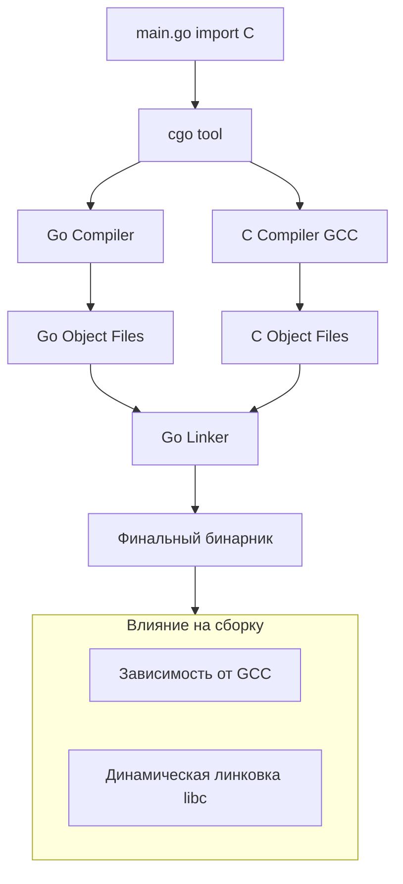

## Мост между мирами: CGO

Go — это язык с управляемой памятью и мощным рантаймом. C — это язык с ручным управлением памятью и прямым доступом к железу. **CGO** — это "клей", который позволяет Go-коду вызывать C-код и наоборот.

Для Senior-разработчика CGO — это мощный, но опасный инструмент. Он открывает доступ к огромной экосистеме C-библиотек (OpenSSL, SQLite, ImageMagick, драйверы БД), но ломает фундаментальные преимущества Go: легковесную статическую компиляцию и безопасность памяти.

## Как это работает (Under the hood)

Когда вы пишете `import "C"` в своем Go-файле, происходит магия, скрытая за инструментом `cgo`.

1.  **Генерация**: `cgo` парсит комментарии над `import "C"` и генерирует два набора файлов:
    *   `.go` файлы с обертками для вызова C-функций.
    *   `.c` файлы с обертками для вызова Go-функций (если нужно экспортировать Go в C).
2.  **Компиляция**: Go-компилятор (`compile`) обрабатывает Go-часть. C-компилятор (`gcc` или `clang`) обрабатывает C-часть.
3.  **Линковка**: Go-линкер (`link`) объединяет все это в один бинарник, подключая системные библиотеки C.



> [!info] Под капотом: Стеки и Runtime
> Это критически важный момент для понимания производительности. Go использует **динамические стеки** (начинаются с 2KB и растут/сжимаются по необходимости). C ожидает **большой фиксированный стек** (обычно 2MB-8MB).
> 
> При вызове C-функции через CGO, Go-рантайм должен "отключить" свой планировщик для текущей горутины и переключиться на системный стек (System Stack, `g0` или `gsignal`). Это дорогостоящая операция (порядка 50-100 наносекунд, что в 10-50 раз дороже обычного вызова функции).
> Поэтому CGO не подходит для узких циклов (например, вызов C-функции для сложения двух чисел в цикле). Оверхед съест весь выигрыш.

## Влияние на сборку и Docker

Включение CGO кардинально меняет требования к среде сборки и выполнения.

### 1. Требуется C-компилятор
Ваш бинарник больше не собирается "из коробки" на чистом Go. Вам нужно установить `build-essential` (Linux), Xcode Command Line Tools (macOS) или MinGW (Windows).

### 2. Динамическая линковка
По умолчанию CGO создает динамически слинкованный бинарник. Он зависит от `libc.so` (glibc) на Linux.
*   Это означает, что вы **не можете** использовать `FROM scratch` в Docker.
*   Вам нужно использовать `FROM alpine` (но там `musl libc`, возможны проблемы совместимости) или `FROM debian/ubuntu`.
*   Бинарник, собранный на Ubuntu, может не запуститься на Alpine из-за разных реализаций libc.

### 3. Смерть кросс-компиляции
Простая команда `GOOS=linux GOARCH=arm64 go build` перестает работать. Кросс-компиляция с CGO требует наличия кросс-компилятора C (`aarch64-linux-gnu-gcc`) и библиотек для целевой платформы.

> [!warning] Ловушка / Gotcha
> Пакет `net` в стандартной библиотеке Go использует CGO по умолчанию на многих системах для DNS-резолвинга (использует системный резолвер).
> Если вы хотите собрать полностью статический бинарник без CGO, но используете пакет `net`, вам нужно явно указать:
> ```bash
> CGO_ENABLED=0 go build -tags netgo -a -v .
> ```
> Иначе вы можете неожиданно получить динамическую зависимость от libc.

## `CGO_ENABLED`: Главный рубильник

Переменная окружения `CGO_ENABLED` управляет поведением:

*   **`CGO_ENABLED=1`**: По умолчанию на Linux/macOS. CGO разрешен. Если есть `import "C"`, он используется. Если нет — стандартные пакеты (вроде `os/user` или `net`) могут использовать C-реализации.
*   **`CGO_ENABLED=0`**: CGO запрещен.
    *   Компилятор полностью игнорирует файлы с `import "C"`.
    *   Все стандартные библиотеки используют чистые Go-реализации (Pure Go implementations).
    *   Результат: статический бинарник, готовый для `scratch`.
    *   Если в вашем коде есть `import "C"`, сборка упадет с ошибкой.

## Производительность и безопасность

Помимо оверхеда на переключение стека, есть более серьезные риски.

1.  **Паники**: C-код не знает о паниках в Go. Если C-код вызовет Segmentation Fault (SIGSEGV), Go-рантайм не сможет его изолировать. Программа упадет (crash), минуя `recover`.
2.  **Garbage Collector**: GC Go не видит память, выделенную в C (через `malloc`). Если вы передаете Go-объект в C, он может быть собран GC, пока C им пользуется (нужно использовать `runtime.SetFinalizer` или `C.GoString` для копирования).

> [!tip] Собеседование
> **Вопрос:** В каком случае стоит использовать CGO, а когда лучше переписать код на Go?
> **Ответ:**
> Использовать CGO стоит только если:
> 1. Нет аналогов на Go (например, драйвер специфичного железа).
> 2. Переписывание огромной библиотеки (например, криптографии или видеокодека) нецелесообразно.
> 
> Всегда предпочтительнее Pure Go реализация. Она безопаснее, быстрее компилируется, легче деплоится (один бинарник) и не ломает кросс-компиляцию.

## Итог

1.  **CGO** — мост в мир C, необходимый для интеграции, но ломающий портабельность Go.
2.  Он требует наличия C-компилятора и системных библиотек.
3.  Влияет на Docker-образы: `scratch` недоступен, нужен `alpine` или `debian`.
4.  Убивает простую кросс-компиляцию.
5.  Отключайте через `CGO_ENABLED=0` для создания полностью статических бинарников.

Мы научились справляться со сложностями сборки. Однако, когда в продакшене происходит падение (crash), нам часто говорят: "соберите с debug-символами". В следующей статье мы разберем, что скрывается внутри бинарника: [[35. Debug сборки и символы]].