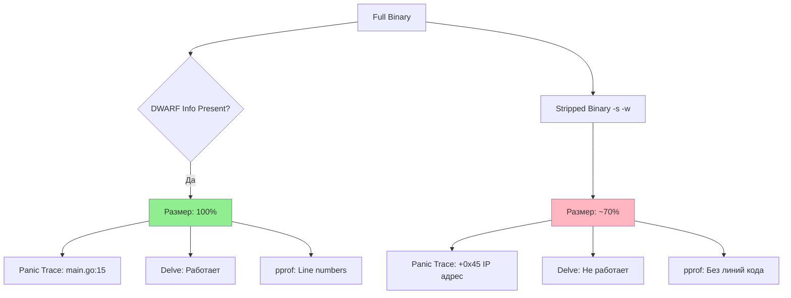

## Невидимый вес: Отладочная информация

При сборке Go-бинарника по умолчанию вы получаете не только машинный код, но и значительный объем метаданных. Это "багаж", который помогает разработчику, но может быть лишним в продакшене.

Понимание того, что находится внутри бинарника и как этим управлять, — важный навык для оптимизации размера дистрибутива и настройки процессов отладки.

## DWARF: Карта внутри бинарника

Go, в отличие от C или C++, по умолчанию собирает бинарники с включенной отладочной информацией. Она хранится в формате **DWARF** (Debugging With Attributed Record Formats).

Эта информация позволяет утилитам (отладчикам, профилировщикам, трассировщикам стека) сопоставлять машинные инструкции с исходным кодом.

Что включает DWARF:
1.  **Таблица символов**: Соответствие адресов памяти именам функций и глобальным переменным.
2.  **Линейная информация**: Мэппинг адресов инструкций на строки исходного кода (`main.go:42`).
3.  **Информация о типах**: Описание структур, интерфейсов и их полей.

> [!info] Под капотом
> Если вы запустите `go build` без флагов, а затем сделаете `go tool objdump -S main`, вы увидите ассемблерный код, перемежающийся строками Go-кода. Это возможно благодаря DWARF-секциям в ELF-файле. Если эту информацию вырезать, останется только "голый" ассемблер.

## `-ldflags="-s -w"`: Хирургическое удаление

Флаги `-s` и `-w`, передаваемые линкеру, позволяют удалить эту информацию, значительно (иногда на 20-30%) уменьшив размер бинарника.

*   **`-s`**: Удаляет таблицу символов (symbol table). Бинарник перестает "знать", как называются его функции.
*   **`-w`**: Удаляет DWARF-информацию (отладочные записи).

```bash
# Полный бинарник: ~15 MB
go build -o app_full .

# Облегченный бинарник: ~10 MB
go build -ldflags="-s -w" -o app_stripped .
```



## Цена легкости: Обратная сторона медали

Уменьшение размера бинарника — это заманчиво, особенно для микросервисов в Docker-образах `scratch`. Однако у этой оптимизации есть высокая цена.

### 1. Бесполезные Stack Traces
Если ваша программа запаникует в продакшене, вы получите трассировку стека.
*   **С DWARF**:
    ```text
    panic: something went wrong
    goroutine 1 [running]:
    main.processData(0x0)
            /app/service/processor.go:45 +0x12a
    main.main()
            /app/cmd/main.go:12 +0x3b
    ```
    Вы сразу видите файл и строку.
*   **Без DWARF (`-s -w`)**:
    ```text
    panic: something went wrong
    goroutine 1 [running]:
    main.processData(0x0)
            <autogenerated>:1 +0x12a
    main.main()
            <autogenerated>:1 +0x3b
    ```
    Вы видите только адреса инструкций. Найти место ошибки можно только с помощью карты адресов (которую нужно строить отдельно) или локальной отладки той же версии кода. Это значительно увеличивает MTTR (Mean Time To Resolve).

### 2. Проблемы с профилированием
Инструменты вроде `pprof` используют DWARF для аннотации профилей CPU и памяти номерами строк. Без этой информации вы будете видеть только имена функций, но не конкретное место в файле, где происходит аллокация или расход CPU.

### 3. Delve не работает
Отладчик Delve (`dlv debug`) полностью полагается на отладочные символы. Вы не сможете поставить точку останова (breakpoint) в коде бинарника, собранного с `-s -w`.

## `go tool nm` и `objdump`

Даже в "облегченных" бинарниках остаются имена пакетов и методов, необходимые для работы反射 (reflection) и интерфейсов. Посмотреть их можно с помощью утилиты `go tool nm`.

```bash
# Список всех символов в бинарнике
go tool nm app_full | grep main
# 10aa40 T main.main
# 10ab20 T main.processData
```

Эта утилита полезна, чтобы убедиться, что нужные функции действительно попали в бинарник (например, при использовании плагинов или сложных build tags), или чтобы найти адрес функции для низкоуровневого дебага.

## Best Practice: Что выбирать?

> [!warning] Ловушка / Gotcha
> Энтузиазм новичков часто приводит к тому, что они везде добавляют `-ldflags="-s -w"`.
> **Правило:** В современном мире хранилища дешевы, а время инженеров дорого.
> *   **Dev / Staging**: Никогда не удаляйте символы. Вам нужна полная информация для отладки.
> *   **Production**: Если вы используете `pprof` в проде (что крайне полезно) или хотите адекватные логи паник — **оставьте символы**. Потеря 5-10 мегабайт на диске незначительна по сравнению с неудобством отладки.
> *   **CLI Tools / Client Apps**: Здесь размер имеет значение для скачивания. Удаление символов оправдано.

Если вы все же вынуждены стрипать бинарники для прода, используйте **символьные серверы** или сохраняйте отдельный "debug" бинарник той же версии в артефакты CI, чтобы иметь возможность сопоставить адрес из паники с кодом.

## Итог

1.  По умолчанию Go включает **DWARF**-отладочную информацию.
2.  Флаги `-ldflags="-s -w"` удаляют её, уменьшая размер файла.
3.  Цена удаления: потеря номеров строк в `panic`, ухудшение работы `pprof`, невозможность использования Delve.
4.  В бэкенд-микросервисах лучше **оставлять отладочную информацию**, чтобы ускорить расследование инцидентов.

Мы разобрались с содержимым бинарника. В следующей статье мы обсудим, как автоматизировать проверку производительности кода в пайплайне: [[36. Профилирование в CI]].