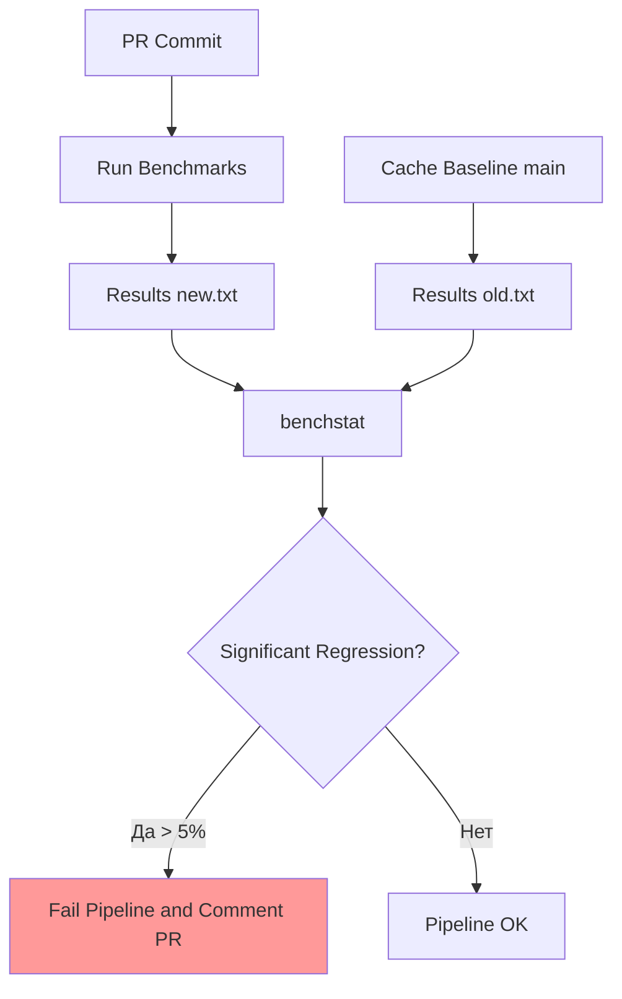

## Профилирование в CI: Охота на регрессии

Мы привыкли, что CI проверяет корректность логики (тесты) и стиль кода (линтеры). Но есть третий критерий, который часто упускают до самого релиза — **производительность**. Код может работать правильно, но стать в 2 раза медленнее или потреблять в 3 раза больше памяти.

Профилирование в CI — это попытка поймать такие регрессии автоматически, до того как они попадут в продакшн. Это "Shift Left" для перформанса.

## Бенчмарки как тесты: `go test -bench`

В Go есть встроенный фреймворк для бенчмарков. В CI их можно запускать так же регулярно, как и юнит-тесты.

```bash
# Запуск бенчмарков
go test -bench=. -benchmem -count=5 ./...
```

*   `-bench=.`: Запускает все функции, начинающиеся с `Benchmark`.
*   `-benchmem`: Показывает количество аллокаций памяти на операцию. Это **самая стабильная метрика** в CI.
*   `-count=5`: Запускает бенчмарк 5 раз для статистической достоверности.

### Проблема: Шум в CI

CI-раннеры — это виртуальные машины в облаке. На них могут запускаться соседние задачи, "шуметь" сеть или диск. Время выполнения (`ns/op`) может прыгать на 10-20% от запуска к запуску, делая автоматическую проверку сложности бесполезной.

> [!warning] Ловушка / Gotcha
> Никогда не пытайтесь сравнивать абсолютное время выполнения (`ns/op`) в CI жестко (например, "если больше 100мс, то fail"). Шум среды убьет ваш пайплайн. Вы будете постоянно перезапускать упавшие билды ("flaky builds").

## `benchstat`: Статистическая значимость

Инструмент `golang.org/x/perf/cmd/benchstat` решает проблему шума. Он использует статистические методы для сравнения двух наборов бенчмарков и определяет, является ли разница значимой.

Сценарий в CI:
1.  Скачать бенчмарки из ветки `main` (базовая линия).
2.  Запустить бенчмарки в текущей ветке (PR).
3.  Сравнить результаты.

```bash
# 1. Сохраняем результаты ветки main (условно)
go test -bench=. -count=10 ./... > old.txt

# 2. Сохраняем результаты текущей ветки
go test -bench=. -count=10 ./... > new.txt

# 3. Сравниваем
benchstat old.txt new.txt
```

Вывод `benchstat` покажет, есть ли статистически значимая разница (p-value < 0.05) и насколько она велика в процентах.



## Аллокации: Самый надежный индикатор

В отличие от CPU времени, количество аллокаций (`B/op` и `allocs/op`) почти не зависит от шума среды. Это детерминированная метрика: один и тот же код всегда делает одно и то же количество аллокаций.

Именно на аллокации стоит ставить жесткие ворота (Quality Gates).

> [!info] Под капотом
> Escape Analysis (анализ побега) работает на этапе компиляции. Если компилятор решил, что переменная `x` убежит в кучу, она будет аллоцироваться всегда. Количество аллокаций в бенчмарке — это прямое следствие работы компилятора. Если вы добавили новое поле в структуру, которое используется в "горячем" цикле, и оно увеличило количество аллокаций с 0 до 1 — это серьезная проблема, которую `benchstat` (или даже простое сравнение чисел) обнаружит мгновенно.

## `pprof` в артефактах

Если бенчмарки показывают регрессию, разработчику нужно понять, *где* она произошла. В CI сложно запустить интерактивный `go tool pprof -http`, но можно сохранить профиль как артефакт.

В Go тесты поддерживают флаги профилирования:
```bash
go test -cpuprofile=cpu.out -memprofile=mem.out -bench=.
```

В GitHub Actions или GitLab CI эти файлы можно сохранить как артефакты. Разработчик скачивает `cpu.out` и анализирует его локально:
```bash
go tool pprof -http=:8080 cpu.out
```

Это превращает "сломанный тест" в конкретный Flame Graph.

## Continuous Profiling (Продвинутый уровень)

Следующий этап — интеграция CI с системами Continuous Profiling (например, Pyroscope, Grafana Phlare). В этом случае данные профилирования загружаются в хранилище и сравниваются не просто с `main`, а с исторической динамикой.

Однако для большинства задач **сравнение бенчмарков через `benchstat` и контроль аллокаций** — это золотой стандарт, который не требует сложной инфраструктуры.

> [!tip] Собеседование
> **Вопрос:** Почему проверки производительности в CI часто называют "flaky" (нестабильными)?
> **Ответ:** Потому что производительность (CPU time) зависит от внешних факторов (нагрузка на гипервизоре, состояние кэша CPU соседних процессов). Чтобы избежать этого, нужно использовать:
> 1. Статистическую обработку (`benchstat`).
> 2. Метрики, не зависящие от времени (Allocs/op).
> 3. Выделенные (dedicated) раннеры для performance-тестов, если важны абсолютные цифры CPU.

## Итог

1.  Профилирование в CI помогает ловить регрессии производительности до продакшена.
2.  Используйте `go test -bench` с флагом `-benchmem`.
3.  **Аллокации** — самая надежная метрика для автоматических проверок.
4.  Используйте `benchstat` для корректного сравнения результатов.
5.  Сохраняйте `cpu.out` и `mem.out` как артефакты для ручного разбора.

Мы научились контролировать качество кода и его производительность. Теперь нужно разобраться с теми материальными ценностями, которые мы производим в конце конвейера. В следующей статье мы поговорим об управлении результатами сборки: [[37. Артефакты сборки]].