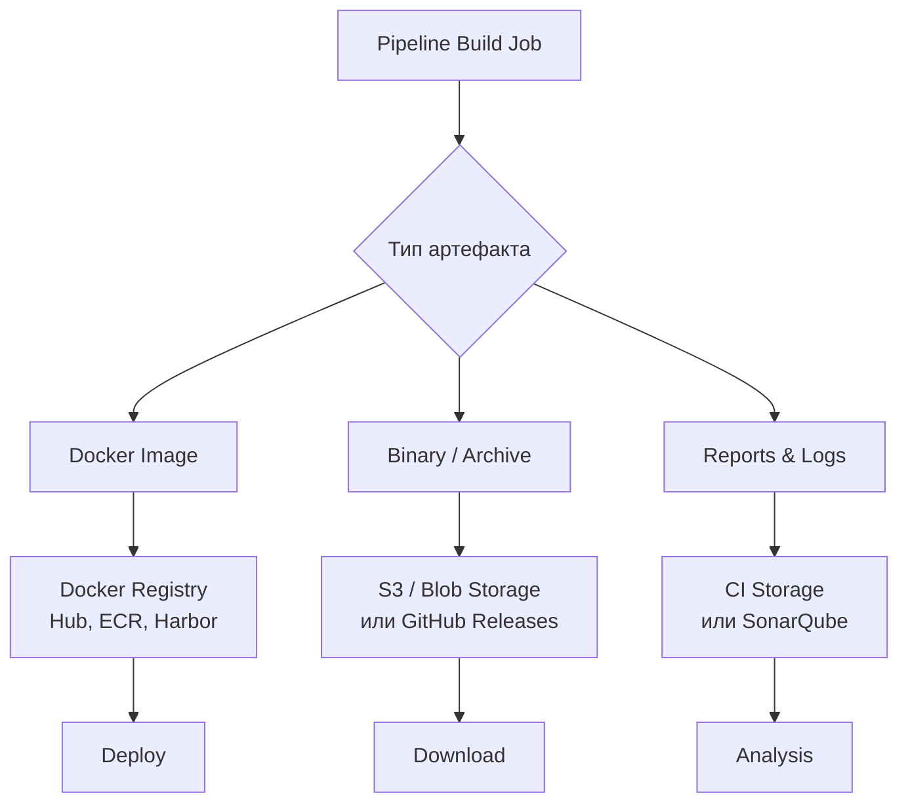

## Материальные ценности конвейера

CI/CD пайплайн — это фабрика. Сырьем служит исходный код, а готовой продукцией — **Артефакты**. Это файлы, которые генерируются в процессе сборки и должны быть сохранены для последующего использования: распространения, деплоя или анализа.

Понимание того, что считать артефактом, как его хранить и как обеспечить его неизменность, отличает зрелый пайплайн от скрипта "собрать и забыть".

## Классификация артефактов

В экосистеме Go артефакты можно разделить на три категории:

1.  **Исполняемые (Executable)**: Бинарники, Docker-образы. Их цель — быть запущенными в среде исполнения.
2.  **Архивы (Archives)**: `.tar.gz`, `.zip`, содержащие бинарники, конфигурации и скрипты. Нужны для распространения (дистрибутивы CLI).
3.  **Метаданные и Отчеты (Reports)**: Результаты тестов (`junit.xml`), отчеты покрытия (`coverage.out`), профили (`cpu.out`), SBOM (Software Bill of Materials). Их цель — анализ и аудит.



## Docker Image как главный артефакт

В современной бэкенд-разработке Docker-образ стал основным единичным артефактом. Это не просто файл, а упакованное окружение.

### Иммутабельность (Immutability)
Это золотое правило. Один и тот же артефакт должен проходить путь Development -> Staging -> Production.
*   **Неправильно**: Собрать отдельный образ для прода с другими флагами.
*   **Правильно**: Собрать образ один раз по тегу (например, `myapp:v1.0.0-abc123`), протестировать его, и именно этот образ (по его SHA-256 дайджесту) задеплоить в прод.

> [!warning] Ловушка / Gotcha
> Не используйте тег `latest` или теги веток (`main`, `develop`) для деплоя. Они изменчивы (mutable). Сегодня `latest` указывает на версию 1.0, а завтра на 2.0. Используйте уникальные теги, основанные на Git Commit SHA или SemVer (например, `v1.2.3` или `1.2.3-abc1234`). Это гарантирует, что вы деплоите именно то, что тестировали.

## Хранение бинарников и архивов

Go позволяет создавать автономные бинарники, что упрощает дистрибуцию CLI-утилит или десктопных приложений.

1.  **GitHub Releases**: Стандарт для Open Source. GoReleaser умеет автоматически загружать архивы (`.tar.gz`, `.zip`) и чек-суммы на страницу релиза.
2.  **S3 / Nexus / Artifactory**: Для приватных проектов. Храните бинарники в объектном хранилище с политиками жизненного цикла (Lifecycle Policies) — удалять старые версии через N дней.

## Отчеты и Промежуточные файлы

CI-системы (GitHub Actions, GitLab CI) предоставляют временное хранилище для артефактов, созданных в рамках пайплайна.

Эти артефакты живут недолго (обычно 7-90 дней) и нужны для:
*   Передачи данных между джобами (Job A компилирует -> Job B тестирует).
*   Скачивания разработчиком для локального анализа (например, `coverage.out` или скриншоты упавших UI-тестов).

> [!info] Под капотом
> В GitHub Actions артефакты загружаются через действие `actions/upload-artifact`. Это работает через API GitHub, который сохраняет файлы во внутреннее хранилище Azure. При скачивании (`actions/download-artifact`) раннер получает их обратно. Учтите, что это **не** Docker Registry. Хранить там образы нельзя, только файлы.

## Security: SBOM и Подпись (Signing)

Современный стандарт безопасности требует, чтобы артефакт содержал не только код, но и информацию о том, из чего он состоит.

### 1. SBOM (Software Bill of Materials)
Список материалов программного обеспечения. Это файл (обычно SPDX или CycloneDX формат), который перечисляет все зависимости и их версии, заблокированные в артефакте. Это критично для быстрой реакции на уязвимости (например, Log4Shell).

В Go можно генерировать SBOM с помощью `syft` (от Anchore):
```bash
# Генерация SBOM для Docker образа
syft myapp:v1.0.0 -o spdx-json > sbom.spdx.json
```

### 2. Signing (Подписывание)
Как доказать, что бинарник или образ собран именно вашим CI-сервером, а не злоумышленником?
Инструмент **Cosign** (от Sigstore) позволяет подписывать Docker-образы.

```bash
# Подпись образа ключом
cosign sign --key cosign.key myregistry/myapp:v1.0.0

# Проверка перед деплоем в Kubernetes
cosign verify --key cosign.pub myregistry/myapp:v1.0.0
```

Это превращает артефакт в "запечатанный контейнер", который Kubernetes (через Admission Controller) может проверить перед запуском.

## Итог

1.  **Артефакт** — это результат работы CI, подлежащий хранению.
2.  Главный принцип: **Build Once, Deploy Anywhere**. Не пересобирайте артефакты для разных сред.
3.  Используйте уникальные теги (Git SHA) для идентификации.
4.  Для продакшена обязательны **SBOM** и **Signing** (Cosign) для безопасности цепочки поставок.

Артефакты созданы, подписаны и сохранены. Осталось дело за малым: донести эту радостную весть до пользователей и автоматизировать финальный шаг публикации. В следующей статье мы обсудим: [[38. Автоматизация релизов]].