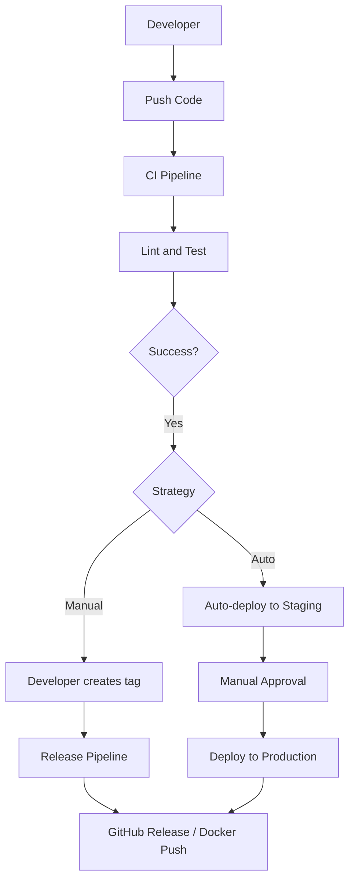

Релиз — это не просто "нажать кнопку". Это процесс превращения набора изменений в истории коммитов в формальный, маркированный и доставленный пользователю продукт. В идеальном мире релиз — это скучное, рутинное событие, происходящее по щелчку или автоматически, лишенное человеческих ошибок и "забыл обновить версию".

Главная цель автоматизации релизов — сделать их **предсказуемыми** и **воспроизводимыми**.

## Стратегии триггеров: Когда начинать?

Существует два основных подхода к запуску релизного конвейера.

### 1. Явный тег (Manual Trigger)
Классический подход для Go-библиотек и утилит. Разработчик решает, когда код готов.
```bash
git tag v1.2.0
git push origin v1.2.0
```
Плюсы: Полный контроль. Вы никогда не выпустите сломанный код, если не захотите.
Минусы: Зависит от дисциплины разработчика. Легко забыть обновить CHANGELOG.

### 2. Автоматический (Continuous Delivery)
Используется в веб-сервисах. Каждое успешное слияние (Merge) в ветку `main` или `master` запускает процесс деплоя. Версионирование в этом случае часто опирается на Git SHA или инкрементальные номера билдов (`v1.2.0+build.123`).



> [!info] Под капотом
> В GitHub Actions для запуска пайплайна по тегу используется фильтр:
> ```yaml
> on:
>   push:
>     tags:
>       - 'v*.*.*'
> ```
> Это позволяет отделить "обычные" проверки (на каждый коммит) от "релизных" задач (сборка артефактов, обновление Homebrew формулы), которые выполняются редко.

## GoReleaser: "Швейцарский нож"

Мы упоминали его ранее, но в контексте автоматизации релизов он незаменим. GoReleaser закрывает 90% проблем, с которыми сталкиваются Go-разработчики при выпуске версий.

Что он автоматизирует:
1.  **Версионирование**: Берет версию из Git-тега.
2.  **Кросс-компиляция**: Собирает бинарники для всех популярных ОС.
3.  **Архивация**: Упаковывает бинарники, README и LICENSE в архивы.
4.  **Changelog**: Автоматически генерирует список изменений из коммитов.
5.  **Публикация**: Создает Release на GitHub, загружает файлы.
6.  **Homebrew/Scoop**: Автоматически обновляет формулы для пакетных менеджеров (чтобы пользователи могли делать `brew upgrade myapp`).

> [!warning] Ловушка / Gotcha
> Если вы используете GoReleaser в CI, убедитесь, что у раннера есть права на запись в репозиторий (`contents: write`). Иначе шаг создания GitHub Release упадет с ошибкой 403 Forbidden.

## Разделение обязанностей: Build vs Release

В сложных системах полезно разделять пайплайны.
*   **Build Pipeline** (на каждый коммит): Собирает Docker-образ, тегает его по SHA (`myapp:abc123`), прогоняет тесты. Результат: "зеленый" образ в регистри.
*   **Release Pipeline** (по тегу или кнопке): Не собирает код! Он берет уже готовый Docker-образ (по SHA), тегает его как `v1.2.0` и `latest`, обновляет конфиги в Kubernetes и рассылает уведомления.

Это гарантирует, что в продакшен попадает именно тот код, который тестировали, а не "та же версия, но пересобранная с другим базовым образом".

## Уведомления и Обратная связь

Автоматизация не заканчивается на загрузке файла. Команда должна знать, что произошло.
Интеграция CI с Slack, Telegram или Email — стандарт. Скрипт отправки сообщения должен содержать:
*   Версию релиза.
*   Ссылку на Changelog.
*   Ссылку на артефакты.
*   Статус (Success/Fail).

## Итог

1.  Автоматизация релизов убирает человеческий фактор из рутины.
2.  Выбирайте стратегию триггера (Tag vs Auto) в зависимости от типа продукта (CLI vs Web Service).
3.  Используйте **GoReleaser** для Go-утилит — это стандарт индустрии.
4.  Разделяйте сборку (Build) и релиз (Release) для гарантии идентичности артефактов.

Мы автоматизировали процесс выпуска. Но как объяснить пользователям (и себе через полгода), что именно изменилось в новой версии? В следующей статье мы разберем генерацию логов изменений: [[39. Changelog и semantic release]].