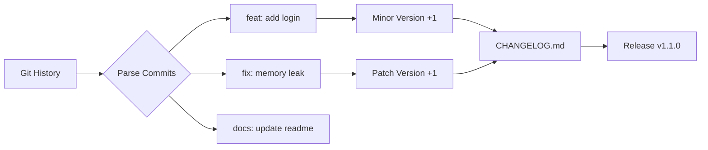

## Связь с пользователем: Changelog и semantic release

В предыдущей статье мы автоматизировали сборку и публикацию. Но остался один важный человеческий аспект: **коммуникация**. Пользователи вашего ПО (будь то клиенты API, другие разработчики или SRE-инженеры) должны знать, что изменилось.

"Исправлены баги" — это плохой ченджлог. "Add user authentication via OAuth2" — это хороший ченджлог. Чтобы генерировать осмысленные списки изменений автоматически, нам нужен порядок в истории коммитов.

## Conventional Commits: Фундамент автоматизации

Вся современная экосистема автоматизации релизов держится на стандарте **Conventional Commits**. Это соглашение о формате сообщений коммитов.

Формат: `<type>(<scope>): <description>`.

Основные типы:
*   **`feat`**: Новая функциональность (соответствует **MINOR** версии в SemVer).
*   **`fix`**: Исправление бага (соответствует **PATCH** версии).
*   **`docs`**: Изменения в документации.
*   **`chore`, `refactor`, `style`**: Технические изменения, не влияющие на API (обычно не попадают в CHANGELOG или идут в секцию "Maintenance").
*   **`BREAKING CHANGE`**: (в футере коммита или `!` после типа) — ломает обратную совместимость (соответствует **MAJOR** версии).



> [!warning] Ловушка / Gotcha
> Автоматизация работает только при жесткой дисциплине в команде. Если разработчик пишет коммит "fix stuff" вместо "fix: resolve race condition in handler", ваш Changelog будет бесполезен. Используйте **Commit Linting** (инструменты вроде `commitlint`) в pre-commit хуках или CI, чтобы принудительно требовать правильный формат.

## Semantic Release: Полная автоматизация

Инструмент **Semantic Release** (популярный в JS-экосистеме, но применимый везде) автоматизирует весь цикл релиза на основе коммитов.

Его алгоритм работы:
1.  Анализирует коммиты с последнего релиза.
2.  Определяет новую версию (например, был `1.0.0`, увидел `feat` -> станет `1.1.0`).
3.  Генерирует `CHANGELOG.md`.
4.  Создает Git Tag.
5.  Публикует релиз на GitHub/GitLab.

Для Go проектов это может быть избыточно (требует Node.js рантайма для запуска самого инструмента), но в крупных монорепозиториях это стандарт.

## Go-нативный подход: `svu` и GoReleaser

Для Go-разработчиков есть более "легкие" альтернативы, написанные на Go.

### 1. `svu` (Semantic Version Util)
Небольшая утилита, которая анализирует git-историю и выводит следующую версию.
```bash
# Текущая версия v1.0.0
git commit -m "feat: add new feature"

# svu вычислит следующую версию
svu next
# Вывод: v1.1.0
```
Это можно использовать в скриптах:
```bash
VERSION=$(svu next)
git tag $VERSION
git push origin $VERSION
```

### 2. GoReleaser Changelog
GoReleaser умеет генерировать Changelog из коробки. Конфигурация в `.goreleaser.yml` позволяет фильтровать шум.

```yaml
release:
  footer: |
    ### Thanks to all contributors!

changelog:
  sort: asc
  filters:
    exclude:
      - '^docs:'
      - '^test:'
      - '^chore:'
      - '^style:'
```

При запуске `goreleaser` он создаст релиз на GitHub, в котором коммиты будут отфильтрованы и сгруппированы.

## Куда девать CHANGELOG.md?

В библиотеках (Open Source) файл `CHANGELOG.md` обычно коммитят прямо в репозиторий.
В микросервисах создавать файл в репо часто избыточно. Достаточно страницы релиза на GitHub/GitLab, которая генерируется автоматически. CI-пайплайн может отправлять содержимое Changelog в Slack-канал или корпоративный Wiki (Confluence) при деплое.

## Итог

1.  **Conventional Commits** — язык, на котором "говорит" автоматизация релизов.
2.  Semantic Release позволяет полностью автоматизировать версионирование (Build -> Version -> Release).
3.  Для Go удобны нативные инструменты: **`svu`** для определения версии и **GoReleaser** для генерации логов.
4.  Настройте `commitlint`, чтобы разработчики не портили историю мусорными коммитами.

Мы прошли долгий путь: от настройки локального окружения до полностью автоматизированного, безопасного и информативного релизного цикла. В следующей, финальной статье раздела, мы подведем черту под всем инструментарием: [[40. Итоги раздела. Production ready toolchain]].