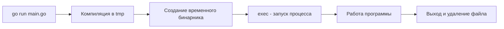

Разработчики, приходящие из Python, PHP или Node.js, привыкли к интерпретируемому циклу: изменил код -> нажал Enter -> увидел результат. В компилируемых языках традиционно этот цикл длиннее: изменил код -> скомпилировал -> запустил бинарник -> увидел результат.

Команда `go run` — это мост между этими мирами. Она создает иллюзию интерпретации, хотя под капотом происходит полноценная компиляция. Понимание того, как работает `go run`, позволяет использовать её эффективно, не попадая в ловушки производительности и дискового пространства.

## Как работает `go run` (Under the hood)

Многие новички думают, что `go run` — это интерпретатор. Это опасное заблуждение. `go run` — это, по сути, сценарий `go build` + `exec`.

Когда вы запускаете `go run main.go`, происходит следующее:

1.  **Анализ и компиляция**: Go тулчейн компилирует исходный код во временный бинарный файл. Это полноценная компиляция со всеми оптимизациями.
2.  **Временное хранилище**: Бинарник создается во временной директории (обычно `/tmp` в Linux или `%TEMP%` в Windows).
3.  **Исполнение**: Системный вызов `exec` заменяет текущий процесс Go на процесс вашего скомпилированного бинарника.
4.  **Очистка**: После завершения работы программы (или если она была прервана сигналом), временный файл удаляется.



> [!info] Под капотом
> Вы можете увидеть, где именно создается временный файл, используя флаг `-work`.
> ```bash
> go run -work main.go
> # WORK=/tmp/go-build123456789
> ```
> Директория не удалится после запуска, и вы сможете заглянуть внутрь и увидеть скомпилированный бинарник. Это полезно для отладки сложных сценариев сборки.

## Разница между файлом и пакетом

Это классическая ошибка новичков.
*   `go run main.go` — компилирует и запускает только этот файл. Если в вашей директории есть другие файлы с функциями, которые вызывает `main`, вы получите ошибку `undefined`.
*   `go run .` — компилирует и запускает **весь пакет** в текущей директории. Это идиоматичный способ запуска локальных приложений.

Также можно запускать пакеты по пути импорта, если они находятся в `GOPATH` или `go.mod`:
```bash
go run github.com/myuser/myproject/cmd/server
```

## Аргументы и флаги

Частая путаница возникает при передаче флагов приложению. `go run` принимает свои флаги (например, `-race` или `-tags`) до имени файла, а флаги вашего приложения — после.

```bash
# Неправильно: go run попытается интерпретировать -config как свой флаг
go run main.go -config=dev.yaml

# Правильно: флаги go run идут до точки/файла, аргументы приложения — после
go run . -config=dev.yaml
```

Если нужно передать специфичные флаги для Go, используйте разделитель `--`, хотя это редко требуется в повседневной разработке.

## Инструментарий для разработки (Dev Tools)

`go run` отлично подходит для быстрых экспериментов, но для реальной разработки на бэкенде (HTTP-серверы, gRPC-сервисы) перезапускать сервер вручную после каждого изменения утомительно.

В экосистеме Go стандартом де-факто стали инструменты **Live Reload**. Они используют `go run` или `go build` под капотом, но автоматически перезапускают процесс при изменении файлов.

Самый популярный инструмент — **Air** (cosmtrek/air).

Пример `.air.toml` конфигурации:
```toml
[build]
  cmd = "go build -o ./tmp/main ."
  bin = "./tmp/main"
  include_ext = ["go", "tpl", "tmpl", "html"]
  exclude_dir = ["assets", "tmp", "vendor"]
```

Air следит за файловой системой (используя `fsnotify`), при изменении `.go` файлов вызывает `go build`, убивает старый процесс и запускает новый.

> [!warning] Ловушка / Gotcha
> При использовании `go run` с флагом `-race` (детектор гонок данных) программа работает медленнее (иногда в 5-10 раз) и потребляет больше памяти.
> *   В продакшене `-race` обычно не используют из-за оверхеда.
> *   Но в разработке (`go run -race main.go` или в тестах `go test -race`) это обязательно для отлова ошибок конкурентности на ранних стадиях.

## `go run` vs `go build`: Что выбрать?

| Характеристика | `go run` | `go build` |
| :--- | :--- | :--- |
| **Результат** | Запуск программы, артефакт удаляется. | Создание бинарника на диске. |
| **Скорость старта** | Чуть медленнее (нужно скомпилировать). | Мгновенный запуск готового файла. |
| **Использование** | Локальная разработка, скрипты, прототипирование. | CI/CD, продакшн, распространение. |
| **Отладка** | Удобно для быстрых проверок. | Требует сборки и запуска дебаггера (Delve). |

## Итог

1.  **`go run`** не является интерпретатором, он компилирует код во временный файл и запускает его.
2.  Всегда запускайте пакет (`go run .`), а не один файл (`go run main.go`), чтобы избежать проблем с линковкой.
3.  Используйте флаг `-work`, чтобы понять, куда Go складывает временные файлы.
4.  Для разработки серверов используйте инструменты Live Reload (Air), которые автоматизируют процесс перезапуска `go run`.

Мы научились быстро запускать код локально. Но что, если нам нужно установить написанный инструмент в систему, чтобы вызывать его из любой точки терминала? Об этом поговорим в следующей статье: [[5. go install и установка CLI]].