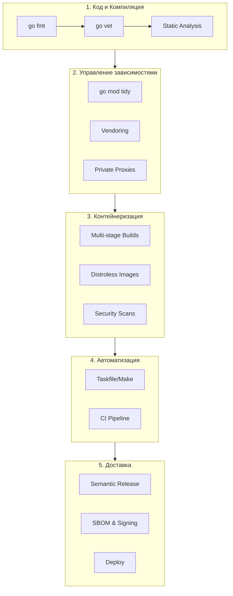

## Production Ready Toolchain: Эволюция процесса

Мы прошли путь от первой команды `go build` до полностью автоматизированного релизного конвейера. Этот раздел был посвящен не просто инструментам, а философии **инженерной дисциплины**. В Go "инструментарий" — это не отдельная профессия (как DevOps в других языках), а неотъемлемая часть компетенции каждого разработчика.

Мы убедились, что Go уникален: его тулчейн встроен в язык, а бинарник — это самодостаточная единица доставки. Это снимает 90% проблем, с которыми сталкиваются пользователи Python, Node.js или Java (зависимости рантайма, виртуальные окружения, класспасы).

## Пять уровней зрелости

Подводя итог разделу, мы можем выделить пять уровней "Production Readiness", которые мы настроили.

### 1. Код и Компиляция
Мы поняли, что `go build` — это вершина айсберга. Под ним скрываются SSA, оптимизации и линковка.
*   **Ключевой навык**: Умение пользоваться `-ldflags` для внедрения версий и понимание разницы между `go build` и `go install`.
*   **Инструменты**: `go fmt`, `go vet`, `golangci-lint`.

### 2. Управление зависимостями
Модули Go (`go.mod`) решили проблему ада зависимостей через строгий алгоритм MVS и семантическое версионирование.
*   **Ключевой навык**: Понимание, почему `v2+` требует изменения пути импорта, и умение работать с `replace` и `GOPRIVATE` для корпоративных нужд.
*   **Статьи для повторения**: [[12. Модули. go.mod и go.sum]], [[13. Versioning. SemVer и совместимость]].

### 3. Контейнеризация
Go идеально ложится в докер благодаря статической компиляции.
*   **Ключевой навык**: Написание эффективных `Dockerfile` с использованием кэширования слоев и `Multi-stage builds`. Выбор между `Alpine`, `Distroless` и `Scratch`.
*   **Статьи для повторения**: [[23. Multi stage сборки Docker]], [[24. Минимизация образов. scratch, distroless]].

### 4. Автоматизация
Ручной труд — враг надежности. Мы научились описывать задачи декларативно.
*   **Ключевой навык**: Написание `Makefile` или `Taskfile` как единой точки входа (Single Source of Truth) для проекта.
*   **Статьи для повторения**: [[20. Makefile для Go проектов]], [[21. Taskfile как альтернатива Makefile]].

### 5. Доставка (CI/CD)
Финальный этап — превращение кода в продукт. Мы настроили "ворота качества" и автоматизировали релизы.
*   **Ключевой навык**: Настройка пайплайнов GitHub Actions / GitLab CI, разделение Build и Release стадий, внедрение безопасности (SBOM, signing).
*   **Статьи для повторения**: [[27. GitHub Actions для Go]], [[38. Автоматизация релизов]].

## Мышление Senior-уровня

> [!tip] Собеседование
> **Вопрос:** Что отличает "Senior" подход к инструментарию от "Junior"?
> **Ответ:** Junior думает: "Как мне запустить это у себя?".
> Senior думает: "Как мне сделать так, чтобы это собиралось, тестировалось и деплоилось автоматически и одинаково у всех, даже когда я буду в отпуске?".
> 
> Senior понимает, что тулинг — это не рутина, а управление рисками (Risk Management). Кэширование слоев экономит деньги компании. `govulncheck` предотвращает взлом. `Multi-stage builds` уменьшают поверхность атак.

## Итог

Раздел "Инфраструктура и Тулинг" завершен. У вас теперь есть база знаний для создания надежного, быстрого и безопасного цикла разработки (DevOps Lifecycle) на Go. Мы закрыли вопросы "Как собирать?" и "Как доставлять?".