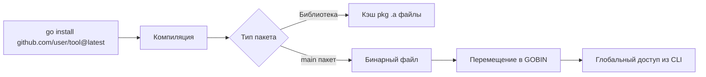

Если `go build` создает бинарник "здесь и сейчас", а `go run` запускает его "на лету", то `go install` — это команда для внедрения вашего (или чужого) инструмента в систему. Это способ превратить исходный код на Go в постоянную утилиту командной строки, доступную из любого места терминала.

Для разработчиков, переходящих с `npm install -g` или `pip install`, концепция `go install` покажется знакомой, но с важными нюансами, касающимися версионирования и изоляции.

## Что делает `go install`?

По своей сути, `go install` очень похож на `go build`. Она компилирует пакеты (используя тот же кэш и компилятор). Однако у неё есть два критических отличия:

1.  **Назначение:** Она сохраняет скомпилированный бинарник в специальную директорию `$GOBIN` (или `$GOPATH/bin`, если `GOBIN` не задан), а не в текущую рабочую директорию.
2.  **Артефакты:** Для пакетов, не являющихся `main` (библиотеки), она компилирует и сохраняет объектные файлы (`.a`) в кэш `$GOPATH/pkg`, что ускоряет последующие сборки.



## Настройка окружения: $GOBIN

Ключевое условие для комфортной работы с `go install` — правильная настройка переменных окружения.

По умолчанию Go использует структуру `GOPATH`. Однако современной лучшей практикой является явное указание переменной `GOBIN`.

```bash
# ~/.bashrc или ~/.zshrc
export GOBIN=$HOME/go/bin
export PATH=$PATH:$GOBIN
```

Если `GOBIN` не установлен, бинарники падают в `$GOPATH/bin`. Если вы не добавите эту директорию в `$PATH`, команда `go install` отработает "успешно", но вы не сможете запустить установленную утилиту просто набрав её имя.

> [!warning] Ловушка / Gotcha
> Если вы работаете внутри директории с `go.mod`, команда `go install` без аргументов установит бинарник текущего проекта. Если вы хотите установить сторонний инструмент, находясь внутри проекта, **обязательно указывайте путь к пакету с суффиксом версии**. В противном случае Go попытается обновить зависимости вашего текущего проекта, что может привести к неожиданным изменениям в `go.mod`.

## Версионирование: Суффикс `@version`

До появления модулей (Go 1.16), `go get` использовался и для зависимостей, и для установки инструментов. Это приводило к хаосу: `go get` менял `go.mod` вашего проекта, когда вы просто хотели установить линтер.

Сейчас принят четкий стандарт:
*   **`go install pkg@version`** — для установки инструментов (CLI). **НЕ меняет** `go.mod` текущего проекта.
*   **`go get pkg`** — для управления зависимостями проекта (устаревает в пользу `go get` только для обновлений, но `go mod tidy` предпочтительнее).

Примеры установки популярных инструментов:

```bash
# Установка последней версии линтера
go install github.com/golangci/golangci-lint/cmd/golangci-lint@latest

# Установка конкретной версии (важно для CI reproducibility)
go install mvdan.cc/gofumpt@v0.5.0

# Установка генератора моков
go install github.com/vektra/mockery/v2@v2.38.0
```

> [!info] Под капотом
> При использовании суффикса `@version` (например, `@latest` или `@v1.2.3`), `go install` работает в режиме **module-aware**. Он скачивает указанную версию модуля в кэш (`$GOMODCACHE`), компилирует её и устанавливает бинарник. При этом он полностью игнорирует `go.mod` файл в текущей директории, что обеспечивает изоляцию ваших инструментов от зависимостей проекта.

## Замена бинарников и Конфликты

Если вы установили `tool@v1.0`, а затем запустили `go install tool@v2.0`, Go просто перезапишет бинарник в `$GOBIN`. Там не может быть двух версий одной утилиты одновременно. Имя файла бинарника определяется последним сегментом пути импорта (или значением `go install -name`, что используется редко).

Это создает классическую проблему "dependency hell" для инструментов CLI, но в Go она решается просто: вы устанавливаете ту версию, которая нужна вам прямо сейчас. Если вам нужно держать несколько версий одновременно, придется переименовывать бинарники вручную или использовать менеджеры версий.

## `go install` vs `go build -o`

| Характеристика | `go build -o /path/bin/app` | `go install` |
| :--- | :--- | :--- |
| **Цель** | Гибкая сборка для распространения или тестирования. | Стандартная установка инструментов в систему. |
| **Зависимости** | Требует явного указания пути вывода. | Знает "правильное место" (`$GOBIN`) автоматически. |
| **Версионирование** | Нет встроенной поддержки `@version` при сборке локального кода. | Позволяет скачивать и собирать конкретные версии удаленных репозиториев. |
| **Использование** | CI/CD пайплайны, создание релизов. | Локальная разработка, установка линтеров, генераторов. |

> [!tip] Собеседование
> **Вопрос:** В чем разница между `go get` и `go install` в современных версиях Go (1.18+)?
> **Ответ:** `go get` теперь предназначен только для добавления или обновления зависимостей в файле `go.mod` (и фактически депрекейтед в пользу `go mod tidy` / `go get` для обновления). `go install` с суффиксом `@version` — это единственный правильный способ установки бинарников (CLI tools) без загрязнения `go.mod` текущего проекта.

## Итог

1.  **`go install`** — это способ "зарегистрировать" программу в ОС, положив её в `$GOBIN`.
2.  Всегда добавляйте `$GOBIN` в системный `$PATH`.
3.  Используйте суффикс `@version` (например, `@latest`), чтобы установить инструмент, не затрагивая зависимости текущего проекта.
4.  Для библиотек `go install` кэширует объектные файлы, ускоряя сборку.

Теперь, когда у нас установлены необходимые инструменты, самое время научиться проверять работоспособность нашего кода. В следующей статье мы перейдем к одной из самых мощных частей тулчейна — встроенному фреймворку тестирования. Читаем: [[6. go test. Запуск тестов и флаги]].