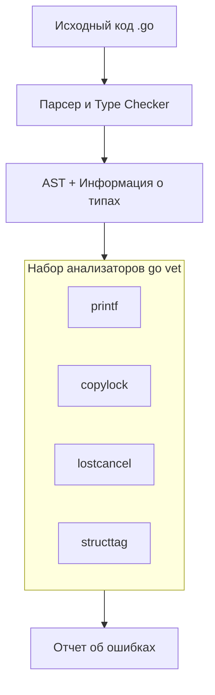

Если компилятор Go (`go build`) проверяет синтаксис и корректность типов, а тесты (`go test`) проверяют логику работы программы, то `go vet` занимает промежуточную нишу. Это инструмент **статического анализа кода**, который ищет подозрительные конструкции, которые компилируются, но с высокой вероятностью являются ошибками.

Для разработчика на C# или Java это аналог работы IDE "подчеркивания волнистой линией", но встроенный прямо в тулчейн языка и работающий из консоли.

## Философия: Ноль ложных срабатываний

Главное отличие `go vet` от большинства линтеров — его консерватизм. Цель `go vet` — сообщать только о тех проблемах, которые **точно** являются ошибками. Он старается минимизировать «ложные срабатывания» (false positives), чтобы разработчики могли доверять ему слепо.

Если `go vet` ругается, код нужно исправлять. Это не вопрос стиля, это баг.

## Как это работает (Under the hood)

`go vet` работает с Абстрактным Синтаксическим Деревом (AST) и информацией о типах, которую предоставляет компилятор. Он не строит бинарник, а загружает исходный код в память, парсит его и прогоняет через набор независимых анализаторов (`analyzers`).



> [!info] Под капотом
> Раньше `go vet` был монолитным инструментом. Сейчас он переведен на архитектуру `analysis.Driver`. Каждый чекер (например, проверка `Printf`) является отдельным модулем, удовлетворяющим интерфейсу `analysis.Analyzer`. Это позволяет легко расширять `vet` или писать свои анализаторы, используя тот же фреймворк.

## Самые частые проверки (с примерами)

`go vet` содержит десятки чекеров. Вот те, с которыми вы будете сталкиваться чаще всего.

### 1. Printf family (Несоответствие формата)

Самая известная проверка. Она ловит ошибки в строках форматирования.

```go
package main

import "fmt"

func main() {
    name := "Alice"
    // ОШИБКА: %d ожидает число, а не строку
    fmt.Printf("User ID: %d", name) 
}
```

Компилятор это пропустит, но `go vet` сразу скажет:
`Printf format %d has arg name of wrong type string`.

Также он ловит ситуацию, когда аргументов меньше, чем плейсхолдеров:
```go
fmt.Printf("%s %s", "first") // vet: Printf format %s reads arg #2, but only 1 arg passed
```

### 2. Copy locks (Копирование мьютексов)

Это классическая ошибка для новичков в Go. Если структура содержит `sync.Mutex` (или `sync.WaitGroup`), её нельзя копировать по значению. Мьютексы содержат внутреннее состояние, которое ломается при копировании. Нужно передавать указатель.

```go
type Counter struct {
    mu    sync.Mutex
    count int
}

func BadIdea(c Counter) { // vet: BadIdea passes lock by value: Counter contains sync.Mutex
    c.mu.Lock()
    defer c.mu.Unlock()
    c.count++
}
```

`go vet` спасет вас от сложноуловимых багов конкурентности, которые проявятся только под нагрузкой.

> [!warning] Ловушка / Gotcha
> Эта ошибка часто встречается при использовании методов-значений. Если у вас метод `func (c Counter) Increment()`, и вы вызываете его на значении, а не указателе, может произойти копирование. `go vet` ловит и это.

### 3. Unreachable code (Мертвый код)

Go не предупреждает о недостижимом коде при компиляции, если только он не находится после `return` в той же функции в простых случаях. `vet` делает это глубже.

```go
func getStatus() string {
    return "ok"
    fmt.Println("This will never print") // vet: unreachable code
}
```

### 4. Boolean tautologies (Тавтология в условиях)

Писать условия, которые всегда истинны или ложны, — частая опечатка.

```go
func isAllowed(role string) bool {
    // Опечатка: role == "user" вместо role == "admin" или просто лишнее условие
    if role == "user" || role == "user" { 
        return true
    }
    return false
}
```
`vet: suspect or: role == "user" || role == "user"`

### 5. Использование `range` в горутинах

Эта ошибка специфична для замыканий в цикле.

```go
for _, val := range values {
    go func() {
        fmt.Println(val) // vet: loop variable val captured by func literal
    }()
}
```

Хотя в Go 1.22 поведение `range` изменили (переменные теперь создаются новые на каждой итерации), в старых версиях это был критический баг. `go vet` предупреждает о потенциальной проблеме на старых версиях или в сложных сценариях захвата.

## Интеграция и запуск

`go vet` работает с пакетами, как и другие инструменты.

```bash
# Проверить текущий пакет
go vet

# Проверить все пакеты в проекте (рекурсивно)
go vet ./...

# Проверить конкретный файл (обычно работает с пакетом целиком)
go vet main.go
```

### Связка с `go test`

Важный момент: команда `go test` автоматически запускает `go vet` перед запуском тестов. Если `vet` находит ошибку, тесты не запустятся.

Это делает его неявной частью вашего рабочего процесса. Вам даже не нужно помнить о нем, если вы запускаете тесты регулярно.

> [!tip] Собеседование
> **Вопрос:** В чем разница между `go vet` и линтерами типа `staticcheck` или `golangci-lint`?
> **Ответ:** `go vet` — часть стандартного дистрибутива, его цель — находить гарантированные баги и проблемы совместимости. Он консервативен. Внешние линтеры могут проверять стиль, производительность, сложность кода и потенциальные баги, используя более агрессивные эвристики. `golangci-lint` включает в себя `go vet` как один из многих чекеров.

## Итог

1.  **`go vet`** — консервативный статический анализатор, входящий в состав Go.
2.  Его задача — ловить **баги**, а не проблемы стиля.
3.  Он работает через AST и информацию о типах.
4.  Он автоматически запускается перед `go test`.
5.  Ключевые проверки: форматирование строк, копирование локов, тавтология в условиях.

Мы научились находить ошибки до запуска кода с помощью статического анализа. Но что, если стандарты языка меняются, а старый код становится не просто «плохим», а синтаксически или семантически устаревшим? В арсенале Go есть инструмент, который не просто диагностирует проблемы, а берет скальпель и исправляет код автоматически. Переходим к статье: [[7.1. go fix. Автоматическая миграция кода]].