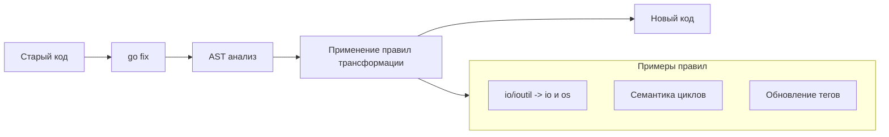

Если `go vet` — это врач, который ставит диагноз, то `go fix` — это хирург. Это инструмент, который автоматически переписывает исходный код, чтобы привести его в соответствие с новыми версиями языка и API.

Долгое время `go fix` был «спящей красавицей», использовавшейся в основном для исторических миграций. Однако, начиная с версии Go 1.26, утилита была реинкарнирована и переписана, получив модульную архитектуру и способность исправлять сложные семантические проблемы современности.

## Зачем нужен `go fix`?

Go обещает обратную совместимость: код, написанный 10 лет назад, скомпилируется сегодня. Но обратная совместимость не означает, что старые API остаются лучшим способом решения задач. Пакеты депрекейтятся, имена функций меняются, а семантика конструкций эволюционирует.

`go fix` решает проблему технического долга на уровне синтаксиса. Он находит паттерны старого кода и заменяет их на новые, идиоматичные эквиваленты.



## Как это работает (Under the hood)

`go fix` работает не с текстом (как `sed`), а с Абстрактным Синтаксическим Деревом (AST).
1.  Он парсит исходный код в AST.
2.  Проходит по дереву, применяя набор зарегистрированных «фиксов» (правил переписывания).
3.  Если правило срабатывает, узлы дерева заменяются на новые.
4.  Дерево сериализуется обратно в исходный код (при этом сохраняется форматирование).

> [!info] Под капотом
> В современных версиях Go архитектура `go fix` строится на базе `analysis.Driver` (похожей на `go vet`), но вместо отчетов об ошибках анализаторы генерируют правки (edits). Это позволяет писать сложные миграции, которые учитывают типы данных и область видимости переменных.

## Ключевые сценарии использования

### 1. Миграция с устаревших пакетов
Самый известный пример — депрекейция пакета `io/ioutil` в Go 1.16. Функции переехали в `io` и `os`.
Вместо того чтобы вручную искать и заменять `ioutil.ReadFile` на `os.ReadFile`, можно запустить:

```bash
go fix
```

Было:
```go
data, err := ioutil.ReadFile("file.txt")
```

Станет:
```go
data, err := os.ReadFile("file.txt")
```

### 2. Изменение семантики (Go 1.26+)
С развитием языка меняются не только имена, но и поведение. Новые версии `go fix` способны адаптировать код под изменения в циклах (loop variable semantics), автоматизируя добавление явного захвата переменных или переписывая паттерны, которые стали небезопасны или неэффективны.

### 3. Обновление тегов сборки
Переход со старого формата тегов `// +build` на новый `//go:build` также может быть автоматизирован через `go fix`, обеспечивая консистентность объявлений.

## Использование

Запуск осуществляется так же просто, как и `go fmt`:

```bash
# Применить фиксы к текущему пакету
go fix

# Применить фиксы ко всему проекту
go fix ./...
```

> [!warning] Ловушка / Gotcha
> `go fix` переписывает файлы **in-place** (прямо на диске). Перед запуском обязательно убедитесь, что ваш код закоммичен в Git. Хотя `go fix` старается быть безопасным, автоматическая правка кода всегда несет риски. Всегда просматривайте `git diff` после его работы.

## `go fix` vs Ручной рефакторинг

| Характеристика | Ручной поиск/замена | `go fix` |
| :--- | :--- | :--- |
| **Контекст** | Не учитывает область видимости, может сломать строки. | Работает с AST, учитывает контекст. |
| **Типы** | Игнорирует типы. | Может учитывать типы (в новых версиях). |
| **Импорты** | Требует ручного обновления `import`. | Автоматически обновляет блок `import`. |
| **Скорость** | Медленно на большой кодовой базе. | Мгновенно. |

> [!tip] Собеседование
> **Вопрос:** В чем разница между `go fmt` и `go fix`?
> **Ответ:** `go fmt` занимается косметологией: выравнивает отступы, приводит код к стандартному стилю, но **не меняет** логику и семантику программы. `go fix` занимается хирургией: он меняет имена функций, пакеты и паттерны использования, фактически меняя код программы (с сохранением поведения), чтобы адаптировать его к новым версиям Go.

## Итог

1.  **`go fix`** — инструмент для автоматической миграции кода на новые версии Go.
2.  Он работает на уровне AST, что безопаснее текстовых замен.
3.  В современных версиях (1.26+) он значительно расширил свои возможности.
4.  Используйте его при обновлении версии Go в продакшене, чтобы убрать использование deprecated API.

Код исправлен, миграции пройдены. Теперь нужно привести его к идеальному виду, чтобы любой член команды мог его легко читать. В следующей статье мы разберем инструменты форматирования: [[8. go fmt и goimports. Форматирование кода]].