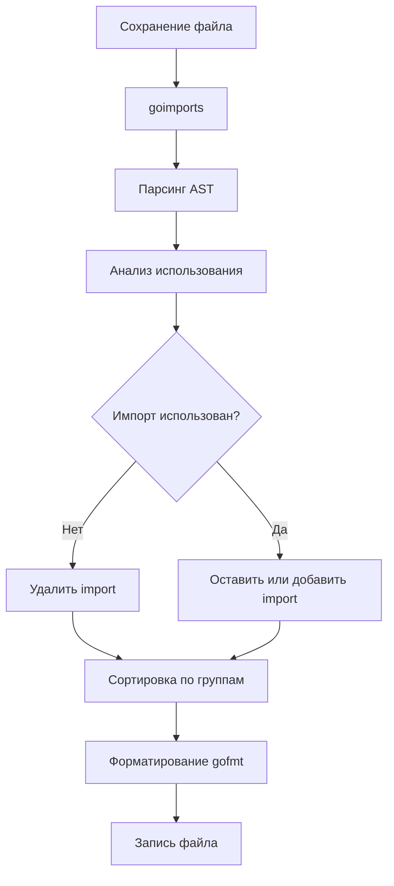

Один из самых больших культурных шоков для разработчиков, переходящих с C#, Java или C++, — это отсутствие споров о стиле кода. В этих языках можно найти десятки споров: "ставить ли фигурную скобку на новой строке?", "отступ 2 или 4 пробла?", "пробел после if или нет?".

В Go этот вопрос закрыт раз и навсегда. Есть `gofmt`, и есть правильный стиль. Всё остальное — ошибка.

## Философия: Gofmt's style is not my style, it's the style

Роб Пайк однажды сказал: *"Gofmt's style is noones favorite, yet gofmt is everyone's favorite"*. Стиль `gofmt` не нравится никому конкретно, но сам факт его существования радует всех.

`go fmt` (и его нижележащий инструмент `gofmt`) форматирует исходный код по единому стандарту. Это часть концепции "Mechanical Sympathy" применительно к людям: код должен выглядеть одинаково на любом проекте, чтобы мозг разработчика не тратил ресурсы на парсинг разного форматирования, а фокусировался на логике.

## Как это работает (Under the hood)

`gofmt` не работает с текстом как строками. Он парсит исходный код в полное Абстрактное Синтаксическое Дерево (AST), а затем печатает его обратно в текст, используя жестко заданные правила.

Это означает, что `gofmt` не просто выравнивает пробелы. Он может структурно изменить представление, если оно не соответствует канону.

Пример: Выравнивание полей в структуре.
```go
// До gofmt (хаос)
struct {
    Name string
    Age int
    IsActive bool
}

// После gofmt (автоматическое выравнивание)
struct {
    Name     string
    Age      int
    IsActive bool
}
```

> [!info] Под капотом
> Алгоритм работает в несколько проходов. Сначала строится AST, затем вычисляются "веса" узлов для размещения на строках, затем происходит "pretty print". Такой подход гарантирует, что код всегда валиден (вы не можете случайно удалить скобку, как это бывает при работе с текстовыми макросами).

## `go fmt` vs `gofmt`

Это часто путают.
*   **`gofmt`** — это базовый инструмент. Он форматирует файлы и выводит результат в stdout (или перезаписывает с флагом `-w`).
*   **`go fmt`** — это обертка над `gofmt`. Она работает с пакетами, а не просто файлами.
    *   `gofmt -w main.go` — перезаписать файл.
    *   `go fmt ./...` — отформатировать весь проект.

В CI/CD скриптах часто используют проверку:
```bash
# Проверка, отформатирован ли код (для CI)
gofmt -l .
# Если вывод пуст, всё ок. Если есть список файлов, значит они не отформатированы.
```

## goimports: Следующий уровень

Хотя `go fmt` входит в стандартный дистрибутив, в реальной разработке его почти полностью вытеснил `goimports`. Это не официальная часть тулчейна, но де-факто стандарт, который часто встраивают в IDE.

`goimports` делает всё, что делает `gofmt`, плюс автоматически управляет блоком `import`.

1.  **Удаление неиспользуемых импортов**: Если вы закомментировали код, использующий `fmt`, `goimports` удалит `import "fmt"`.
2.  **Добавление недостающих импортов**: Если вы написали `json.Marshal`, `goimports` автоматически добавит `import "encoding/json"`.

### Логика группировки импортов

`goimports` группирует импорты в строгом порядке, разделяя их пустыми строками:
1.  **Standard library**: `fmt`, `os`, `context`.
2.  **Third-party**: `github.com/gin-gonic/gin`, `go.uber.org/zap`.
3.  **Local packages**: `myproject/internal/service`.

```go
package main

import (
    "fmt" // 1. Стандартная библиотека
    "os"

    "github.com/gin-gonic/gin" // 2. Сторонние
    "go.uber.org/zap"

    "myproject/internal/handler" // 3. Локальные
)

// ...
```



> [!warning] Ловушка / Gotcha
> Иногда `goimports` не может определить нужный пакет. Если в `go.mod` есть пакеты с похожими именами (например, `github.com/user/uuid` и `github.com/satori/uuid`), он может выбрать неправильный или выдать ошибку. В этом случае нужно явно указать алиас импорта вручную.

## Интеграция с IDE и CI

Главная польза от форматирования достигается автоматизацией.
1.  **IDE**: Настройте "Format on Save" в VSCode или GoLand. Это мгновенно исправляет код при каждом сохранении.
2.  **CI**: Добавьте шаг в пайплайн, проверяющий `gofmt -l`. Это не даст сломать стиль проекту тому, у кого не настроена IDE.

```bash
# Пример проверки в Makefile
lint:
	@gofmt -l . | read; then \
		echo "Code is not formatted. Run 'gofmt -w .'"; \
		exit 1; \
	fi
```

> [!tip] Собеседование
> **Вопрос:** Почему Go так строго относится к форматированию, в отличие от, например, C++?
> **Ответ:** Это уменьшает когнитивную нагрузку и делает код-ревью более эффективным. В Google, где зародился Go, ревью кода проводятся огромными масштабами. Если бы каждый форматировал код по-своему, diff-ы были бы забиты изменениями пробелов, что мешает видеть логические правки. Стандартный формат — это оптимизация процесса разработки, а не прихоть.

## Итог

1.  **`gofmt`** — стандарт де-факто. Споры о стиле бессмысленны.
2.  Работает через AST, гарантируя валидность кода и умное выравнивание.
3.  **`goimports`** — must-have инструмент, объединяющий форматирование и управление зависимостями.
4.  Интегрируйте эти инструменты в IDE и CI для автоматического применения.

Код отформатирован, импорты расставлены. Но что если нам нужно сгенерировать код до того, как его увидит компилятор? В следующей статье мы разберем мощный механизм кодогенерации: [[9. go generate. Генерация кода]].