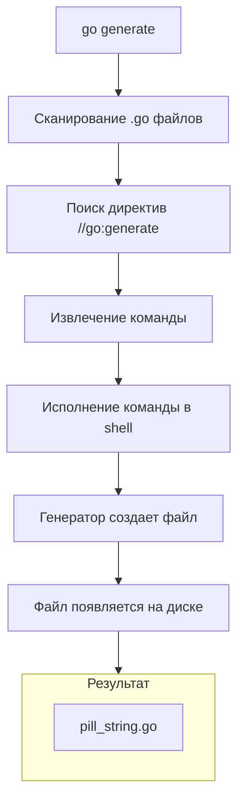

В Go отсутствуют макросы (как в Rust или C++) и механизмы метапрограммирования на уровне компилятора (как шаблоны C++ или Java Annotation Processing, встроенные в компилятор). Вместо этого Go исповедует подход явной кодогенерации.

Команда `go generate` — это драйвер для запуска внешних инструментов генерации кода. Она не является частью процесса сборки (`go build`) по умолчанию. Это принципиальный момент: разработчик должен явно запустить генерацию, когда меняется исходное состояние.

## Как это работает: Магический комментарий

Механизм работает через поиск специальных комментариев в исходном коде, начинающихся с `//go:generate`.

```go
package mypackage

//go:generate stringer -type=Pill
type Pill int

const (
	Placebo Pill = iota
	Aspirin
	Ibuprofen
)
```

Когда вы запускаете `go generate` в этой директории, Go сканирует файлы, находит комментарий `//go:generate` и выполняет указанную после него команду (`stringer -type=Pill`) как обычный shell-процесс.



> [!info] Под капотом
> `go generate` устанавливает несколько переменных окружения для запускаемого процесса, чтобы генераторы могли понимать контекст:
> *   `GOFILE`: Имя текущего файла.
> *   `GOLINE`: Номер строки с директивой.
> *   `GOPACKAGE`: Имя пакета.
> *   `DOLLAR`: Символ `$` (для кроссплатформенности).
> Это позволяет писать генераторы, которые знают, где именно они были вызваны.

## Популярные сценарии использования

### 1. Реализация интерфейсов (Stringer)
Зачем писать метод `String()` для каждого значения `iota` (enum), если это рутинная работа? Утилита `stringer` (из `golang.org/x/tools`) делает это автоматически.

```go
//go:generate stringer -type=Status
type Status int
```
На выходе получается файл `status_string.go` с методом, который возвращает строковое представление константы. Это быстрее и типобезопаснее, чем мапа или рефлексия.

### 2. Мокирование (Mocking)
При написании тестов часто нужны моки интерфейсов. `mockgen` (из `github.com/golang/mock`) генерирует структуру, реализующую интерфейс.

```go
//go:generate mockgen -source=service.go -destination=mock/service_mock.go
```

### 3. Dependency Injection (Wire)
В больших системах инициализация зависимостей превращается в спагетти-код. `wire` (от Google) позволяет описать провайдеры, а затем генерирует код сборки графа зависимостей.

### 4. Генерация из схем (sqlc, protobuf)
Инструменты вроде `sqlc` генерируют типобезопасный Go-код из SQL-запросов и схем БД, а `protoc` с плагинами — gRPC-клиентов из `.proto` файлов.

> [!warning] Ловушка / Gotcha
> **Самая частая ошибка:** Забыть запустить `go generate`.
> В отличие от `npm install` или Maven build, `go build` **никогда** не запускает генерацию автоматически. Если вы добавили новый метод в интерфейс, но забыли обновить мок, ваш код не скомпилируется.
>
> Решение: Добавьте запуск `go generate ./...` в шаги pre-commit хуков или скрипт сборки `Makefile`.

## Сравнение подходов: Генерация vs Рефлексия

Для разработчиков на Java или C# привычно использовать Reflection для решения задач (например, сериализация в JSON или реализация интерфейсов на лету). В Go предпочитают кодогенерацию.

| Характеристика | Рефлексия | Кодогенерация (`go generate`) |
| :--- | :--- | :--- |
| **Скорость выполнения** | Медленнее (рутайм-анализ типов). | Максимальная (обычный Go-код). |
| **Безопасность типов** | Ошибки в рантайме (panic). | Ошибки на этапе компиляции. |
| **Читаемость кода** | Код лаконичнее, но "магия" скрыта. | Можно прочитать сгенерированный файл. |
| **Поддержка IDE** | Autocomplete работает плохо. | Полная поддержка (Go to Definition). |

В Go золотое правило: **"Избегайте рефлексии, если можно сгенерировать код".**

## Практика использования

### Запуск
```bash
# Запустить генерацию в текущей директории
go generate

# Запустить генерацию рекурсивно по всему проекту
go generate ./...
```

### Игнорирование файлов
Сгенерированные файлы обычно игнорируются в `.gitignore` **только если** они не нужны для компиляции основного проекта другими разработчиками.
Однако, если файл является частью API (например, `protobuf` код), его **нужно коммитить**. Если файл — это просто оптимизация (например, `stringer`), его часто коммитят, чтобы пользователи пакета не были вынуждены устанавливать генераторы. В современном Go принято **коммитить** сгенерированный код, чтобы обеспечить воспроизводимость сборки без внешних зависимостей-генераторов.

> [!tip] Собеседование
> **Вопрос:** В чем разница между `//go:generate` и `//go:build`?
> **Ответ:** Это совершенно разные механизмы.
> `//go:build` (build constraints) управляет тем, какие файлы включаются в компиляцию *во время* `go build`.
> `//go:generate` — это директива для инструмента `go generate`, которая выполняется *до* компиляции и не влияет на сам процесс сборки напрямую.

## Итог

1.  **`go generate`** — стандартный способ автоматизации создания кода в Go.
2.  Он использует комментарии-директивы для запуска внешних утилит.
3.  Генерация предпочитается рефлексии из соображений производительности и типобезопасности.
4.  Генерацию нужно запускать явно, она не происходит автоматически при сборке.

Мы настроили генерацию кода. Теперь нам нужно понять, как Go находит этот код и как настраивается само окружение компиляции. В следующей статье мы разберем переменные окружения Go: [[10. go env. Переменные окружения]].