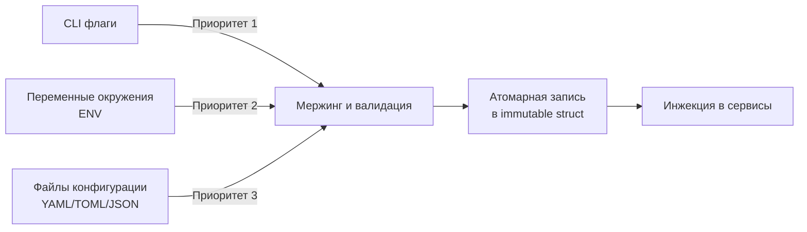

## Философия конфигурации в Go

В PHP конфигурация часто представлена глобальными массивами или `.env` файлами, которые парсятся в runtime. В Java/Spring это сложный контекст с магическими аннотациями `@Value`. Go следует другой парадигме: **явные контракты, строгая типизация и неизменяемость после инициализации**.

Конфигурация — это не просто набор строк. Это структура, которая определяет поведение сервиса, влияет на выделение памяти, таймауты сетевых соединений и параметры сборщика мусора. Правильно спроектированная система конфигурации должна:
- Загружаться один раз при старте (или атомарно обновляться)
- Валидироваться до запуска бизнес-логики
- Быть типизированной (никаких `map[string]string` в production)
- Не зависеть от сторонних библиотек в критическом пути

> [!info] Под капотом
> Переменные окружения загружаются ядром ОС в память процесса при вызове `execve()`. В Go runtime они хранятся в слайсе `os.Environ()`, который является оберткой над массивом указателей на C-строки `char** environ`. Парсинг `os.Getenv()` не вызывает системных вызовов — это операция чтения из уже выделенной памяти с линейным поиском `O(n)` по слайсу строк.

### Источники и приоритеты загрузки

В соответствии с 12-Factor App, конфигурация отделяется от кода. На практике используется каскадная загрузка с четким приоритетом:

1. **CLI Flags** (высший приоритет) — переопределение для отладки
2. **Environment Variables** — основной источник в контейнерах
3. **Config Files** (`yaml`/`toml`/`json`) — локальная разработка, fallback
4. **Hardcoded Defaults** — безопасные значения по умолчанию



### Структурный подход и строгая типизация

Вместо разрозненных вызовов `os.Getenv` создается единая структура конфигурации. Это дает компилятору возможность проверять типы, а линтеру — находить неиспользуемые поля.

```go
package config

import (
    "fmt"
    "time"
)

// Config — корневая структура приложения.
// Поля экспортированы для работы с env-парсерами и сериализацией.
type Config struct {
    Server   ServerConfig
    Database DatabaseConfig
    Log      LogConfig
}

type ServerConfig struct {
    Port         int           `env:"HTTP_PORT" envDefault:"8080"`
    ReadTimeout  time.Duration `env:"HTTP_READ_TIMEOUT" envDefault:"10s"`
    WriteTimeout time.Duration `env:"HTTP_WRITE_TIMEOUT" envDefault:"15s"`
}

type DatabaseConfig struct {
    DSN          string `env:"DB_DSN,required"`
    MaxOpenConns int    `env:"DB_MAX_OPEN_CONNS" envDefault:"25"`
    MaxIdleConns int    `env:"DB_MAX_IDLE_CONNS" envDefault:"5"`
    ConnMaxLifetime time.Duration `env:"DB_CONN_MAX_LIFETIME" envDefault:"1h"`
}

type LogConfig struct {
    Level string `env:"LOG_LEVEL" envDefault:"info"`
    Format string `env:"LOG_FORMAT" envDefault:"json"`
}
```

### Парсинг и валидация

Использование рефлексии (`reflect`) для парсинга тегов удобно, но дорого. Для production рекомендуется пакет `github.com/caarlos0/env/v6` или `github.com/sethvargo/go-envconfig`. Они минимизируют аллокации и позволяют кастомизировать декодирование.

```go
package config

import (
    "fmt"
    "os"
    
    "github.com/caarlos0/env/v6"
)

func Load() (*Config, error) {
    var cfg Config
    
    // Парсинг из ENV
    if err := env.Parse(&cfg); err != nil {
        return nil, fmt.Errorf("parse env: %w", err)
    }

    // Валидация бизнес-правил
    if err := cfg.Validate(); err != nil {
        return nil, fmt.Errorf("validation failed: %w", err)
    }

    return &cfg, nil
}

func (c *Config) Validate() error {
    if c.Database.DSN == "" {
        return fmt.Errorf("database DSN must not be empty")
    }
    if c.Server.Port < 1 || c.Server.Port > 65535 {
        return fmt.Errorf("invalid server port: %d", c.Server.Port)
    }
    if c.Log.Level != "debug" && c.Log.Level != "info" && c.Log.Level != "warn" && c.Log.Level != "error" {
        return fmt.Errorf("unsupported log level: %s", c.Log.Level)
    }
    return nil
}
```

> [!warning] Ловушка / Gotcha
> **Типизация в ENV**: В отличие от PHP или Python, переменные окружения в ОС — это всегда строки (`char*`). Go **не выполняет неявное приведение типов**. `strconv.ParseInt` вернет ошибку, если передать `"10 "` (с пробелом) или `"10s"` в поле `int`. Длительности (`time.Duration`) парсятся корректно только в формате `"1h15m30s"`, а не `"3600"`.
> **Пустые строки vs Unset**: `os.Getenv("MISSING")` возвращает `""`. Если бизнес-логика различает "пусто" и "не задано", используйте `os.LookupEnv()`, который возвращает `(string, bool)`.

### Динамическое обновление и атомарная замена

В stateless микросервисах hot-reload конфигурации часто антипаттерн: это усложняет отладку и нарушает детерминизм. Однако для параметров логгера, лимитов или feature-flags это иногда необходимо.

Безопасная реализация требует атомарного указателя (`sync/atomic.Pointer`), чтобы избежать race condition и блокировок `sync.RWMutex` на критическом пути.

```go
package config

import (
    "sync/atomic"
)

type ConfigManager struct {
    current atomic.Pointer[Config]
}

func (cm *ConfigManager) Load(cfg *Config) {
    // Атомарная замена указателя. Читатели всегда получают консистентную структуру.
    cm.current.Store(cfg)
}

func (cm *ConfigManager) Get() *Config {
    return cm.current.Load()
}

// Пример использования в обработчике (без блокировок)
func handlerWithDynamicConfig(cm *ConfigManager, w http.ResponseWriter, r *http.Request) {
    cfg := cm.Get()
    // cfg.Log.Level можно безопасно читать, структура неизменяема
}
```

> [!info] Под капотом
> `atomic.Pointer[Config]` использует машинные инструкции `cmpxchg` (x86-64) или `ldxr/stxr` (ARM). Это lock-free операция. В отличие от `sync.RWMutex`, которая вызывает `futex` syscall при contention, атомарный указатель выполняется целиком в User Space за 1-2 такта CPU. Это критично для hot-path, где конфигурация читается на каждый запрос.

### Безопасность и работа с секретами

Секреты (пароли, API-ключи, TLS-сертификаты) не должны:
- Попадать в логи или метрики
- Храниться в неизменяемой памяти дольше необходимого
- Передаваться через ENV в виде строк, если возможно

```go
// Безопасное чтение секрета из файла (K8s Secrets, Vault mount)
func readSecretFromFile(path string) (string, error) {
    data, err := os.ReadFile(path)
    if err != nil {
        return "", fmt.Errorf("read secret: %w", err)
    }
    // Удаление trailing newline и очистка буфера (опционально, но хорошая практика)
    secret := strings.TrimSpace(string(data))
    
    // В production: переписать байтовый слайс нулями перед GC
    // для усложнения дампов памяти (defense-in-depth)
    for i := range data {
        data[i] = 0
    }
    
    return secret, nil
}
```

> [!tip] Собеседование
> **Вопрос:** Почему глобальная переменная `var Config = loadConfig()` считается плохой практикой?
> **Ответ:** Глобальные состояния нарушают инверсию зависимостей, делают модули не тестируемыми (нельзя мокнуть конфигурацию без перезаписи глобала) и скрывают контракты. В Go используется Dependency Injection: конфигурация читается в `main`, передается в конструкторы сервисов, а обработчики работают с иммутабельной структурой или `ConfigManager`.
> 
> **Вопрос:** Как обеспечить безопасность конфигурации при парсинге YAML?
> **Ответ:** Стандартный `gopkg.in/yaml.v3` безопасен, но не ограничивает глубину вложенности или размер файлов. Атакующий может прислать YAML с `1000x1000` вложенными слайсами (Billion Laughs attack), что вызовет OOM. Всегда используйте `io.LimitedReader` при чтении и настраивайте `yaml.Decoder.SetMaxAliasCount(10000)`.

### Производительность и Memory Layout

Структура конфигурации читается часто, но записывается редко. Для оптимизации кэш-локальности CPU (L1/L2) применяйте правила выравнивания:
1. Размещайте часто читаемые поля в начале структуры
2. Группируйте поля по размеру (указатели и `int64` в начале, `bool`/`int8` в конце), чтобы избежать padding (выравнивания памяти)
3. Избегайте вложенных интерфейсов и указателей там, где возможны value-типы

```go
// Плохо: много padding, поля разбросаны по разным кэш-линиям (64 байта)
type BadConfig struct {
    Port int8
    Debug bool
    Timeout time.Duration // 8 байт
    Host string           // 16 байт (указатель + длина)
}

// Хорошо: компактное расположение, минимальный padding
type GoodConfig struct {
    Host string           // 16 байт
    Timeout time.Duration // 8 байт
    Port int16            // 2 байта
    Debug bool            // 1 байт
}
```

Компилятор Go автоматически выравнивает структуры, но осознанная группировка уменьшает размер структуры в памяти на 20-40%, что снижает давление на L1 кэш при частых чтениях в высоконагруженных сервисах.

### Итог

1. Конфигурация должна быть типизированной, иммутабельной и валидированной до запуска сервиса.
2. Используйте `atomic.Pointer` для безопасного hot-reload без блокировок.
3. Парсинг через ENV безопаснее и быстрее YAML/JSON в контейнеризованных средах.
4. Избегайте глобальных переменных: конфигурация инжектится через конструкторы.
5. Учитывайте alignment и padding структур для оптимизации CPU-кэша при частых чтениях.
6. Секреты читаются из файлов или secure-хранилищ, буферы очищаются после использования.

Следующая статья: [[12. ENV, flags и config файлы]]