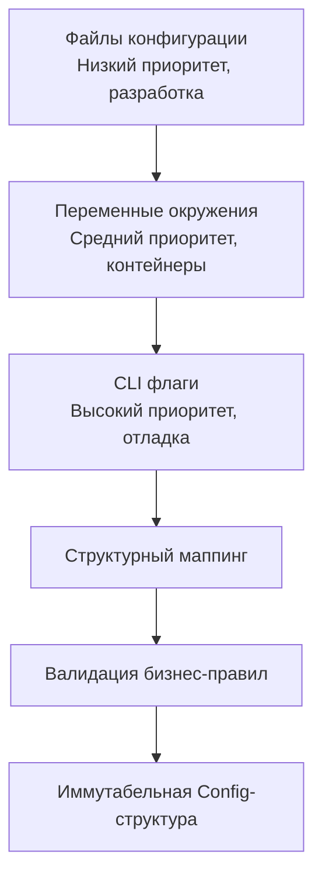

## Три столпа конфигурации в Go

В production-системах конфигурация никогда не должна быть монолитной. Go-сообщество и Cloud Native стандарты де-факто выработали трехуровневую модель, где каждый источник имеет четкую зону ответственности и строгий приоритет.



Правильная организация этих источников исключает магические зависимости, позволяет безопасно деплоить сервис в Kubernetes и даёт возможность локально запускать приложение с переопределением параметров без изменения кода.

### 1. Флаги командной строки

Пакет `flag` из стандартной библиотеки предоставляет базовый синтаксический разбор аргументов. В Go флаги традиционно используются для **override** критических параметров: `port`, `config-path`, `log-level`, `verbose`.

```go
package main

import (
    "flag"
    "fmt"
    "log"
    "os"
)

func parseFlags() (string, int) {
    configPath := flag.String("config", "config.yaml", "path to config file")
    port := flag.Int("port", 8080, "HTTP server port")
    
    // Parse осматривает os.Args[1:]
    flag.Parse()
    
    // Валидация флагов до инициализации
    if *port < 1 || *port > 65535 {
        log.Fatal("invalid port range")
    }
    
    return *configPath, *port
}

func main() {
    cfgPath, port := parseFlags()
    fmt.Printf("Loading config from: %s, overriding port: %d\n", cfgPath, port)
    // Дальнейшая инициализация...
}
```

> [!info] Под капотом
> `flag.Parse()` вызывает `flag.CommandLine.Parse(os.Args[1:])`. Пакет хранит зарегистрированные флаги в двусвязном списке и `map[string]*Flag`. При парсинге используется конечный автомат, который посимвольно разбирает аргументы, обрабатывая `--`, `-` и `=`. Все выделенные строки и указатели живут в куче до завершения процесса. Это не влияет на runtime производительность, так как парсинг происходит однократно при старте.

Для сложных CLI-утилий (вроде `kubectl` или `docker`) стандартный `flag` недостаточен. В таких случаях используют `github.com/spf13/cobra` + `pflag`, которые поддерживают подкоманды, короткие флаги и генерацию справки в `bash`/`zsh` автодополнение.

### 2. Переменные окружения

ENV — основной источник конфигурации в контейнеризованных средах. В отличие от PHP, где `.env` файлы парсятся в runtime, в Go переменные окружения считываются напрямую из памяти процесса, унаследованной от родительского процесса через системный вызов `execve`.

```go
package config

import (
    "fmt"
    "os"
    "strconv"
    "time"
)

type DBConfig struct {
    Host     string
    Port     int
    Name     string
    Timeout  time.Duration
}

func LoadDBFromEnv() (DBConfig, error) {
    cfg := DBConfig{
        Host: getEnv("DB_HOST", "localhost"),
        Name: getEnv("DB_NAME", "app_db"),
    }

    if p, err := strconv.Atoi(getEnv("DB_PORT", "5432")); err == nil {
        cfg.Port = p
    } else {
        return cfg, fmt.Errorf("invalid DB_PORT: %w", err)
    }

    if t, err := time.ParseDuration(getEnv("DB_TIMEOUT", "5s")); err == nil {
        cfg.Timeout = t
    } else {
        return cfg, fmt.Errorf("invalid DB_TIMEOUT: %w", err)
    }

    return cfg, nil
}

// Безопасный хелпер с fallback
func getEnv(key, fallback string) string {
    if v, ok := os.LookupEnv(key); ok {
        return v
    }
    return fallback
}
```

Для production-проектов ручное приведение типов часто заменяют на `github.com/caarlos0/env/v6` или `github.com/sethvargo/go-envconfig`. Они используют рефлексию для маппинга тегов, но кэшируют метаданные структур, снижая накладные расходы при загрузке.

> [!warning] Ловушка / Gotcha
> **Наследование и контейнеры**: В Docker/Kubernetes ENV-переменные передаются при создании контейнера. Если процесс внутри контейнера порождает дочерние процессы (например, через `exec.Command`), они наследуют окружение родителя. Удалить переменную из окружения **во время выполнения** невозможно на уровне ОС. Только перезапуск процесса или инъекция нового конфига в память (через `atomic.Pointer`) работает корректно.
> **Пустые строки**: `os.Getenv("UNSET_VAR")` возвращает `""`. Если пустая строка семантически отличается от "не задано", используйте `os.LookupEnv`.

### 3. Файлы конфигурации

Файлы удобны для локальной разработки, но в Go к ним предъявляются строгие требования безопасности и парсинга.

- **YAML**: Популярен, но спецификация сложна. `tabs vs spaces`, неявное приведение типов (`yes` → `true`), уязвимости типа `YAML Billion Laughs`. Не рекомендуется для security-critical сервисов.
- **JSON**: Строгий, но не поддерживает комментарии и multi-line строки без экранирования. Плохо читается человеком.
- **TOML**: Оптимальный выбор для Go. Явная семантика типов, поддержка комментариев, простой парсер, устойчив к инъекциям.

```go
package config

import (
    "os"
    "fmt"
    "github.com/BurntSushi/toml"
)

func LoadFromFile(path string) (map[string]any, error) {
    data, err := os.ReadFile(path)
    if err != nil {
        return nil, fmt.Errorf("read config: %w", err)
    }

    var cfg map[string]any
    // toml.Decode безопасен, но не ограничивает глубину вложенности
    if _, err := toml.Decode(string(data), &cfg); err != nil {
        return nil, fmt.Errorf("parse toml: %w", err)
    }
    return cfg, nil
}
```

> [!info] Под капотом
> При декодировании YAML/TOML в `map[string]any` или структуры, парсер выделяет память под каждый узел AST. Это создает давление на GC. Для высоконагруженных демонов конфигурация должна парситься **один раз** при старте и сериализоваться в иммутабельные структуры. Динамический `map` в хот-пути — антипаттерн из-за дополнительных хэш-поисков и аллокаций `interface{}`.

### 4. Логика слияния и приоритетов

Никогда не смешивайте источники внутри бизнес-логики. Создайте единый конструктор, который применяет каскадный merge.

```go
func Load() (*Config, error) {
    var cfg Config

    // 1. Базовые значения из файлов
    if err := loadFromYAML("config.default.yaml", &cfg); err != nil && !os.IsNotExist(err) {
        return nil, err
    }

    // 2. Переопределение через ENV
    if err := env.Parse(&cfg); err != nil {
        return nil, err
    }

    // 3. Переопределение через CLI флаги (высший приоритет)
    parseFlagsOverride(&cfg)

    // 4. Валидация
    if err := cfg.Validate(); err != nil {
        return nil, err
    }

    return &cfg, nil
}
```

Такой подход гарантирует детерминизм: разработчик запускает `./app --port=9090` и получает локальную конфигурацию с переопределенным портом, игнорируя ENV из CI/CD пайплайна.

> [!tip] Собеседование
> **Вопрос:** Как безопасно обновить конфигурацию без перезапуска сервиса (hot-reload)?
> **Ответ:** Прямой перезапись структуры приведет к data race. Правильный паттерн: 
> 1. Загрузить новый конфиг во временную структуру.
> 2. Валидировать её.
> 3. Атомарно заменить указатель через `atomic.Pointer[Config].Store(newCfg)`.
> 4. Все горутины читают конфиг через `atomic.Load()`. Это lock-free операция, работающая за 1-2 CPU цикла через инструкцию `cmpxchg`. `sync.RWMutex` здесь избыточен и создаст contention при тысячах RPS.
> 
> **Вопрос:** Почему `flag` не поддерживает короткие флаги по умолчанию?
> **Ответ:** Философия Go ценит читаемость и явность. `--config` понятнее, чем `-c`. Если нужны короткие флаги, используется сторонний пакет `pflag` или ручной парсинг `os.Args`. Стандартная библиотека следует принципу «минимум магии».

### 5. Механика парсинга и производительность

Парсинг конфигурации — операция `O(1)` по частоте, но `O(N)` по объему данных. Оптимизация направлена на:
- **Избегание рефлексии в цикле**: Если используется `env.Parse`, он кэширует `reflect.Type` через `sync.Map`. При 100+ полях это создает заметный оверхед при старте. Для ultra-fast startup (serverless, FaaS) предпочтительнее codegen-подходы или ручной маппинг.
- **Стринг-интернирование**: ENV-переменные живут в памяти вечно. Если парсер создает копии строк без необходимости, это увеличивает RSS. Стандартный `os.Getenv` возвращает внутреннюю ссылку, но большинство библиотек делают `string(b)` копию.
- **Валидация до аллокаций**: Проверяйте типы и диапазоны **до** создания пулов соединений или HTTP-серверов. Ошибка в `DSN` после инициализации `sqlx.Open()` может оставить висеть зомби-процессы.

### Итог

1. Используйте **TOML** или **YAML** только для локальной разработки и defaults.
2. **ENV** — де-факто стандарт для production в контейнерах. Парсите в типизированные структуры.
3. **Flags** — для переопределения и отладки. Всегда высший приоритет.
4. Слияние должно быть детерминированным: `File < ENV < Flags`.
5. Hot-reload реализуется через `atomic.Pointer`, а не `sync.RWMutex`, для минимизации contention.
6. Валидация конфига происходит строго до инициализации внешних зависимостей.

Конфигурация — это контракт сервиса с инфраструктурой. Чем он строже, тем стабильнее работает система в распределенной среде.

Следующая статья: [[13. Dependency Injection в Go]]