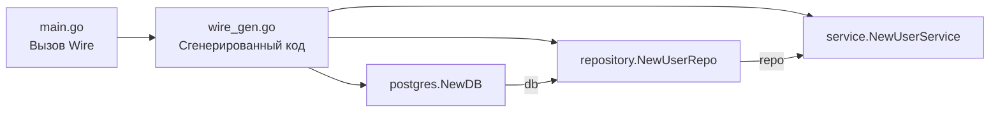

## Философия DI в Go: Явность против Магии

В мире Java/Spring или PHP/Laravel Dependency Injection (DI) ассоциируется с тяжелыми контейнерами, аннотациями, XML-конфигурацией и магией рефлекторного связывания в runtime. Go отвергает эту парадигму. Здесь DI — это не фреймворк, а архитектурный паттерн, реализуемый через **явные конструкторы и интерфейсы**.

Философия Go строится на принципе: *«Зависимости должны передаваться явно при создании, а не извлекаться неявно из глобального контекста»*. Это дает:
- Компиляционную проверку всех связей
- Нулевые накладные расходы на рефлексию
- Прозрачные контракты (видно по сигнатуре функции)
- Тривиальное тестирование (моки передаются как аргументы)

### Идиоматичный паттерн: Constructor Injection

В Go DI реализуется через фабрики-конструкторы, возвращающие указатели на сервисы. Интерфейсы определяются на стороне потребителя (пакет, который использует зависимость), а не на стороне создателя.

```go
// internal/domain/user.go
package domain

// Интерфейс определяется потребителем. Только методы, которые реально нужны.
type UserRepository interface {
    FindByID(ctx context.Context, id int64) (*User, error)
    Save(ctx context.Context, u *User) error
}

type EmailService interface {
    SendWelcome(ctx context.Context, email string) error
}

// internal/service/user_service.go
package service

import "myapp/internal/domain"

type UserService struct {
    repo   domain.UserRepository
    mailer domain.EmailService
}

// Конструктор явно объявляет зависимости
func NewUserService(repo domain.UserRepository, mailer domain.EmailService) *UserService {
    return &UserService{
        repo:   repo,
        mailer: mailer,
    }
}

func (s *UserService) Register(ctx context.Context, req *domain.CreateUserRequest) error {
    user := domain.NewUser(req)
    if err := s.repo.Save(ctx, user); err != nil {
        return fmt.Errorf("save user: %w", err)
    }
    
    if err := s.mailer.SendWelcome(ctx, user.Email); err != nil {
        // Логирование ошибки отправки, но не откат транзакции
        // (в реальном коде здесь будет асинхронная очередь)
    }
    return nil
}
```

> [!info] Под капотом
> Передача зависимостей через конструктор работает на уровне машинных инструкций. Аргументы конструктора размещаются на стеке вызова функции. Компилятор генерирует прямую запись полей структуры в память (`MOV [rdi+8], rsi`). Никаких lookup-таблиц, парсинга тегов или динамической диспетчеризации на этапе связывания. Это максимально быстрая операция, сопоставимая по стоимости с простым присваиванием.

### Composition Root: main.go как точка сборки

Все зависимости собираются в одном месте — функции `main`. Это называется **Composition Root**. Правило: *«Вся иерархия объектов создается сверху вниз, один раз, при старте приложения»*.

```go
func main() {
    cfg := config.MustLoad()
    
    // 1. Инфраструктурные зависимости (низкоуровневые)
    db, err := postgres.Connect(ctx, cfg.DB)
    if err != nil {
        log.Fatal(err)
    }
    defer db.Close()

    smtpClient := smtp.New(cfg.SMTP)
    
    // 2. Слой данных (Repository)
    userRepo := repository.NewUserRepository(db)
    
    // 3. Слой бизнес-логики (Service)
    userService := service.NewUserService(userRepo, smtpClient)
    
    // 4. Слой доставки (Handler/Server)
    mux := http.NewServeMux()
    handlers.RegisterUserRoutes(mux, userService)
    
    // 5. Запуск
    srv := &http.Server{Addr: cfg.HTTP.Addr, Handler: mux}
    log.Fatal(srv.ListenAndServe())
}
```

Такой подход делает `main` «глупым»: он не содержит бизнес-логики, а только связывает готовые модули. При тестировании вы просто вызываете `service.NewUserService(mockRepo, mockMailer)` без поднятия БД и SMTP-сервера.

### Под капотом: Интерфейсы, vtable и Escape Analysis

В Go интерфейсы — это не абстрактные классы, а двухсловная структура в памяти:
1. Указатель на `itab` (Interface Table) — хранит тип интерфейса, тип конкретной реализации и указатель на **vtable** (таблицу методов).
2. Указатель на данные (data pointer).

При вызове метода через интерфейс рантайм выполняет косвенный вызов (`CALL [rax]`), разыменовывая vtable. Это добавляет ~1-2 такта CPU по сравнению со статическим вызовом, что пренебрежимо мало для I/O-операций.

> [!warning] Ловушка / Gotcha
> **Escape Analysis и интерфейсы**: Компилятор не может доказать, куда указатель на данные интерфейса «убежит», если вы передаете в конструктор **значение** (value), а не указатель. Это заставляет данные уходить в кучу (heap allocation), увеличивая давление на GC.
> ```go
> // Плохо: структура Repo копируется, данные уходят в кучу при конвертации в интерфейс
> svc := NewUserService(postgres.NewUserRepo(db)) 
> 
> // Хорошо: передается указатель, интерфейс хранит ссылку на ту же область памяти
> repo := postgres.NewUserRepo(db)
> svc := NewUserService(&repo)
> ```
> Всегда передавайте указатели на реализации в конструкторы, принимающие интерфейсы.

### Контейнеры DI: wire, dig и когда они нужны

Ручное связывание может стать утомительным в монолитах с сотнями зависимостей. В Go существуют два подхода к автоматизации:

1. **`uber/dig` (Runtime Reflection)**: Контейнер регистрирует фабрики в map, а затем рекурсивно разрешает граф зависимостей через рефлексию при вызове `Invoke()`.
   - **Минусы**: Ошибки разрешения возникают только в runtime. Рефлексия добавляет оверхед. Сложно дебажить. Не рекомендуется для production HTTP-сервисов.

2. **`google/wire` (Compile-Time Codegen)**: Статический анализатор, который читает ваши конструкторы и генерирует Go-код функции `Wire()` в отдельном файле.
   - **Плюсы**: Нулевой runtime overhead. Ошибки циклических зависимостей ловятся при компиляции. Сгенерированный код — обычный `main.go`, который можно дебажить в delve.
   - **Минусы**: Требует `go generate` перед сборкой. Усложняет входной порог.



> [!tip] Собеседование
> **Вопрос:** Почему в Go нет встроенного DI-контейнера?
> **Ответ:** Создатели Go считают, что DI-контейнеры скрывают зависимости, усложняют понимание потока данных и нарушают принцип явности. В 95% проектов ручное связывание в `main` покрывает все потребности. Контейнеры добавляют когнитивную нагрузку и runtime-риски, которых Go старательно избегает на уровне дизайна языка.
> 
> **Вопрос:** Как избежать `interface pollution` (создания интерфейсов «на всякий случай»)?
> **Ответ:** Следуйте правилу: *«Интерфейсы определяет потребитель, а не создатель»*. Не создавайте `interface` в пакете репозитория «на будущее». Создайте его только тогда, когда сервису нужна абстракция для тестирования или замены реализации. Маленькие интерфейсы (1-3 метода) идиоматичнее огромных контрактов.

### Циклические зависимости и их разрешение

Компилятор Go запрещает циклические импорты (`A` импортирует `B`, `B` импортирует `A`). Это часто случается при неправильном проектировании DI:

```go
// ОШИБКА: сервис импортирует репозиторий, а репозиторий импортирует сервис для кэширования
package service
import "repo" // service -> repo

package repo  
import "service" // repo -> service (compile error)
```

**Решения:**
1. **Вынос интерфейса**: Переместить интерфейс в отдельный пакет `domain` или `contracts`.
2. **Функциональное внедрение**: Передать `func` вместо интерфейса, если зависимость используется редко.
3. **Перепроектирование**: Часто цикл сигнализирует о нарушении Single Responsibility. Разбейте логику на более мелкие домены.

### Итог

1. DI в Go — это ручное связывание через конструкторы и интерфейсы, а не магические контейнеры.
2. Composition Root (`main`) собирает граф зависимостей сверху вниз один раз при старте.
3. Интерфейсы всегда определяются на стороне потребителя, а не провайдера.
4. Передавайте указатели на реализации в конструкторы для предотвращения лишних аллокаций в куче.
5. Используйте `google/wire` только для очень больших кодобаз, где ручное связывание становится неподдерживаемым.
6. Избегайте циклических импортов через вынос интерфейсов в доменный слой.

Правильный DI в Go превращает архитектуру из запутанного графа в четкую, тестируемую и компиляционно безопасную систему, где каждый модуль знает только то, что ему действительно нужно.

Следующая статья: [[14. Логирование. structured logging]]