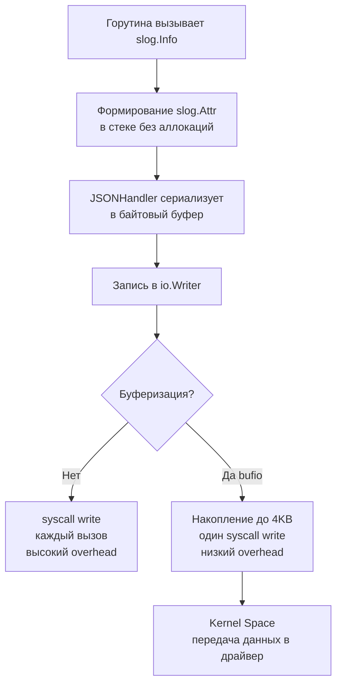

## Философия структурированного логирования

В эпоху микросервисов и распределенных систем текстовые логи в формате `time - level - message` умерли. Они не машинно-читаемы, не поддаются эффективному агрегированию и требуют дорогостоящего regex-парсинга на стороне сборщиков (Loki, ELK). Структурированное логирование заменяет нечитаемые строки на предсказуемые пары ключ-значение или JSON-объекты, превращая логи из текста для человека в данные для машины.

До Go 1.21 сообщество полагалось на `logrus`, `zap` или `zerolog`. Начиная с Go 1.21, стандартная библиотека предоставляет `log/slog` — оптимизированный, типобезопасный и контекстно-ориентированный логгер, который покрывает 95% production-требований без внешних зависимостей.

## Под капотом. Архитектура log/slog

В основе `slog` лежит интерфейс `Handler`. Это не просто обертка над `io.Writer`, а конечный автомат, отвечающий за фильтрацию уровней, форматирование и запись.

```go
type Handler interface {
    Enabled(ctx context.Context, level Level) bool
    Handle(ctx context.Context, r Record) error
    WithAttrs(attrs []Attr) Handler
    WithGroup(name string) Handler
}
```

`log/slog.Logger` — это легковесный wrapper, который делегирует всю работу `Handler`. При вызове `slog.Info("msg", "key", val)`:
1. Создается `slog.Record` (хранит уровень, время, сообщение и атрибуты)
2. Вызывается `handler.Handle()`
3. Атрибуты сериализуются и записываются в `io.Writer`

> [!info] Под капотом
> Ключевая оптимизация `slog` — структура `slog.Attr`. Она занимает ровно 24 байта на 64-битных системах и хранит тип и значение инлайн (до 3 машинных слов). Для примитивов (`int`, `string`, `bool`, `time.Time`) это **zero-allocation** структура. Данные не упаковываются в `interface{}`, не мигрируют в кучу и не создают давления на GC. `JSONHandler` использует собственный быстрый энкодер для базовых типов, избегая рефлексии `encoding/json`. Только для сложных структур применяется fallback в `reflect`.

### Инициализация production-логгера

```go
package main

import (
    "io"
    "log/slog"
    "os"
)

func setupLogger() *slog.Logger {
    opts := &slog.HandlerOptions{
        Level:     slog.LevelInfo,
        AddSource: true, // Добавляет файл и строку вызова
        ReplaceAttr: func(groups []string, a slog.Attr) slog.Attr {
            // Кастомизация атрибутов (например, переименование time -> ts)
            if a.Key == slog.TimeKey {
                a.Key = "ts"
            }
            return a
        },
    }
    
    // JSON-формат предпочтителен для production
    handler := slog.NewJSONHandler(os.Stdout, opts)
    return slog.New(handler)
}
```

## Механика записи и Mechanical Sympathy

Запись в `os.Stdout` или `os.Stderr` — это прямой системный вызов `write()`. Каждый `Write` переключает контекст Ring 3 → Ring 0, сбрасывает буферы ядра и может вызвать блокировку из-за contention на терминальном драйвере или pipe (в Docker/Kubernetes).



Для высоконагруженных сервисов **всегда** оборачивайте вывод в `bufio.Writer` или используйте пул буферов. Без буферизации 10 000 RPS с логами на каждый запрос = 10 000 syscall/sec, что легко съедает 15-30% CPU.

```go
// Production-ready инициализация с буферизацией
func setupBufferedLogger() *slog.Logger {
    w := bufio.NewWriter(os.Stdout)
    // Важно: bufio.Writer НЕ потоко-безопасен по умолчанию.
    // slog.Handler гарантирует синхронизацию на уровне Handler,
    // но для максимальной производительности лучше использовать 
    // slog.NewJSONHandler с кастомным io.Writer, который сам управляет lock.
    // Стандартный JSONHandler уже имеет встроенную синхронизацию через sync.Mutex.
    
    handler := slog.NewJSONHandler(w, &slog.HandlerOptions{Level: slog.LevelInfo})
    logger := slog.New(handler)
    
    // Запуск фоновой горутин для периодического сброса буфера
    go func() {
        ticker := time.NewTicker(500 * time.Millisecond)
        defer ticker.Stop()
        for range ticker.C {
            w.Flush() // Принудительный сброс, чтобы логи не терялись при панике
        }
    }()
    return logger
}
```

> [!warning] Ловушка / Gotcha
> **Мутабельные атрибуты и гонки данных**: Если вы передаете указатель на изменяемую структуру в `slog.Any`, логгер захватит указатель, а сериализация произойдет позже (особенно в асинхронных логгерах). К моменту записи данные могут уже измениться другим потоком. Всегда передавайте значения или используйте `slog.Group` с копированием критичных полей.
> **`slog.Any` vs конкретные типы**: `slog.String("k", v)` и `slog.Int("k", v)` работают без рефлексии. `slog.Any("k", v)` вызывает `reflect.TypeOf` и `reflect.ValueOf` для неизвестных типов, что создает аллокации в куче. Используйте `slog.Any` только для динамических структур, где тип неизвестен на этапе компиляции.

## Контекстуальное логирование и request-scoped данные

В PHP/Laravel вы можете использовать глобальные массивы или `Log::withContext()`. В Go контекст передается явно. `slog` интегрируется с `context.Context` через `slog.WithContext` и `slog.FromContext`.

```go
// Middleware для добавления request_id
func logContextMiddleware(next http.Handler) http.Handler {
    return http.HandlerFunc(func(w http.ResponseWriter, r *http.Request) {
        reqID := uuid.New().String()
        
        // Обогащаем контекст атрибутами логгера
        logger := slog.Default().With("request_id", reqID, "user_agent", r.UserAgent())
        ctx := slog.WithContext(r.Context(), logger)
        
        next.ServeHTTP(w, r.WithContext(ctx))
    })
}

// Использование в обработчике
func handleRequest(w http.ResponseWriter, r *http.Request) {
    // Извлекаем обогащенный логгер
    log := slog.Default()
    if ctxLog := slog.FromContext(r.Context()); ctxLog != nil {
        log = ctxLog
    }
    
    log.Info("processing request", "method", r.Method, "path", r.URL.Path)
    // ... бизнес-логика
    log.Info("request completed", "duration_ms", 42)
}
```

Это позволяет строить цепочку логов: `Global -> Request -> Handler -> DB`, где каждый уровень автоматически наследует атрибуты предыдущего без явного проброса.

## Асинхронный логгер для Highload

Стандартный `slog` синхронный. Если `io.Writer` блокируется (медленный диск, переполненный pipe), вся горутина обработчика встанет. Для систем с SLO < 50ms требуется асинхронный логгер.

```go
type AsyncHandler struct {
    handler slog.Handler
    ch      chan slog.Record
    done    chan struct{}
}

func NewAsyncHandler(base slog.Handler, queueSize int) *AsyncHandler {
    h := &AsyncHandler{
        handler: base,
        ch:      make(chan slog.Record, queueSize),
        done:    make(chan struct{}),
    }
    go h.run()
    return h
}

func (h *AsyncHandler) run() {
    for r := range h.ch {
        _ = h.handler.Handle(context.Background(), r)
    }
    h.handler.Close() // если есть
    close(h.done)
}

func (h *AsyncHandler) Handle(ctx context.Context, r slog.Record) error {
    select {
    case h.ch <- r:
        return nil
    default:
        // Очередь полна. Либо дропаем, либо пишем в stderr.
        // В production лучше дропнуть, чем блокировать горутина.
        _, _ = os.Stderr.WriteString("log queue full, dropping record\n")
        return nil
    }
}

// Остальные методы Enabled, WithAttrs, WithGroup делегируются base handler
```

> [!tip] Собеседование
> **Вопрос:** Почему `zap` часто быстрее `slog` в микробенчмарках?
> **Ответ:** `zap` использует zero-allocation энкодер, который пишет напрямую в `[]byte` через unsafe-операции и избегает `interface{}`. `slog` делает ставку на безопасность типов и стандартную библиотеку, поэтому в `slog.Any` или сложных структурах может возникать рефлексия. Однако для реального HTTP-сервиса разница нивелируется накладными расходами на I/O. `slog` предпочтителен из-за отсутствия внешних зависимостей и лучшей интеграции с `context`.
> 
> **Вопрос:** Как гарантировать доставку логов при graceful shutdown в асинхронном логгере?
> **Ответ:** Канал очереди должен быть закрыт, а воркер должен дожидаться обработки всех записей перед выходом. В `main` после получения `SIGTERM` вызывается `handler.Close()`, который закрывает канал, ждет `done` и только потом завершает процесс. Без этого последние логи могут потеряться в канале.

## Сравнение подходов

| Метод | Аллокации | CPU overhead | Контекст | Использование |
|---|---|---|---|---|
| `fmt.Println` / `log.Println` | Высокие (строки) | Низкий | Нет | Только для CLI/дебага |
| `log/slog` (sync) | Нулевые для примитивов | Средний | Встроенный `context` | 95% production-сервисов |
| `uber/zap` (async) | Нулевые | Минимальный | Ручной прокид | Extreme low-latency, трейдинг |
| `rs/zerolog` | Низкие | Низкий | Встроенный | Микросервисы с фокусом на JSON |

## Итог

1. Используйте `log/slog` с `JSONHandler` как стандарт для новых проектов на Go 1.21+.
2. Избегайте `slog.Any` для известных типов, используйте `slog.String`, `slog.Int` для zero-allocation.
3. Всегда буферизуйте `io.Writer` через `bufio` или пулы для минимизации syscall `write`.
4. Интегрируйте логгер с `context.Context` для автоматического наследования `request_id`, `user_id`, `trace_id`.
5. Для highload-сервисов с жесткими SLO реализуйте асинхронный логгер с bounded-каналом и graceful drain при shutdown.
6. Никогда не блокируйте горутины обработчика медленным I/O логгера — лучше дропнуть лог, чем потерять RPS.

Следующая статья: [[15. Error handling в сервисах]]