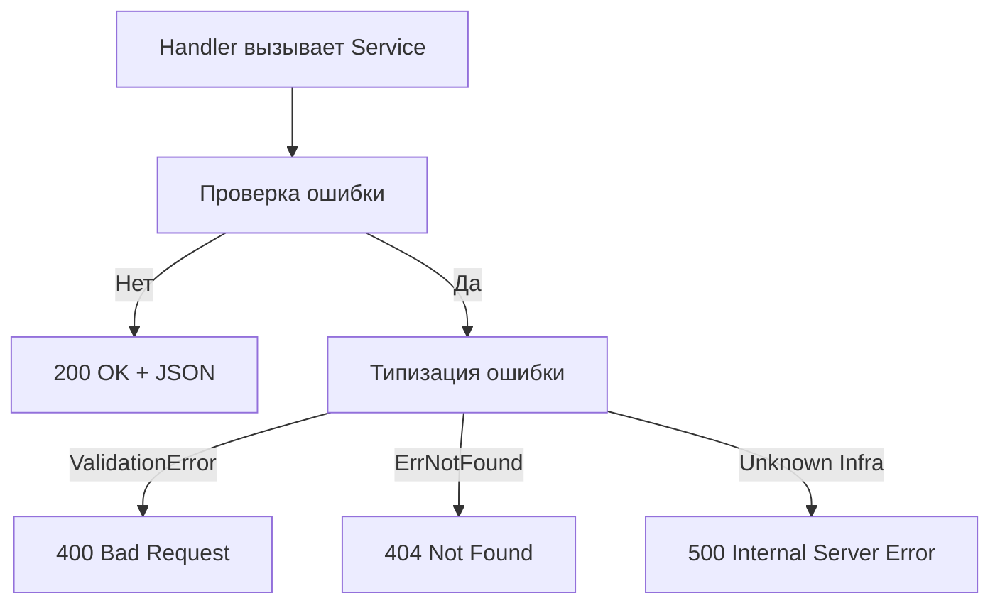

## Философия Error Handling в Go

В отличие от Java, C# или PHP, где ошибки управляются через механизм исключений и неявный unwind стека, Go трактует ошибки как **обычные значения**. Это фундаментальное архитектурное решение, которое меняет подход к потоку управления и отказоустойчивости.

Ошибка — это не аномальное прерывание выполнения, а ожидаемый результат операции, который несет контекст о том, почему действие не удалось. Идиома `if err != nil` — не баг дизайна языка, а явное декларирование ветки выполнения, где разработчик обязан принять решение: обработать локально, обернуть в контекст или пробросить наверх.

```go
// Идиоматично: явная проверка, ранний возврат
func GetOrder(ctx context.Context, id int64) (*Order, error) {
    order, err := db.FindByID(ctx, id)
    if err != nil {
        return nil, fmt.Errorf("find order %d: %w", id, err)
    }
    return order, nil
}
```

## 1. Стандартные механизмы и ошибки как значения

Пакет `errors` и `fmt` предоставляют инструменты для классификации, сравнения и обогащения ошибок без потери оригинального типа. Современный Go требует использования обертки `%w` и методов `errors.Is/As`.

- `errors.Is(err, target)`: проверка цепочки оберток на равенство конкретному sentinel-ошибку.
- `errors.As(err, target)`: безопасное приведение к кастомному типу ошибки в цепочке.
- `%w` в `fmt.Errorf`: оборачивание с сохранением оригинала для последующего `Is/As`.

```go
var ErrNotFound = errors.New("resource not found")

type ValidationError struct {
    Field string
    Msg   string
}
func (e *ValidationError) Error() string { return e.Msg }

func process(ctx context.Context) error {
    if err := fetch(ctx); err != nil {
        if errors.Is(err, ErrNotFound) {
            return ErrNotFound // Sentinel
        }
        var ve *ValidationError
        if errors.As(err, &ve) {
            return fmt.Errorf("validation failed on %s: %w", ve.Field, err)
        }
        return fmt.Errorf("fetch failed: %w", err)
    }
    return nil
}
```

> [!info] Под капотом
> `%w` создает новую структуру ошибки `fmt.wrapError`, которая хранит указатель на оригинал. При вызове `errors.Is/As` рантайм обходит цепочку через метод `Unwrap()`. Это линейный поиск `O(n)` по глубине вложенности. Глубокое оборачивание замедляет проверку и увеличивает потребление памяти, так как каждый `fmt.Errorf` выделяет новую строку и структуру в куче. Escape Analysis не может разместить их в стеке из-за передачи по ссылке через `Unwrap`.

## 2. Паттерн обработки в сервисном слое

В production-сервисах ошибки делятся на категории: доменные, инфраструктурные и системные. Сервис не должен возвращать `sql.ErrNoRows` или сетевые ошибки напрямую. Он маппит их в доменные ошибки, сохраняя контекст.

```go
func (s *UserService) Create(ctx context.Context, req *CreateUserReq) error {
    if err := s.validate(req); err != nil {
        return fmt.Errorf("validate: %w", err)
    }

    if err := s.repo.Create(ctx, &User{Email: req.Email}); err != nil {
        // Инфраструктурную ошибку превращаем в бизнес-сигнал
        if errors.Is(err, sql.ErrNoRows) { 
            return fmt.Errorf("create user: %w", ErrDuplicateEmail)
        }
        return fmt.Errorf("repo create: %w", err)
    }
    return nil
}
```

> [!warning] Ловушка / Gotcha
> **Ничего незначащий `nil`**: В Go интерфейс равен `nil` только если оба его слова (тип и данные) равны `nil`. Если функция возвращает указатель на nil-структуру, интерфейс не будет nil.
> ```go
> func bad() error {
>     var e *MyErr
>     return e // Интерфейс имеет тип *MyErr, данные nil. err == nil вернет false!
> }
> func good() error {
>     return nil // Явный nil интерфейса
> }
> ```
> Всегда возвращайте `nil` явно, если ошибки нет.

## 3. Маппинг ошибок в HTTP-слое

Обработчик — это переводчик. Он преобразует доменные ошибки в HTTP-статусы и структурированные JSON-ответы. Бизнес-логика не должна знать о `http.StatusBadRequest`.



```go
func writeError(w http.ResponseWriter, err error) {
    var status int
    var code string

    switch {
    case errors.Is(err, ErrNotFound):
        status = http.StatusNotFound
        code = "NOT_FOUND"
    case errors.Is(err, ErrDuplicate):
        status = http.StatusConflict
        code = "DUPLICATE"
    case errors.As(err, new(ValidationError)):
        status = http.StatusBadRequest
        code = "VALIDATION_FAILED"
    default:
        status = http.StatusInternalServerError
        code = "INTERNAL_ERROR"
        log.Printf("unhandled error: %v", err)
    }

    w.Header().Set("Content-Type", "application/json")
    w.WriteHeader(status)
    json.NewEncoder(w).Encode(ErrorResponse{Code: code, Message: err.Error()})
}
```

## 4. Производительность и Mechanical Sympathy

Создание ошибки в Go — операция с измеримой стоимостью. `errors.New()` аллоцирует строку в куче. `fmt.Errorf` создает форматированную строку + структуру. В hot-path генерация тысяч ошибок в секунду вызывает резкий всплеск аллокаций и повышает нагрузку на GC.

**Оптимизация:**
- Используйте **sentinel-ошибки** (`var ErrX = errors.New("...")`) для повторяемых состояний. Они инициализируются один раз при старте пакета в `.rodata` сегменте и живут вечно.
- Избегайте `fmt.Errorf` в циклах валидации. Возвращайте код или булево значение, конвертируйте в текст только на границе ответа.
- `panic` и `recover` — не замена error handling. Создание stack trace через `runtime.Callers` аллоцирует память и требует unwind. Используйте только для фатальных состояний (битая конфигурация, невозможность подключиться к критической БД).

> [!tip] Собеседование
> **Вопрос:** В чем разница между `errors.Is` и `errors.As`? Почему прямое сравнение `err == ErrNotFound` иногда не работает?
> **Ответ:** `errors.Is` проверяет равенство с конкретным значением ошибки, распутывая цепочку `%w`. `errors.As` проверяет тип и делает приведение. Прямое сравнение `==` не работает, если ошибка была обернута, так как сравниваются указатели на разные объекты в памяти. В современных сервисах почти всегда используется `errors.Is/As`.
>
> **Вопрос:** Стоит ли возвращать ошибки из `defer`?
> **Ответ:** Нет. Функция возвращает один `error`. Если в `defer` возникает ошибка, она должна быть залогирована, но не перезатирать основной результат. Идиома: `if err2 := f.Close(); err2 != nil { log.Printf("close failed: %v", err2) }`.

## 5. Сравнение с другими языками

| Аспект | Java / C# / PHP | Go |
|---|---|---|
| Поток управления | Неявный, `catch` прерывает стек | Явный, `if err != nil` ветвит выполнение |
| Контекст ошибки | Stack trace автоматически | Вручную через `%w` или кастомные поля |
| Производительность | `throw` дорого, требует unwind стека | Дешево при `err == nil`. Аллокация только при создании |
| Тестируемость | Мокирование исключений сложно | Ошибки — данные, легко мокать и проверять |

Go-подход требует больше кода, но дает полный контроль над восстановлением после сбоя и предотвращает скрытые переходы в неизвестное состояние, характерные для исключений.

## Итог

1. Ошибки в Go — это значения. Обрабатывайте их явно и локально, где это возможно.
2. Используйте `errors.Is/As` и `%w` для построения предсказуемой цепочки контекста.
3. Маппите доменные ошибки в HTTP-коды только на границе сервера.
4. Избегайте глубокого оборачивания и создания ошибок в hot-path без необходимости.
5. Возвращайте явный `nil` типа `error`, а не указатель на nil-структуру.
6. Логгируйте только непредвиденные ошибки на уровне инфраструктуры, бизнес-ошибки отдавайте клиенту структурированно.

Следующая статья: [[16. Healthcheck и readiness probe]]