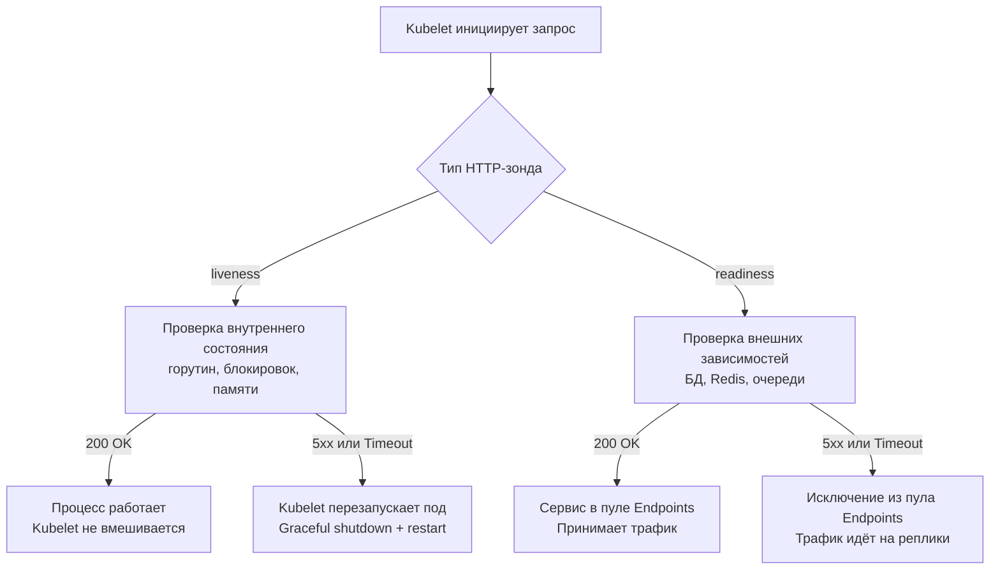

## Разделение ответственности. Liveness и Readiness

В контейнерных оркестраторах (Kubernetes, Docker Swarm, Nomad) жизненный цикл сервиса управляется через HTTP-зонды. Они сигнализируют платформе о состоянии процесса: «завис ли он» и «готов ли принимать трафик». Неправильная реализация зондов — одна из самых частых причин каскадных падений, 502-х ошибок при деплое и бесконечных рестартов подов.

В Go реализация зондов тривиальна синтаксически, но требует глубокого понимания механики оркестратора, работы сетевого стека и стоимости операций на уровне CPU и памяти.

### 1. Архитектура HTTP-зондов в Kubernetes

Существует три типа проб, каждый из которых выполняет строго определённую функцию:

- **Liveness (Жизнеспособность)**: Отвечает на вопрос «Процесс мёртв?». Если зонд падает, оркестратор принудительно перезапускает контейнер. **Не должен** проверять внешние зависимости (БД, кеш, очереди). Временный сетевой разрыв не должен убивать под.
- **Readiness (Готовность)**: Отвечает на вопрос «Могу ли я обрабатывать запросы?». Если зонд падает, оркестратор исключает под из пула `Endpoints`. Трафик перенаправляется на реплики. **Должен** проверять критические зависимости.
- **Startup (Запуск)**: Даёт сервису время на инициализацию (миграции, загрузка кешей,预热 пулов соединений). Пока не ответит `200`, liveness-проба не активна.



### 2. Идиоматичная реализация на Go

Зонды находятся на **hot-path** оркестратора. Они вызываются каждые 1-5 секунд на каждый под. Любая аллокация или блокировка в обработчике создаёт кумулятивный overhead на кластере.

```go
package health

import (
	"net/http"
	"sync/atomic"
)

// Probes управляет состояниями жизнеспособности и готовности.
// Использует атомарные операции для lock-free чтения на горячем пути.
type Probes struct {
	isReady atomic.Int32 // 0 = not ready, 1 = ready
}

func NewProbes() *Probes {
	p := &Probes{}
	p.isReady.Store(0) // Изначально сервис не готов
	return p
}

func (p *Probes) SetReady(ready bool) {
	var val int32
	if ready {
		val = 1
	}
	p.isReady.Store(val)
}

// LivenessHandler проверяет только базовую работоспособность процесса.
func (p *Probes) LivenessHandler() http.HandlerFunc {
	return func(w http.ResponseWriter, r *http.Request) {
		w.Header().Set("Content-Type", "application/json")
		w.WriteHeader(http.StatusOK)
		// Использование константного среза избегает аллокаций в куче на каждый вызов
		w.Write([]byte(`{"status":"ok"}`))
	}
}

// ReadinessHandler возвращает готовность на основе атомарного флага.
func (p *Probes) ReadinessHandler() http.HandlerFunc {
	return func(w http.ResponseWriter, r *http.Request) {
		w.Header().Set("Content-Type", "application/json")
		if p.isReady.Load() == 1 {
			w.WriteHeader(http.StatusOK)
			w.Write([]byte(`{"status":"ready"}`))
		} else {
			w.WriteHeader(http.StatusServiceUnavailable)
			w.Write([]byte(`{"status":"not ready"}`))
		}
	}
}
```

### 3. Механика работы и Mechanical Sympathy

Понимание того, как зонды взаимодействуют с рантаймом Go и ядром Linux, критично для стабильности.

**Сетевой стек и syscalls**
Каждый зонд `kubelet` — это новый TCP-соединение (в старых версиях K8s) или мультиплексированный поток (HTTP/2 в новых). Для Go `net/http` сервера это означает:
1. `accept()` syscall → получение файлового дескриптора
2. Регистрация в `netpoll` (epoll/kqueue)
3. Запуск горутины-обработчика
4. `read()` → парсинг HTTP-заголовков
5. `write()` → отправка ответа
6. Закрытие соединения (если нет keep-alive)

Частые зонды (каждую секунду) на 100-подовом кластере генерируют сотни `accept`/`close` syscall в секунду. Это нагружает планировщик, увеличивает churn горутин и создает contention на уровне `netpoll`.

**Атомарные операции vs Мьютексы**
Для флага готовности `atomic.Int32` предпочтительнее `sync.RWMutex`. `atomic.Store/Load` компилируется в инструкции `mov` с префиксами памяти (x86) или `ldxr/stxr` (ARM). Это lock-free операция, выполняемая за 1-2 такта CPU в User Space. `sync.RWMutex` при высокой конкуренции вызывает `futex` syscall, переводит горутины в состояние `_Gwaiting` и требует переключения контекста ядра. На hot-path разница достигает 10-50x.

> [!info] Под капотом
> Константные байтовые срезы `[]byte(`{"status":"ok"}`)` размещаются в секции `.rodata` бинарного файла при компиляции. Они не аллоцируются в куче во время выполнения. Использование `fmt.Sprintf` или `json.Marshal` на каждый запрос создаёт аллокации, которые попадают в молодое поколение GC. При тысячах зондов в секунду это вызывает дополнительные микро-паузы сборщика мусора.

### 4. Асинхронная проверка зависимостей

Readiness должен проверять БД, кеш или очереди, но **никогда не должен** делать это синхронно внутри HTTP-обработчика. Блокировка обработчика приведёт к таймауту пробы, исключению пода из сервиса и увеличению нагрузки на оставшиеся реплики.

Правильный паттерн — фоновый воркер, который обновляет атомарный флаг:

```go
func StartDependencyChecker(p *Probes, db *sql.DB) {
	go func() {
		ticker := time.NewTicker(5 * time.Second)
		defer ticker.Stop()
		
		for range ticker.C {
			ctx, cancel := context.WithTimeout(context.Background(), 2*time.Second)
			err := db.PingContext(ctx)
			cancel()
			
			// Атомарное обновление состояния готовности
			p.SetReady(err == nil)
		}
	}()
}
```

### 5. Ловушки и антипаттерны

> [!warning] Ловушка / Gotcha
> **Liveness с проверкой БД**: Классическая ошибка. Если сеть между подом и БД лагает на 3 секунды, liveness возвращает 503. Kubelet убивает под. Под перезапускается, пытается подключиться, снова лагает, снова убивается. Получается **restart loop**. Liveness должен проверять только внутренние инварианты: deadlock-детектор, использование памяти, состояние планировщика горутин.
> 
> **Тяжёлая логика в Readiness handler**: Вызов сложных SQL-запросов или проверка внешних API прямо в `http.HandlerFunc`. При высокой нагрузке очередь на `accept()` растёт, обработчик блокируется, kubelet помечает под как `NotReady`, трафик уходит на соседние поды, которые тоже не справляются → каскадный отказ.
> 
> **Отсутствие таймаутов на сервере**: Если `http.Server.ReadTimeout` не настроен, медленные или зависшие TCP-соединения от kubelet остаются в `ESTABLISHED` состоянии, потребляя файловые дескрипторы и память. Всегда задавайте `ReadTimeout: 5s` для probe-эндпоинтов.

### 6. Собеседование и типичные вопросы

> [!tip] Собеседование
> **Вопрос:** В чем архитектурная разница между liveness и readiness? Что произойдет, если перепутать их логику?
> **Ответ:** Liveness управляет перезапуском процесса, Readiness управляет маршрутизацией трафика. Если в liveness добавить проверку БД, временный сетевой разрыв будет вызывать бесконечные рестарты подов. Если в readiness убрать проверку БД, под начнет отдавать 500-е ошибки клиентам, так как оркестратор будет слать на него трафик.
> 
> **Вопрос:** Почему `atomic` предпочтительнее `sync.Mutex` для флага готовности?
> **Ответ:** `atomic` использует аппаратные инструкции CAS/LoadStore, работает без блокировок ядра и не вызывает переключения контекста горутин. `sync.Mutex` при contention переводит горутины в системный вызов `futex`, что увеличивает задержку и нагрузку на планировщик ОС. Для простого булевого флага `atomic` даёт O(1) lock-free доступ.
> 
> **Вопрос:** Как реализовать startup probe для долгого инициализации (например, загрузка 10 ГБ кеша в память)?
> **Ответ:** Использовать `startupProbe` в K8s с большим `failureThreshold`. В Go логика та же: флаг `ready` остаётся `0`, пока фоновая задача не завершит загрузку. `liveness` проверяет только, что процесс не завис (например, heartbeat таймер обновляется), а `readiness` ждёт сигнала от воркера загрузки.

### Итог

1. Разделяйте liveness (процесс жив) и readiness (зависимости доступны) на уровне кода и конфигурации оркестратора.
2. Используйте `atomic` примитивы для управления флагами готовности, избегая блокировок на горячем пути.
3. Никогда не проверяйте внешние зависимости внутри liveness-обработчика.
4. Асинхронные воркеры обновляют состояние readiness, обработчики только читают атомарный флаг.
5. Оптимизируйте аллокации: константные JSON-ответы, отсутствие рефлексии, минимальный набор заголовков.
6. Настройте таймауты HTTP-сервера специально для probe-портов, чтобы избежать утечки дескрипторов.

Следующая статья: [[17. Метрики и базовый monitoring]]