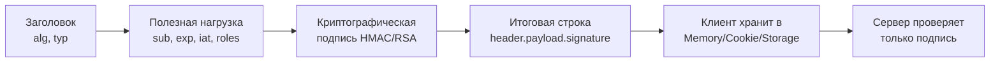
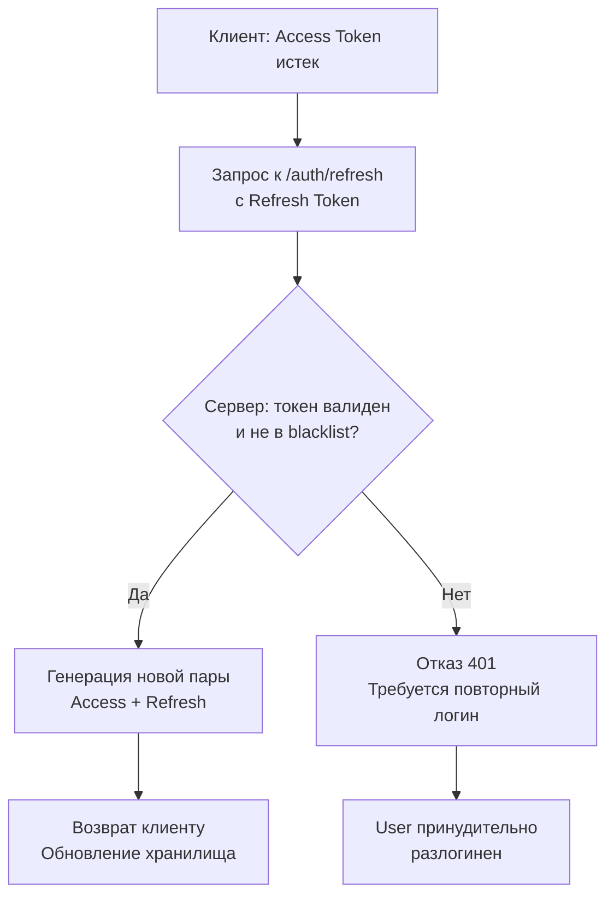

## Философия и структура JWT

JWT (JSON Web Token) — это стандарт де-факто для stateless-аутентификации в распределенных системах. В отличие от классических сессий, где состояние хранится на сервере (в памяти, Redis или БД), JWT переносит состояние на клиента. Это устраняет необходимость синхронизации сессий между инстансами, упрощает горизонтальное масштабирование и снижает latency за счет отсутствия сетевых вызовов к хранилищу состояний на каждый запрос.

Токен состоит из трех частей, разделенных точкой: `header.payload.signature`. Все части кодируются в Base64URL.



> [!info] Под капотом
> JWT не шифруется по умолчанию. Payload доступен для чтения любому, кто перехватит токен. Конфиденциальные данные (пароли, PII, токены доступа к сторонним API) **никогда** не должны попадать в claims. Для защиты используется подпись (Integrity), а не шифрование (Confidentiality). Если требуется скрыть содержимое, применяется JWE (JSON Web Encryption), но в 99% production-сценариев это избыточно.

## Криптография под капотом

Подпись JWT генерируется и проверяется с использованием криптографических примитивов из стандартной библиотеки `crypto`. Выбор алгоритма напрямую влияет на производительность и архитектуру.

- **HMAC-SHA256 (HS256)**: Симметричный алгоритм. Один общий секрет используется для подписи и проверки. Быстрый, но требует безопасной доставки ключа на все инстансы.
- **RSA/ECDSA (RS256/ES256)**: Асимметричные алгоритмы. Приватный ключ подписывает на Auth-сервисе, публичный ключ проверяет на микросервисах. Безопаснее в распределенных кластерах, но дороже по CPU.

```go
// Пример подписи на стороне Auth-сервиса
import (
    "crypto/rand"
    "crypto/rsa"
    "crypto/sha256"
    "math/big"
)

func signRS256(header, payload []byte, priv *rsa.PrivateKey) ([]byte, error) {
    data := append(header, []byte(".")...)
    data = append(data, payload...)
    
    hash := sha256.Sum256(data)
    
    // RSA-SHA256 PKCS#1 v1.5 подпись
    return rsa.SignPKCS1v15(rand.Reader, priv, crypto.SHA256, hash[:])
}
```

> [!info] Под капотом
> Современные CPU (x86-64 с расширениями SHA-NI, ARM с Crypto Extensions) выполняют хэширование SHA256 аппаратно, за ~1-3 цикла на байт. Без аппаратного ускорения операция занимает ~100-200 тактов на блок. RSA-подпись требует возведения в степень по модулю больших чисел, что обходится в 1000-5000 тактов CPU и вызывает аллокации для `big.Int` в куче. ECDSA (P-256) значительно легче RSA и предпочтителен для highload-систем. Все крипто-операции в Go выполняются в User Space, без системных вызовов.

## Идиоматичная реализация в Go

Стандарт де-факто — пакет `github.com/golang-jwt/jwt/v5`. Он строго типизирован, поддерживает кастомные claims и безопасен по умолчанию (rejects `alg: none`, проверяет `exp`).

```go
package auth

import (
    "context"
    "errors"
    "fmt"
    "net/http"
    "strings"
    "time"

    "github.com/golang-jwt/jwt/v5"
)

type Claims struct {
    UserID int64  `json:"sub"`
    Role   string `json:"role"`
    jwt.RegisteredClaims
}

var (
    ErrInvalidToken   = errors.New("invalid token")
    ErrExpiredToken   = errors.New("token expired")
    ErrMissingBearer  = errors.New("missing Bearer token")
)

// JWTMiddleware проверяет токен и инжектирует Claims в контекст
func JWTMiddleware(secret []byte) func(http.Handler) http.Handler {
    return func(next http.Handler) http.Handler {
        return http.HandlerFunc(func(w http.ResponseWriter, r *http.Request) {
            tokenStr := extractBearerToken(r)
            if tokenStr == "" {
                http.Error(w, ErrMissingBearer.Error(), http.StatusUnauthorized)
                return
            }

            claims := &Claims{}
            token, err := jwt.ParseWithClaims(tokenStr, claims, func(t *jwt.Token) (interface{}, error) {
                // Защита от атаки смены алгоритма
                if _, ok := t.Method.(*jwt.SigningMethodHMAC); !ok {
                    return nil, fmt.Errorf("unexpected signing method: %v", t.Header["alg"])
                }
                return secret, nil
            })

            if err != nil {
                if errors.Is(err, jwt.ErrTokenExpired) {
                    http.Error(w, ErrExpiredToken.Error(), http.StatusUnauthorized)
                    return
                }
                http.Error(w, ErrInvalidToken.Error(), http.StatusUnauthorized)
                return
            }

            if !token.Valid {
                http.Error(w, ErrInvalidToken.Error(), http.StatusUnauthorized)
                return
            }

            // Инжекция в контекст для следующих слоев
            ctx := context.WithValue(r.Context(), "claims", claims)
            next.ServeHTTP(w, r.WithContext(ctx))
        })
    }
}

func extractBearerToken(r *http.Request) string {
    auth := r.Header.Get("Authorization")
    if !strings.HasPrefix(auth, "Bearer ") {
        return ""
    }
    return strings.TrimPrefix(auth, "Bearer ")
}
```

> [!warning] Ловушка / Gotcha
> **Алгоритмическая путаница (Algorithm Confusion)**: Если сервер принимает `alg: none` или позволяет клиенту сменить `HS256` на `RS256` без проверки ключа, атакующий может сгенерировать произвольный токен. Всегда явно проверяйте `t.Method` в `KeyFunc` и никогда не используйте `jwt.Parse` без `jwt.WithValidMethods` или явной проверки типа метода.
> **Парсинг времени**: `jwt.RegisteredClaims` использует `time.Time`. При сравнении `exp` пакет учитывает clock skew (разницу во времени между серверами). Рекомендуется настраивать `jwt.WithLeeway(2*time.Second)`.

## Проблема отзыва и Refresh Token Pattern

JWT stateless по дизайну. Сервер не хранит список активных токенов, поэтому мгновенно отозвать конкретный токен невозможно (до истечения `exp`). Это фундаментальный компромисс.

Решение в production:
1. Короткоживущие Access Token (`exp: 15m`)
2. Долгоживущие Refresh Token (`exp: 30d`), хранящиеся в БД/Redis
3. При истечении Access Token клиент шлет Refresh Token на `/auth/refresh`
4. Сервер проверяет Refresh Token, сверяет с БД, генерирует новую пару
5. При смене пароля или подозрении на взлом Refresh Token инвалидируется в БД



## Производительность и Mechanical Sympathy

Парсинг JWT — операция с измеримой стоимостью:
- `jwt.ParseWithClaims` создает `map[string]interface{}` для header, аллоцирует `Claims`, парсит JSON payload (`json.Unmarshal`), проверяет время и подпись.
- На 100 000 RPS это генерирует ~5-8 аллокаций на запрос, попадающих в молодое поколение GC.
- Escape Analysis: `claims` и временные буферы уходят в кучу, так как возвращаются из функций парсинга или передаются через `interface{}`.

**Оптимизация для Highload:**
1. Избегайте `json.Unmarshal` в hot-path, если claims известны на этапе компиляции. Используйте кастомный декодер или pre-allocated структуры.
2. Кешируйте публичные ключи для RS256/ES256 в памяти с `sync.RWMutex` или `atomic.Pointer`. Не загружайте JWKS-эндпоинт на каждый запрос.
3. Используйте `sync.Pool` для временных буферов Base64URL-декодирования, если пишете кастомный парсер.

> [!tip] Собеседование
> **Вопрос:** Почему JWT не подходит для хранения состояния корзины или сессий пользователя?
> **Ответ:** JWT имеет лимит размера (обычно 4KB-8KB из-за HTTP-заголовков). Хранение большого state в token раздувает размер пакетов, увеличивает CPU на сериализацию/проверку и усложняет ротацию ключей. State должен жить в Redis/DB, а JWT — только для идентификации (`sub`, `roles`, `exp`).
> 
> **Вопрос:** Как безопасно хранить JWT на клиенте?
> **Ответ:** `localStorage` уязвим к XSS (любой JS-скрипт прочитает токен). `Cookie` с флагами `HttpOnly`, `Secure`, `SameSite=Strict` защищает от XSS, но требует CSRF-защиты. В SPA-архитектурах часто используют `Memory Storage` (переменная в JS) с автоматическим refresh через скрытый iframe/service worker, что балансирует между UX и безопасностью.

## Сравнение с сессиями и другими экосистемами

| Аспект | PHP / Java Sessions | Go + JWT |
|---|---|---|
| Хранение состояния | Server-side (Redis, Files, DB) | Client-side (в токене) |
| Масштабирование | Требует sticky-sessions или shared storage | Stateless, легко масштабируется |
| Отзыв | Мгновенный (удаление из хранилища) | Задержка до истечения `exp` или blocklist |
| Размер заголовка | Только `PHPSESSID` / `JSESSIONID` | 200-2000 байт (Base64 payload) |
| CPU overhead | Минимальный (lookup по ID) | Выше (crypto verify + JSON parse) |

В монолитах сессии удобнее. В микросервисах на Go JWT предпочтительнее из-за отсутствия зависимостей от общего хранилища состояний и упрощения сетевого взаимодействия.

## Итог

1. JWT обеспечивает stateless-аутентификацию, но требует строгой проверки алгоритма и подписи.
2. Никогда не храните секреты или конфиденциальные данные в payload.
3. Используйте короткий `exp` + Refresh Token pattern для контролируемого отзыва.
4. `golang-jwt/jwt/v5` безопасен по умолчанию, но требует явной проверки `t.Method` в `KeyFunc`.
5. На highload парсинг создает аллокации; кешируйте ключи и минимизируйте payload.
6. Храните токены в `HttpOnly` cookies или memory, избегая `localStorage` при рисках XSS.

Следующая статья: [[20. Authorization. RBAC]]