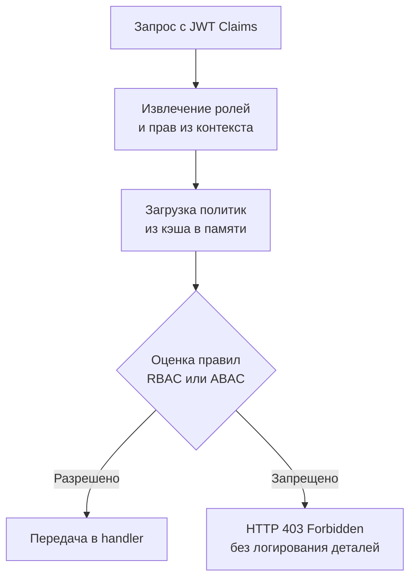

В PHP, Spring или Laravel авторизация часто реализуется через магические аннотации `@PreAuthorize`, `@Can` или макросы в роутах, которые неявно перехватывают выполнение. Go отвергает эту парадигму. Здесь авторизация — это **явная проверка контрактов** на уровне middleware или сервисного слоя. Это дает полный контроль над потоком выполнения, упрощает отладку, исключает скрытые side-эффекты и позволяет точно измерять накладные расходы.

RBAC (Role-Based Access Control) моделирует доступ через связку `User → Role → Permission`. В production-системах чистый RBAC редко встречается изолированно: его дополняют атрибутами (ABAC) или контекстом запроса для гибкости без потери производительности.

## 1. Математическая модель и структура данных

В основе RBAC лежит теория множеств. Проверка доступа — это операция пересечения: `User.Permissions ∩ Resource.RequiredPermissions ≠ ∅`. В Go это реализуется через:
- `map[string]struct{}` для быстрого поиска O(1)
- Битовые маски (`uint64`) для компактного хранения и атомарных операций
- Графы зависимостей (если роли наследуются)



## 2. Под капотом. Оптимизация горячего пути

Проверка прав происходит на **каждый запрос**. Это критический путь. Использование `map[string]bool` или рефлексии для парсинга тегов создает аллокации и contention. Идиоматичный подход — использование битовых масок или pre-compiled слайсов прав.

```go
// Битовые флаги для прав (до 64 прав в uint64)
const (
    PermRead   uint64 = 1 << iota // 1
    PermWrite                     // 2
    PermDelete                    // 4
    PermAdmin                     // 8
)

// Проверка за O(1) без аллокаций
func HasPermission(userPerms uint64, required uint64) bool {
    return (userPerms & required) == required
}
```

> [!info] Под капотом
> Битовые операции выполняются за 1 такт CPU в регистре ALU. Они не требуют доступа к памяти, не вызывают cache miss и не создают аллокаций. При использовании `uint64` данные помещаются в одну кэш-линию (64 байта). Сравните с `map[string]struct{}`, где поиск требует хэширования строки, прохода по бакетам `hmap` и потенциальных cache miss при разыменовании указателей. На 100k RPS разница в задержке между битовой маской и map может достигать 50-100 нс на запрос, что складывается в миллисекунды общей задержки p99.

## 3. Идиоматичная реализация Middleware

Авторизация должна быть отделена от аутентификации. JWT middleware устанавливает `claims`, а RBAC middleware проверяет права.

```go
package middleware

import (
    "context"
    "net/http"
)

type PermissionKey struct{}

// RequirePerm возвращает middleware, проверяющий наличие прав
func RequirePerm(required uint64) func(http.Handler) http.Handler {
    return func(next http.Handler) http.Handler {
        return http.HandlerFunc(func(w http.ResponseWriter, r *http.Request) {
            // Извлекаем права из контекста (установлены auth middleware)
            perms, ok := r.Context().Value(PermissionKey{}).(uint64)
            if !ok {
                http.Error(w, "unauthorized", http.StatusUnauthorized)
                return
            }

            if (perms & required) != required {
                http.Error(w, "forbidden", http.StatusForbidden)
                return
            }

            next.ServeHTTP(w, r)
        })
    }
}
```

Использование в роутинге:
```go
mux.Handle("/api/users", RequirePerm(PermRead)(userHandler))
mux.Handle("/api/users/admin", RequirePerm(PermAdmin)(adminHandler))
```

## 4. Динамические политики и Policy Engines

Битовые маски идеальны для статичных систем. В enterprise-приложениях права меняются на лету, есть иерархия ролей и условия (время, IP, статус ресурса). Здесь подключаются policy engines, чаще всего **Casbin** или **Open Policy Agent (OPA)**.

Casbin использует модель `PERM` (Policy, Effect, Request, Matchers). Конфигурация описывается в строке, а правила загружаются из БД/файла.

```go
import "github.com/casbin/casbin/v2"

func casbinMiddleware(e *casbin.Enforcer) func(http.Handler) http.Handler {
    return func(next http.Handler) http.Handler {
        return http.HandlerFunc(func(w http.ResponseWriter, r *http.Request) {
            subj := getUserFromCtx(r)
            obj := r.URL.Path
            act := r.Method

            ok, err := e.Enforce(subj, obj, act)
            if err != nil || !ok {
                http.Error(w, "forbidden", http.StatusForbidden)
                return
            }
            next.ServeHTTP(w, r)
        })
    }
}
```

> [!warning] Ловушка / Gotcha
> `e.Enforce()` по умолчанию использует линейный поиск по правилам. При тысячах политик это замедляет hot-path. Casbin предоставляет оптимизации: `rbac_api` с кэшированием в `sync.Map`, компиляция матчеров в AST, или pre-compiled `rbac_domain_model`. В production всегда включайте кэш: `e.EnableAutoSave(false)` и управляйте инвалидацией вручную через атомарную замену энфорсера.
> **Horizontal Privilege Escalation**: RBAC проверяет только действие. Проверка принадлежности ресурса пользователю (ownership) — это бизнес-логика. Всегда валидируйте `resource.owner_id == claims.user_id` на уровне сервиса, а не middleware. Middleware должен пропускать только авторизованные роли.

## 5. Race Conditions и атомарное обновление политик

В распределенных системах политики меняются асинхронно (из админки, через Kafka, polling БД). Прямая замена энфорсера или map прав вызовет data race.

Правильный паттерн: `atomic.Pointer` + двойная загрузка.

```go
var policyCache atomic.Pointer[casbin.Enforcer]

func reloadPolicies() {
    newEnforcer, err := casbin.NewEnforcer("model.conf", "new_policies.csv")
    if err != nil {
        log.Printf("policy reload failed: %v", err)
        return
    }
    policyCache.Store(newEnforcer)
}

// В middleware:
func checkAuth(w http.ResponseWriter, r *http.Request) {
    e := policyCache.Load()
    subj := r.Context().Value("user").(string)
    ok, _ := e.Enforce(subj, r.URL.Path, r.Method)
    // ...
}
```
Это lock-free замена. Читатели всегда получают консистентную версию политик без `sync.RWMutex` и без перевода горутин в `_Gwaiting`.

## 6. Производительность и Mechanical Sympathy

- **Кэш-локальность**: Если права хранятся в слайсе или маске, CPU предзагружает соседние данные. `map` разбрасывает узлы по памяти, увеличивая `dTLB-load-misses`.
- **Escape Analysis**: Передача `uint64` в контекст или замыкание не вызывает аллокаций. Передача `[]string` прав может уйти в кучу из-за передачи по ссылке.
- **Branch Prediction**: `if (perms & required) == required` имеет высокую предсказуемость ветвлений для успешных запросов. Компилятор Go может оптимизировать такие проверки, избегая ветвлений при векторизации.
- **Сравнение с PHP/Java**: В Spring Security цепочка фильтров проходит через множество прокси и аспектов (AOP). В Go middleware — это прямые вызовы функций. Overhead Casbin/OPA в Go измеряется микросекундами против миллисекунд в JVM-стеке благодаря отсутствию JIT-прогрева и тяжелого runtime.

> [!tip] Собеседование
> **Вопрос:** В чем разница между RBAC и ABAC? Когда переходить от одного к другому?
> **Ответ:** RBAC отвечает на вопрос «Кто ты?» (роль), ABAC — «При каких условиях?» (атрибуты: время, IP, владелец ресурса, статус). Чистый RBAC масштабируется до ~50 ролей. При появлении кросс-доменных прав, временных доступов или контекстных условий переходят к ABAC или гибридной модели.
> 
> **Вопрос:** Почему `map[string]struct{}` лучше `map[string]bool` для множеств прав?
> **Ответ:** `struct{}` занимает 0 байт. `bool` занимает 1 байт, но из-за выравнивания (alignment) в `hmap` бакеты все равно резервируют место. `struct{}` минимизирует footprint и давление на кэш. При 100k пользователей разница в RSS может достигать десятков мегабайт.

## 7. Сравнение подходов

| Метод | Сложность | Производительность | Динамичность | Идеально для |
|---|---|---|---|---|
| Битовые маски | Низкая | Максимальная (O(1)) | Низкая | Внутренние API, монолиты |
| `map`/слайсы | Средняя | Высокая | Средняя | Микросервисы без сложных правил |
| Casbin/OPA | Высокая | Средняя (кэшируется) | Высокая | Enterprise, SaaS, multi-tenant |
| Код в handler | Низкая | Максимальная | Нулевая | Прототипы, простые CRUD |

## Итог

1. В Go авторизация реализуется явно через middleware или сервисный слой, без магических аннотаций.
2. Для статичных прав используйте битовые маски (`uint64`) — это O(1), 0 аллокаций, 100% cache-friendly.
3. Для динамических политик применяйте Casbin, но обязательно кэшируйте энфорсер и обновляйте его через `atomic.Pointer`.
4. Разделяйте аутентификацию (кто ты), авторизацию (что можно) и бизнес-валидацию (твой ли это ресурс).
5. Избегайте `map` для прав в hot-path из-за аллокаций и cache miss.
6. RBAC масштабируется до ~50 ролей; для сложных условий переходите к ABAC или hybrid-моделям.

Следующая статья: [[21. Работа с базой данных]]