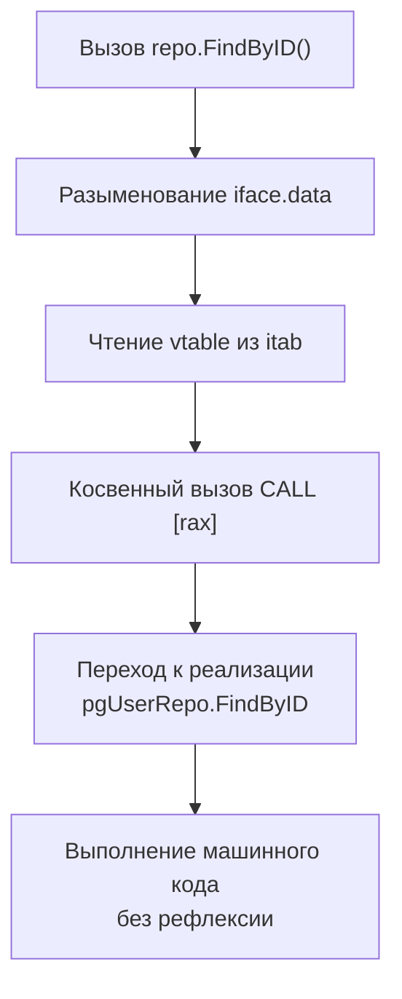

## Философия паттерна в Go

Repository pattern в Go — это не просто папка `internal/repository` с CRUD-методами. Это архитектурный контракт, который изолирует бизнес-логику от деталей хранения данных. В отличие от Active Record, где модель сама знает о БД, или DAO (Data Access Object), который часто привязан к конкретной таблице, Repository абстрагирует коллекцию доменных объектов.

Главное правило Go-архитектуры: **интерфейсы определяются потребителем, а не создателем**. Сервисный слой диктует, какие методы ему нужны для работы, а репозиторий реализует этот контракт, скрывая SQL, драйверы и маппинг строк.

### Интерфейсы определяются потребителем

Вместо универсального `Save()` или `Find()`, методы отражают предметную область:

```go
package service

// UserRepository — контракт, определенный сервисом.
// Только те методы, которые реально нужны бизнес-логике.
type UserRepository interface {
    FindByID(ctx context.Context, id int64) (*User, error)
    FindActiveByEmail(ctx context.Context, email string) (*User, error)
    Create(ctx context.Context, u *User) error
    UpdateStatus(ctx context.Context, id int64, status UserStatus) error
}
```

Это предотвращает раздувание интерфейса и упрощает тестирование. Моки реализуют только нужные методы.

### Под капотом. Механика интерфейсов и память

Когда вы передаете указатель на структуру в функцию, принимающую интерфейс, Go выполняет неявное преобразование. В памяти создается двухсловная структура `iface`:

1. **`itab`** (Interface Table): указатель на тип интерфейса, тип конкретной реализации и **vtable** — массив указателей на методы.
2. **`data`**: указатель на данные (ваш `*pgUserRepo`).



> [!info] Под капотом
> Косвенный вызов через vtable добавляет ~1-2 такта CPU по сравнению со статическим вызовом. Это пренебрежимо мало для I/O-операций, но может суммироваться в tight loops. Компилятор Go (GOSSAFUNC) часто инлайнит методы репозитория, если интерфейс не передается через границы пакетов или замыканий. Однако при передаче в `interface{}` или сохранении в `map` происходит escape в кучу, так как компилятор не может доказать время жизни данных.

### Идиоматичная реализация

```go
package repository

import (
    "context"
    "database/sql"
    "errors"
    "fmt"
)

type pgUserRepo struct {
    db *sql.DB
}

func NewUserRepo(db *sql.DB) *pgUserRepo {
    return &pgUserRepo{db: db}
}

func (r *pgUserRepo) FindByID(ctx context.Context, id int64) (*User, error) {
    row := r.db.QueryRowContext(ctx, 
        "SELECT id, email, status FROM users WHERE id = $1", id,
    )

    var u User
    if err := row.Scan(&u.ID, &u.Email, &u.Status); err != nil {
        if errors.Is(err, sql.ErrNoRows) {
            return nil, fmt.Errorf("user %d: %w", id, ErrNotFound)
        }
        return nil, fmt.Errorf("scan user %d: %w", id, err)
    }
    return &u, nil
}

func (r *pgUserRepo) Create(ctx context.Context, u *User) error {
    _, err := r.db.ExecContext(ctx,
        "INSERT INTO users (email, status) VALUES ($1, $2)",
        u.Email, u.Status,
    )
    return err
}
```

Обратите внимание: интерфейс `UserRepository` не знает о `sql.DB`, `pgxpool` или ORM. Реализация может быть заменена на in-memory mock для тестов или на ClickHouse для аналитики без изменения сервисного слоя.

### Транзакции и Unit of Work

Репозиторий **не должен** управлять транзакциями самостоятельно. Это задача сервисного слоя. Правильный паттерн в Go — явная передача транзакции или использование callback-конструкции.

```go
// Плохо: репозиторий сам начинает/коммитит транзакцию
func (r *pgUserRepo) CreateUserWithProfile(ctx context.Context, u *User, p *Profile) error {
    tx, _ := r.db.BeginTx(ctx, nil) // Утекающая абстракция, сложное тестирование
    // ...
}

// Хорошо: сервис управляет транзакцией, репозиторий работает с executor
type DBExecutor interface {
    ExecContext(ctx context.Context, query string, args ...any) (sql.Result, error)
    QueryRowContext(ctx context.Context, query string, args ...any) *sql.Row
}

func (r *pgUserRepo) Create(ctx context.Context, u *User, exec DBExecutor) error {
    _, err := exec.ExecContext(ctx, "INSERT INTO users ...", u.Email, u.Status)
    return err
}
```

Такой подход позволяет переиспользовать один репозиторий как в `*sql.DB`, так и в `*sql.Tx`, сохраняя чистоту контракта.

### Ловушки и антипаттерны

> [!warning] Ловушка / Gotcha
> **Generic Repository `<T>`**: В Go часто пытаются написать `type Repository[T any] struct` с универсальными `Get`, `Save`, `Delete`. Это приводит к потере типобезопасности, сложным WHERE-условиям и невозможности оптимизировать конкретные запросы. Используйте дженерики только для truly-универсальных CRUD без бизнес-логики, либо откажитесь от них в пользу explicit interfaces.
> 
> **Возврат `sql.Rows` или `driver.Value` наружу**: Никогда не передавайте типы `database/sql` за пределы пакета `repository`. Это ломает инкапсуляцию, усложняет замену драйвера и создает скрытые зависимости от версии пакета.
> 
> **Repository как Active Record**: Методы вроде `user.Save()` смешивают состояние объекта с операциями хранения. В Go это антипаттерн. Данные и поведение разделены: структура `User` — это просто DTO/Entity, а `repository.Create(ctx, user)` — операция.

### Производительность и Mechanical Sympathy

Работа репозитория на hot-path создает несколько точек давления:
- **Аллокации при `Scan`**: `row.Scan(&u.ID)` требует указателей. Компилятор размещает их в стеке, но если `Scan` передается в функцию, принимающую `[]any`, слайс уходит в кучу. `pgx/v5` решает это через прямую запись в поля структуры, минуя `[]any`.
- **Кэш-локальность**: Структура репозитория должна быть компактной. Размещайте часто используемые поля (например, `*sql.DB` или `preparedStmt`) в начале. Это улучшает предвыборку L1 кэша при обходе.
- **Подготовленные запросы**: `stmt, _ := db.PrepareContext()` кэширует план выполнения на стороне БД. В Go используйте `pgx.Prepared` или `sql.Conn.Prepare`. Однако `Prepare` создает объект в памяти, который нужно закрывать. При высоких RPS лучше использовать query cache драйвера или пул соединений с prepared statements.

> [!tip] Собеседование
> **Вопрос:** В чем разница между DAO и Repository в контексте Go?
> **Ответ:** DAO (Data Access Object) абстрагирует таблицу БД и часто возвращает сырые структуры или мапы. Repository абстрагирует коллекцию доменных объектов и работает с бизнес-сущностями. DAO ближе к инфраструктуре, Repository — к домену. В Go граница стирается из-за минимализма, но концептуально Repository должен оперировать `User`, а не `db_row_123`.
> 
> **Вопрос:** Когда Repository pattern избыточен?
> **Ответ:** Если у вас CRUD-сервис с 1-2 таблицами, прямой вызов `db.QueryContext` в handler или простом сервисе быстрее и читаемее. Паттерн окупается при сложной бизнес-логике, необходимости замены хранилища (SQL → NoSQL), или когда сервис зависит от 5+ источников данных. Не абстрагируйте ради абстракции.

### Итог

1. Интерфейсы репозитория определяются на стороне потребителя (сервиса), а не в пакете инфраструктуры.
2. Не используйте универсальные Generic Repository для бизнес-логики. Явные методы (`FindByEmail`, `Deactivate`) читаемее и безопаснее.
3. Управляйте транзакциями на уровне сервиса, передавая `DBExecutor` или `*sql.Tx` в методы репозитория.
4. Никогда не возвращайте `database/sql` типы наружу. Конвертируйте в доменные ошибки и структуры.
5. `pgx/v5` предпочтительнее `database/sql` для PostgreSQL: меньше аллокаций при `Scan`, поддержка pipeline mode и бинарных протоколов.
6. Repository — это контракт, а не ORM. Он должен быть тестируемым, заменяемым и свободным от SQL-магии в сигнатурах.

Следующая статья: [[23. Транзакции]]