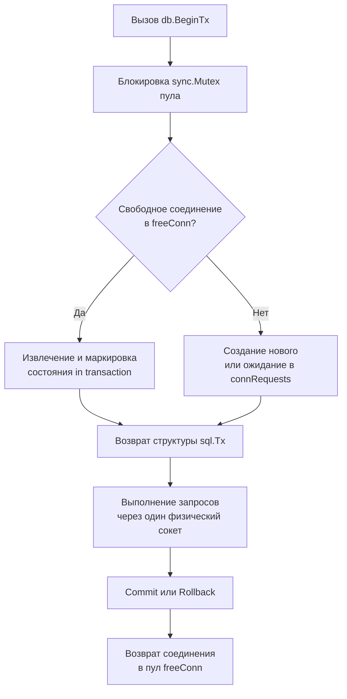

## Философия транзакций в Go

В Go транзакции управляются **явно и детерминированно**. Здесь нет `@Transactional` аннотаций, скрывающих за собой thread-local переменные, прокси и магию автокоммита. Пакет `database/sql` предоставляет структуру `sql.Tx`, которая является строгой оберткой над одним физическим соединением из пула. Это дает разработчику полный контроль над границами консистентности, но требует дисциплины в работе с соединениями и контекстами.

### 1. Механика sql.Tx и привязка к соединению

`db.BeginTx(ctx, opts)` извлекает одно соединение из пула и блокирует его исключительно для этой транзакции. Пока `tx` не завершена (`Commit` или `Rollback`), соединение находится в состоянии `in transaction` и **не возвращается** в `freeConn`.



> [!info] Под капотом
> `sql.Tx` содержит указатель на `driverConn`. Все методы `tx.QueryContext`, `tx.ExecContext` делегируются напрямую этому драйверу, минуя пул. Пул не может пулить соединение, помеченное как `inTx`. Это гарантирует изоляцию транзакции, но создает риск исчерпания пула при долгих операциях.

### 2. Идиоматичный паттерн: defer и обработка ошибок

Стандартный шаблон в Go — немедленный `defer tx.Rollback()` после успешного начала транзакции. Это гарантирует откат при любом пути выхода из функции: паника, ошибка в `Exec`, таймаут контекста.

```go
func UpdateUserBalance(ctx context.Context, db *sql.DB, userID int64, amount int) error {
    // Явное начало транзакции с таймаутом
    tx, err := db.BeginTx(ctx, &sql.TxOptions{
        Isolation: sql.LevelReadCommitted,
        ReadOnly:  false,
    })
    if err != nil {
        return fmt.Errorf("begin tx: %w", err)
    }
    defer tx.Rollback() // Безопасный откат при ошибке или панике

    // 1. Списание с основного счета
    _, err = tx.ExecContext(ctx, 
        "UPDATE accounts SET balance = balance - $1 WHERE user_id = $2 AND balance >= $1",
        amount, userID,
    )
    if err != nil {
        return fmt.Errorf("deduct balance: %w", err)
    }

    // 2. Запись в историю
    _, err = tx.ExecContext(ctx,
        "INSERT INTO balance_history (user_id, amount, type) VALUES ($1, $2, 'debit')",
        userID, amount,
    )
    if err != nil {
        return fmt.Errorf("log history: %w", err)
    }

    // Коммит. Если он упадет, defer Rollback() вызовется повторно.
    // В Go это безопасно: повторный Rollback на закрытой tx вернет ErrTxDone.
    if err := tx.Commit(); err != nil {
        return fmt.Errorf("commit tx: %w", err)
    }

    return nil
}
```

> [!tip] Собеседование
> **Вопрос:** Безопасно ли вызывать `defer tx.Rollback()` перед `tx.Commit()`?
> **Ответ:** Абсолютно. В `database/sql` методы `Commit` и `Rollback` меняют внутреннее состояние `tx.done = true`. Повторный вызов `Rollback` после успешного `Commit` просто проверит флаг, не выполнит сетевых операций и вернет `sql.ErrTxDone`. Это позволяет избежать дублирования `Rollback` в каждом `if err != nil`.
> 
> **Вопрос:** Что произойдет, если контекст отменится во время активной транзакции?
> **Ответ:** Драйвер получит сигнал отмены, прервет текущий сетевой запрос и вернет `context.Canceled`. Соединение пометится как `driver.ErrBadConn` и будет закрыто пулом. Транзакция на стороне БД автоматически откатится (Postgres/MySQL делают это при обрыве сокета), но явный `Rollback` в Go все равно должен быть вызван для корректного возврата соединения в пул.

### 3. Уровни изоляции и влияние на MVCC

Go не реализует уровни изоляции самостоятельно. Он передает флаги в драйвер, который транслирует их в команды БД (`SET TRANSACTION ISOLATION LEVEL...` или протокольные расширения).

- `LevelDefault`: зависит от драйвера (обычно `READ COMMITTED` в Postgres, `REPEATABLE READ` в MySQL).
- `LevelReadCommitted`: видит только зафиксированные данные. Минимум блокировок, максимальная пропускная способность.
- `LevelRepeatableRead`: гарантирует одинаковый результат `SELECT` внутри транзакции. В Postgres реализуется через MVCC (snapshot), без блокировок чтений. В MySQL может использовать gap locks.
- `LevelSerializable`: строгая сериализация. Высокий риск `SerializationFailure` и повторных попыток.

> [!warning] Ловушка / Gotcha
> **Serialization Failure**: При `LevelSerializable` PostgreSQL может вернуть `40001`. Обработка должна включать retry-логику с экспоненциальной задержкой. Игнорирование этой ошибки ведет к потере данных или silent corruption.
> **Вложенные транзакции**: `database/sql` их не поддерживает. Драйверы обычно игнорируют второй `Begin` или возвращают ошибку. Для вложенности используйте `SAVEPOINT` через сырой SQL: `tx.Exec("SAVEPOINT sp1")` / `tx.Exec("ROLLBACK TO sp1")`.

### 4. Ловушки production и антипаттерны

- **Долгие транзакции + внешний I/O**: Если внутри `tx` выполняется HTTP-запрос к микросервису, соединение БД заблокировано на время сетевого round-trip. При 100 RPS и `MaxOpenConns=20` пул исчерпается за 200 мс. Все новые запросы встанут в `connRequests` → cascading failure.
- **Игнорирование `driver.ErrBadConn` при коммите**: Если сеть дрогнула в момент `Commit()`, драйвер вернет `ErrBadConn`. Транзакция на стороне БД может быть уже зафиксирована, но клиент не узнает об этом. Требуется idempotency keys или двухфазный коммит для критичных операций.
- **Передача `tx` в другие горутины**: `sql.Tx` не потоко-безопасна для параллельных запросов. Она содержит `sync.Mutex`, но параллельное выполнение внутри одной транзакции все равно сериализуется и блокирует сокет.

### 5. Производительность и Mechanical Sympathy

- **Состояние сокета**: Активная транзакция держит TCP-соединение в режиме `ESTABLISHED` с отложенным `COMMIT`. БД держит undo-log и row-locks. Чем дольше транзакция, тем больше вакуумных процессов (Postgres) и тем медленнее работают конкурентные `UPDATE`.
- **Аллокации**: `tx.ExecContext` создает `[]any{}` для аргументов. Компилятор размещает слайс в куче из-за `interface{}` передачи. `pgx/v5` оптимизирует это, записывая аргументы напрямую в wire-формат без промежуточных интерфейсов.
- **Кэш-линии и Mutex**: `sql.Tx` использует внутренний `sync.Mutex` для защиты состояния `done`. При высокой конкуренции на коммит/роллбакк возникает contention, но так как операции атомарны и быстры, влияние минимально. Основной bottleneck — сетевая задержка и блокировки на стороне БД.

### 6. Сравнение с другими экосистемами

| Аспект | Java / Spring `@Transactional` | PHP / Laravel (PDO) | Python / SQLAlchemy | Go `database/sql` |
|---|---|---|---|---|
| Управление | AOP-прокси, thread-local connection | Implicit per request или explicit `BEGIN` | Session/Unit of Work, неявный flush | Явный `BeginTx`, `Commit`, `Rollback` |
| Пул соединений | External (HikariCP), shared | Per-process, нет пула на уровне языка | Pool через `QueuePool` | Встроенный `sql.DB` |
| Вложенность | `REQUIRES_NEW` создает новую tx | Нет нативной поддержки | Nested sessions | Только через `SAVEPOINT` |
| Откат при панике | Зависит от конфигурации proxy | Требуется явный `ROLLBACK` | Session rollback на выходе из with | `defer tx.Rollback()` покрывает panic |

### 7. Итог

1. Транзакции в Go управляются явно через `sql.Tx`. Никакой скрытой магии.
2. Всегда используйте `defer tx.Rollback()` сразу после `BeginTx`. Это безопасно и покрывает все пути выхода.
3. `sql.Tx` блокирует одно соединение из пула на все время жизни. Держите транзакции короткими и избегайте внешних сетевых вызовов внутри них.
4. Параллельное выполнение запросов внутри одной транзакции сериализуется на уровне сокета.
5. Для вложенности используйте `SAVEPOINT`, а не повторный `Begin`.
6. На highload системах `pgx/v5` с `Batch` API значительно снижает round-trip latency и аллокации по сравнению с нативным `sql.Tx`.

Следующая статья: [[24. Кеширование]]