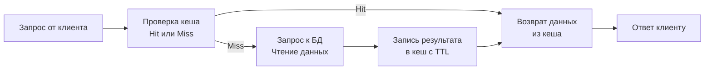

## Философия кеширования в Go

Кеширование в Go — это не просто `map[string]any` для ускорения запросов. Это архитектурный паттерн, который радикально снижает задержку (latency) и нагрузку на БД, но вводит фундаментальную сложность: управление согласованностью данных (consistency). В отличие от PHP или Python, где кеши часто делегируются внешним расширениям или фреймворкам, Go требует явного контроля над аллокациями, эвикцией и конкурентным доступом, чтобы не превратить кеш в причину утечек памяти или GC-пауз.

### Основные стратегии кеширования

В production-микросервисах де-факто стандартом является **Cache-Aside (Lazy Loading)**. Другие паттерны применяются в специфичных сценариях:

1. **Cache-Aside**: Приложение читает из кеша. При промахе (miss) запрашивает БД, сохраняет результат в кеш с TTL и возвращает клиенту. Устойчив к падениям кеша, не требует синхронизации записи.
2. **Write-Through**: Запись происходит синхронно в кеш и БД. Гарантирует консистентность, но увеличивает задержку `PUT/POST` запросов.
3. **Write-Behind (Async)**: Запись сразу в кеш, асинхронный batch-сброс в БД. Максимальная пропускная способность, но риск потери данных при крахе процесса.



### Идиоматичная реализация In-Memory кеша

Стандартная библиотека Go не предоставляет готового кеша с TTL и автоматической очисткой. Идиоматичная реализация использует дженерики для типобезопасности, `sync.RWMutex` для конкурентного доступа и фоновый воркер для удаления истекших записей.

```go
package cache

import (
    "sync"
    "time"
)

type Item[V any] struct {
    Value     V
    ExpiresAt time.Time
}

type Cache[K comparable, V any] struct {
    mu      sync.RWMutex
    items   map[K]Item[V]
    ttl     time.Duration
    done    chan struct{}
}

func New[K comparable, V any](ttl, cleanupInterval time.Duration) *Cache[K, V] {
    c := &Cache[K, V]{
        items: make(map[K]Item[V]),
        ttl:   ttl,
        done:  make(chan struct{}),
    }
    go c.startCleanup(cleanupInterval)
    return c
}

func (c *Cache[K, V]) Set(key K, value V) {
    c.mu.Lock()
    c.items[key] = Item[V]{
        Value:     value,
        ExpiresAt: time.Now().Add(c.ttl),
    }
    c.mu.Unlock()
}

func (c *Cache[K, V]) Get(key K) (V, bool) {
    c.mu.RLock()
    item, ok := c.items[key]
    c.mu.RUnlock()

    if !ok {
        var zero V
        return zero, false
    }
    if time.Now().After(item.ExpiresAt) {
        return item.Value, false
    }
    return item.Value, true
}

func (c *Cache[K, V]) startCleanup(interval time.Duration) {
    ticker := time.NewTicker(interval)
    defer ticker.Stop()
    for {
        select {
        case <-ticker.C:
            c.mu.Lock()
            now := time.Now()
            for k, v := range c.items {
                if now.After(v.ExpiresAt) {
                    delete(c.items, k)
                }
            }
            c.mu.Unlock()
        case <-c.done:
            return
        }
    }
}

func (c *Cache[K, V]) Close() {
    close(c.done)
}
```

> [!info] Под капотом
> Внутреннее устройство `map` в Go — это хеш-таблица `hmap` с бакетами. При высокой конкуренции `sync.RWMutex` переводит горутины в `_Gwaiting` через `futex` syscall. Структура `Item[V any]` с дженериками позволяет компилятору генерировать специализированный код для каждого типа `V`, избегая упаковки в `interface{}`. Это исключает аллокации в куче при чтении и снижает давление на GC, так как данные остаются в стеке или переиспользуемом `map` бакете.

### Проблема Cache Stampede (Thundering Herd)

Когда ключ истекает (TTL) или вытесняется (eviction), тысячи горутин одновременно обнаруживают промах и идут в БД. Это вызывает мгновенный скачок нагрузки, блокировки таблиц и может уронить базу данных.

Решение: **Singleflight**. Пакет `golang.org/x/sync/singleflight` гарантирует, что тяжелая операция (loader) выполнится только один раз для одинакового ключа, а остальные горутины получат тот же результат.

```go
package cache

import (
    "golang.org/x/sync/singleflight"
)

type SafeCache[K comparable, V any] struct {
    *Cache[K, V]
    group singleflight.Group
}

func (sc *SafeCache[K, V]) GetOrLoad(key K, loader func() (V, error)) (V, error) {
    if val, ok := sc.Get(key); ok {
        return val, nil
    }

    // singleflight сериализует запросы к loader
    v, err, _ := sc.group.Do(key, func() (interface{}, error) {
        return loader()
    })
    
    if err != nil {
        var zero V
        return zero, err
    }
    
    result := v.(V)
    sc.Set(key, result)
    return result, nil
}
```

> [!warning] Ловушка / Gotcha
> **Неограниченный рост памяти**: `map` в Go не возвращает память ОС сразу после `delete()`. Ячейки помечаются как `tombstone`, но память переиспользуется внутри рантайма. Если только добавлять элементы, RSS процесса будет расти до OOM. Обязательно ограничивайте размер кеша через LRU-эвикцию или жесткий лимит на количество ключей.
> **Отсутствие Negative Caching**: Если БД возвращает `nil` для несуществующего ID, не кешьте это. Злоумышленник будет генерировать рандомные ID, вызывая постоянные cache miss и долбя БД. Кешируйте `ErrNotFound` на короткий TTL (например, 30 секунд), чтобы защитить слой хранения.

### Производительность и Mechanical Sympathy

Кеширование в памяти должно быть дружелюбным к иерархии кэшей процессора и планировщику Go:

1. **Sharding (Шардирование)**: Разделите один `map` на 16-64 независимых сегментов с собственными `RWMutex`. Это распределяет блокировки по разным кэш-линиям CPU (64 байта), снижая false sharing и contention на системной шине. Hash функции `farmhash` или `xxhash` минимизируют коллизии.
2. **Локальность данных**: Указатели на разбросанные объекты в куче вызывают cache misses (`dTLB-load-misses`). Для value-heavy кешей храните структуры inline, а не указатели на них.
3. **Аллокации**: Каждый `Set` создает новую структуру `Item`. Для ultra-low-latency используйте `sync.Pool` для переиспользования буферов сериализации или pre-allocated массивы.

> [!tip] Собеседование
> **Вопрос:** В чем разница между `sync.Map` и `map` + `sync.RWMutex`? Когда что использовать?
> **Ответ:** `sync.Map` оптимизирован для сценариев, где ключи стабильны, а обновления редки (read-heavy, write-rare). Он использует copy-on-write атомарные снимки, избегая блокировок при чтении, но требует дополнительных аллокаций при записи. `map` + `RWMutex` быстрее при частых записях/чтениях известных ключей, но страдает от contention. Для production веб-сервисов чаще используют sharded maps или готовые библиотеки (`groupcache`, `ristretto`), так как они решают проблемы эвикции и лимита памяти.
> 
> **Вопрос:** Как обеспечить согласованность кеша при обновлениях в БД?
> **Ответ:** Строгой консистентности в распределенном кеше не бывает без блокировок, что убивает производительность. Используйте паттерн Cache-Aside с коротким TTL, инвалидацию по событиям (CDC через Kafka/Debezium), или Write-Through для критичных данных. В Go часто применяют eventual consistency: обновление БД → публикация события → асинхронное удаление ключа из кеша.

### Итог

1. Кеширование снижает latency и нагрузку на БД, но вводит сложность управления согласованностью и лимитами памяти.
2. Cache-Aside с TTL — стандарт для микросервисов на Go.
3. Избегайте cache stampede с помощью `singleflight` или локальных блокировок.
4. Ограничивайте размер кеша (LRU/эвикция) для предотвращения OOM. `map` не возвращает память ОС мгновенно.
5. Для production используйте `sharded maps`, `ristretto` или `groupcache` вместо самописных реализаций.
6. Всегда применяйте negative caching для защиты от сканирования БД несуществующими ключами.

Следующая статья: [[25. Работа с Redis]]