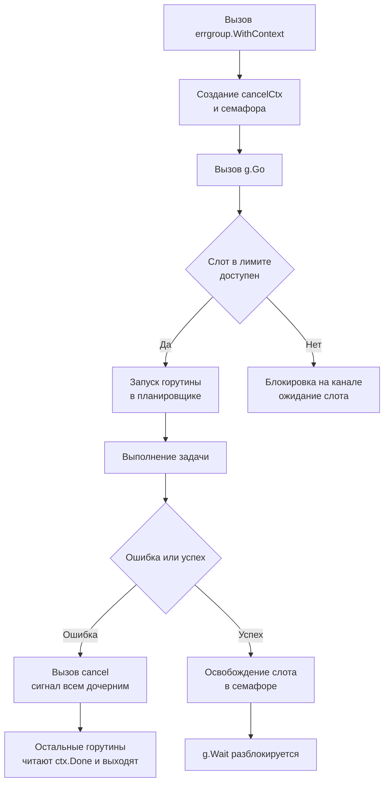

## Философия фоновых задач в Go

В PHP фоновые задачи обычно делегируются системным демонам вроде `supervisord` или кроном, так как модель запрос-ответ синхронна и ограничена временем жизни скрипта. В Java используется тяжелый `ExecutorService` с пулами тредов ОС. В Go горутины позволяют запускать миллионы параллельных задач с минимальным оверхедом, но эта сила требует строгой дисциплины. Фоновая задача в Go — это не просто `go func()`, а управляемый процесс с контекстом, обработкой ошибок, возможностью отмены и интеграцией в graceful shutdown.

1. Fire-and-Forget против Reliable Processing
`go doWork()` подходит только для неблокирующих, некритичных операций отправки метрик, логирования или обновления кэша. Для критичных бизнес-процессов генерации отчетов, отправки транзакционных email или обработки вебхуков требуется гарантированная доставка, повторные попытки и мониторинг. Здесь в игру вступают воркеры, явное управление жизненным циклом и интеграция с брокерами сообщений.

2. Синхронизация через errgroup и WaitGroup
Для управления набором фоновых задач стандартно используют `sync.WaitGroup`. Однако в production чаще применяется `golang.org/x/sync/errgroup`, который сочетает ожидание завершения с контекстом отмены и агрегацией ошибок.

```go
import "golang.org/x/sync/errgroup"

func processBatch(ctx context.Context, items []Item) error {
    g, ctx := errgroup.WithContext(ctx)
    g.SetLimit(10) // Ограничение параллелизма

    for _, item := range items {
        item := item // Capture для замыкания
        g.Go(func() error {
            // Автоматическая отмена всей группы при первой ошибке
            return processItem(ctx, item)
        })
    }

    // Блокирует до завершения всех задач или отмены контекста
    return g.Wait()
}
```

> [!info] Под капотом
> `errgroup.WithContext` создает дочерний контекст `cancelCtx`. При вызове `g.Go` задача передается в планировщик Go. Если одна из функций возвращает ошибку, `errgroup` вызывает `cancel` для всего контекста. Все остальные горутины, проверяющие `ctx.Done`, получат сигнал и завершатся. `SetLimit` реализует семафор через буферизованный канал `chan struct{}`, блокируя создание новых горутин до освобождения слота. Это предотвращает OOM и exhaustion ресурсов при обработке больших батчей.



3. Worker Pool для потоковой обработки
Для бесконечных потоков данных используют паттерн Worker Pool с каналами. Это классический пример разделения producers и consumers через `chan`.

```go
func StartWorkerPool(ctx context.Context, numWorkers int, jobs <-chan Job, results chan<- Result) {
    var wg sync.WaitGroup
    for i := 0; i < numWorkers; i++ {
        wg.Add(1)
        go func(id int) {
            defer wg.Done()
            for {
                select {
                case <-ctx.Done():
                    return // Graceful shutdown
                case job, ok := <-jobs:
                    if !ok {
                        return // Канал закрыт
                    }
                    res := process(job)
                    select {
                    case results <- res:
                    case <-ctx.Done():
                        return
                    }
                }
            }
        }(i)
    }
    go func() { wg.Wait(); close(results) }()
}
```

4. Под капотом. Жизненный цикл горутины и память
Каждая фоновая задача — это структура `runtime.g` с собственным стеком по умолчанию два килобайта. Если задача блокируется надолго или рекурсивно вызывает функции, стек динамически растет до одного гигабайта на 64-битных системах.

- Stack Growth: При нехватке места в стеке Go копирует весь стек в новую область памяти, обновляет указатели и передает управление. Это дорогая операция. В долгоживущих воркерах избегайте глубокой рекурсии и огромных локальных переменных.
- Goroutine Leaks: Если горутина блокируется на чтении из канала, который никто не закроет, или на `time.Sleep` без проверки контекста, она никогда не завершится. Рантайм не собирает заблокированные горутины через GC. Это утечка памяти и файловых дескрипторов.
- Scheduler: Долгоживущая задача без `syscall` или `sync` точки может удерживать тред ОС `M`, мешая планировщику переключать контекст. Используйте `runtime.Gosched` или `select` с `ctx.Done` для cooperative preemption. Go 1.14+ использует async preemption через сигналы ОС, но точки отмены все равно обязательны для корректной бизнес-логики.

> [!warning] Ловушка / Gotcha
> Panic в горутине: Если фоновая горутина вызывает `panic` без `recover`, паника завершит только эту горутину, но не весь процесс. Однако она оставит goroutine stack trace в логах и может нарушить инварианты, например оставить открытые файлы или незавершенные транзакции. Всегда оборачивайте входную точку воркера в `defer func() { if r := recover(); r != nil { log.Error("panic recovered", r) } }()`.
> Unbounded Concurrency: Запуск `go func` для каждого элемента из слайса без лимита приведет к созданию десятков тысяч горутин. Планировщик потратит больше времени на переключение контекста, чем на полезную работу. Всегда используйте `errgroup.SetLimit`, семафоры или фиксированные пулы.

5. Интеграция с Graceful Shutdown
Фоновые задачи должны корректно завершаться при получении сигнала ОС. Это достигается через общий `context.Context` и `sync.WaitGroup`.

```go
func runBackgroundWorker(ctx context.Context, wg *sync.WaitGroup) {
    wg.Add(1)
    go func() {
        defer wg.Done()
        for {
            if err := doWork(ctx); err != nil {
                if errors.Is(err, context.Canceled) {
                    return // Shutdown initiated
                }
                log.Printf("worker error: %v", err)
                time.Sleep(backoff(ctx))
            }
        }
    }()
}

// В main:
var bgWg sync.WaitGroup
workerCtx, cancelWorkers := context.WithCancel(context.Background())
runBackgroundWorker(workerCtx, &bgWg)

// При shutdown:
cancelWorkers() // Отмена контекста
bgWg.Wait()     // Ожидание завершения
```

> [!tip] Собеседование
> Вопрос: Чем `errgroup` лучше `sync.WaitGroup` для запуска набора задач?
> Ответ: `errgroup` автоматически отменяет остальные задачи при первой ошибке, агрегирует ошибки в один `error`, поддерживает ограничение параллелизма `SetLimit` и работает с контекстом отмены. `sync.WaitGroup` требует ручной обработки ошибок, контекстов и семафоров, что увеличивает вероятность багов.
> 
> Вопрос: Как обработать панику в горутине, не роняя сервис?
> Ответ: Использовать `defer recover` внутри самой горутины. `recover` работает только в рамках текущей горутины и только внутри `defer`. После восстановления нужно залогировать стек `debug.Stack`, закрыть связанные ресурсы и либо продолжить цикл, либо вернуть ошибку в основной поток через канал или `errgroup`.

6. Сравнение с другими языками

| Аспект | PHP / Cron | Java ExecutorService | Python Celery | Go Background Jobs |
|---|---|---|---|---|
| Модель выполнения | Отдельный процесс на запуск | Пул тредов ОС, тяжелый | Отдельный воркер-процесс + брокер | Горутины в одном процессе, легкие |
| Конкурентность | Нет по умолчанию | Thread-per-task, ограничен RAM | Async IO или multiprocessing | M:N планировщик, тысячи goroutines |
| Отмена задачи | SIGKILL / SIGTERM | Future.cancel | Revoke task | context.Context cooperative |
| Управление памятью | Process termination per request | Heap GC, тяжелый оверхед | Process restarts | Precise GC, stack growth, minimal overhead |

7. Итог

8. Фоновые задачи в Go — это управляемые горутины с контекстом, а не просто `go func`.
9. Используйте `errgroup` для батчевой обработки с ограничением параллелизма и агрегацией ошибок.
10. Всегда проверяйте `ctx.Done` в циклах и блокирующих операциях для предотвращения утечек.
11. Оборачивайте точки входа воркеров в `defer recover`, чтобы паники не нарушали работу остальных задач.
12. Интегрируйте `sync.WaitGroup` и `context` в graceful shutdown для детерминированного завершения.
13. Ограничивайте количество горутин семафорами или `SetLimit`, чтобы избежать starvation планировщика и OOM.
14. Для надежной доставки и масштабирования переходите к внешним брокерам и очередям задач.

Следующая статья: [[27. Очереди задач]]