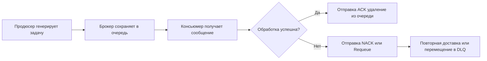
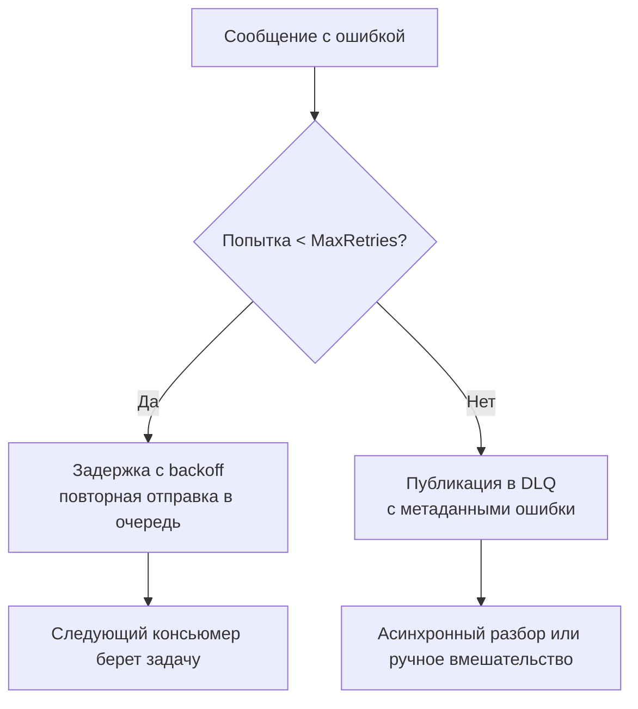

## Философия очередей задач

В отличие от фоновых горутин, которые живут исключительно в памяти процесса и исчезают вместе с ним, очереди задач выносят выполнение за пределы основного сервиса. Они обеспечивают персистентность, горизонтальное масштабирование потребителей, изоляцию сбоев и детерминированный контроль доставки. В production-системах очереди становятся нервной системой микросервисной архитектуры, связывая события, команды и асинхронные процессы без блокирующих вызовов.

## 1. Архитектура и гарантии доставки

Базовый паттерн включает три компонента: продюсер (генерирует задачу), брокер (хранит и маршрутизирует), консьюмер (обрабатывает). Выбор гарантии доставки определяет архитектуру обработки:
- **At-most-once**: сообщение может потеряться, но никогда не будет доставлено дважды. Быстро, но рискованно для бизнеса.
- **At-least-once**: сообщение доставляется минимум один раз. Стандарт де-факто. Требует идемпотентности на стороне обработчика.
- **Exactly-once**: строгая однократная доставка. Крайне дорого в реализации, требует координации брокера и обработчика через транзакции или идемпотентные ключи с дедупликацией.



## 2. Под капотом. Механика брокеров и протоколов

Брокеры радикально отличаются внутренним устройством, что влияет на выбор клиента в Go:
- **RabbitMQ**: Построен на Erlang VM. Использует протокол AMQP 0-9-1 с фреймовой передачей данных. Очереди хранятся в памяти с поддержкой ленивой выгрузки на диск. Гарантии доставки обеспечиваются через подтверждения (acks) и устойчивые хэши.
- **Kafka**: Распределенный журнал транзакций (append-only log). Сообщения записываются последовательно на диск с использованием `mmap` для zero-copy чтения. Консьюмеры читают по смещению (offset), что позволяет перепотреблять или пропускать данные.
- **NATS / JetStream**: Легковесный, написан на Go. Использует бинарный протокол, оптимизированный под низкую латентность. JetStream добавляет персистентность и стриминг поверх in-memory ядра.

> [!info] Под капотом
> При получении сообщения клиент в Go выполняет системные вызовы `read`/`recvmsg` для загрузки байтового потока из сокета. Брокер не отправляет данные в горутину напрямую. Он пушит их в буфер канала `chan amqp.Delivery` или `sarama.ConsumerMessage`. Копирование из сетевого буфера в Go-структуру создает аллокации. Для highload систем важно минимизировать время жизни сообщения в памяти, обрабатывая его сразу или используя `sync.Pool` для временных буферов.

## 3. Идиоматичный потребитель в Go

Правильный потребитель в Go — это управляемый цикл, который реагирует на отмену контекста, явно подтверждает обработку и не блокирует тред ОС ожиданием.

```go
package consumer

import (
    "context"
    "fmt"
    "log"
    
    amqp "github.com/rabbitmq/amqp091-go"
)

func StartWorker(ctx context.Context, conn *amqp.Connection, queueName string, handler func(ctx context.Context, payload []byte) error) error {
    ch, err := conn.Channel()
    if err != nil {
        return fmt.Errorf("open channel: %w", err)
    }
    defer ch.Close()

    msgs, err := ch.Consume(queueName, "", false, false, false, false, nil)
    if err != nil {
        return fmt.Errorf("register consumer: %w", err)
    }

    for {
        select {
        case <-ctx.Done():
            log.Println("consumer shutting down via context cancellation")
            return ctx.Err()
        case d, ok := <-msgs:
            if !ok {
                return fmt.Errorf("consumer channel closed unexpectedly")
            }

            // Обработка в отдельной горутине не рекомендуется без пула
            // Здесь синхронная обработка для простоты контроля ACK/NACK
            if err := handler(ctx, d.Body); err != nil {
                log.Printf("handler error: %v", err)
                // Reject без requeue, если ошибка фатальна для сообщения
                // или с requeue для временных сбоев
                if shouldRequeue(err) {
                    d.Nack(false, true)
                } else {
                    d.Nack(false, false)
                }
                continue
            }

            // Подтверждение после успешной обработки
            d.Ack(false)
        }
    }
}

func shouldRequeue(err error) bool {
    // В реальности проверяем тип ошибки: сетевые сбои -> true, валидация -> false
    return true
}
```

## 4. Управление конкурентностью и Prefetch

Без ограничений брокер будет пушить сообщения быстрее, чем консьюмер успевает их обрабатывать. Это приводит к росту очереди в памяти клиента, увеличению потребления RAM и риску OOM.

**Prefetch (QoS)** ограничивает количество неподтвержденных сообщений, выдаваемых консьюмеру до получения ACK. Это создает естественное обратное давление (backpressure) и балансирует нагрузку между подами.

```go
// Установка prefetch перед start consuming
err = ch.Qos(
    10,     // prefetch count: макс 10 неподтвержденных сообщений на воркер
    0,      // prefetch size: игнорируем (не всегда поддерживается)
    false,  // global: false = только для этого консьюмера
)
if err != nil {
    return fmt.Errorf("set qos: %w", err)
}
```

> [!warning] Ловушка / Gotcha
> **Prefetch = 1**: Безопасно, но неэффективно. Горутина простаивает, пока ждет ACK. Брокер переключается на другой консьюмер, создавая latency.
> **Prefetch > 1000**: Опасно. Клиент буферизует сотни сообщений в памяти. При резкой остановке процесса (`SIGKILL`) или панике все неподтвержденные сообщения рекупируются брокером и повторно доставляются другим потребителям. Настройка должна соответствовать скорости обработки одного сообщения и задержке сети.

## 5. Обработка ошибок, DLQ и повторные попытки

Бесконечный `requeue` при фатальных ошибках создает «ядовитые» сообщения (poison pills), которые блокируют очередь, так как консьюмер будет постоянно падать на одном и том же сообщении.

Правильная стратегия:
1. Ограниченное количество повторных попыток с экспоненциальной задержкой.
2. Перемещение в Dead Letter Queue (DLQ) после N попыток.
3. Асинхронный разборщик (replayer) для ручной обработки или исправления данных в DLQ.



Для реализации в Go без сложных внешних механизмов используйте паттерн из статьи [[29. Retry и backoff]], комбинируя его с публикацией в отдельный `dead_letter_queue` через тот же канал брокера.

## 6. Производительность и Mechanical Sympathy

Работа с очередями создает специфичные точки давления:
- **TCP Backpressure**: Брокер использует `SO_RCVBUF` и TCP window scaling. Если консьюмер не читает данные, окно закрывается, брокер замедляет выдачу. В Go `net.Conn.Read()` блокируется, пока ядро не скопирует данные из буфера сокета в user space.
- **GC Pressure**: Каждое сообщение создает `[]byte` и обертку. При 10k msg/sec без пулов это ~50-100 МБ аллокаций/сек. `sync.Pool` для временных структур или прямая работа с `io.Reader` (например, в Kafka `sarama` с `Fetch` API) снижает нагрузку.
- **Syscall Overhead**: Каждый ACK/NACK — отдельный фрейм по сети. Группировка подтверждений (batch acks) или увеличение prefetch снижает количество системных вызовов.
- **Goroutine Scheduler**: Если обработчик выполняет длительную CPU-задачу без `syscall` или `sync` точки, планировщик может не передать управление другим горутинам. Используйте `runtime.Gosched` в циклах или выносите тяжелые вычисления в отдельные воркеры.

## 7. Ловушки и антипаттерны

> [!tip] Собеседование
> **Вопрос:** Как гарантировать exactly-once доставку в распределенной системе?
> **Ответ:** Математически невозможно без координации на уровне сетевого протокола и хранилища. На практике используется at-least-once + идемпотентный обработчик (статья [[28. Idempotency]]). Ключ дедупликации хранится в БД/кеше с атомарной проверкой `INSERT ... ON CONFLICT DO NOTHING`. Брокерные транзакции (Kafka transactions, RabbitMQ publisher confirms) защищают от дублей только на уровне брокера, но не защищают от сбоев после ACK.
> 
> **Вопрос:** Почему консьюмер в Go «зависает» и перестает брать сообщения, хотя процесс жив?
> **Ответ:** Частые причины: 1) Предыдущее сообщение заблокировало канал `msgs` без ACK/NACK (брокер ждет подтверждения). 2) Контекст отменен, но горутина не обрабатывает `ctx.Done()`. 3) Prefetch исчерпан, а все горутины заняты долгими операциями без асинхронного выноса. 4) Блокировка на `sync.Mutex` внутри обработчика. Решение: метрики consumer lag, таймауты на обработку, асинхронные воркеры с `errgroup`.

> [!warning] Ловушка / Gotcha
> **Auto-Ack = true**: Никогда не используйте в production. Сообщение удаляется сразу после отправки брокером. Если процесс упадет во время обработки, данные потеряются безвозвратно. Всегда `autoAck=false` + явный `Ack` после успешного коммита транзакции или сохранения результата.

## 8. Итог

1. Очереди задач обеспечивают персистентность, масштабирование и изоляцию сбоев, но требуют явного управления подтверждением доставки.
2. At-least-once — стандарт для распределенных систем. Exactly-once достигается через идемпотентность обработчика.
3. Настраивайте `Prefetch` для балансировки нагрузки и предотвращения OOM клиента. Значение должно соответствовать скорости обработки и задержке сети.
4. Используйте `context.Context` для graceful shutdown потребителя и контроля таймаутов.
5. Реализуйте Dead Letter Queue для обработки ядовитых сообщений, избегая бесконечного requeue.
6. Минимизируйте аллокации сообщений через `sync.Pool` и прямую работу с буферами для снижения GC-давления.
7. Группируйте ACK или увеличивайте prefetch для снижения network syscall overhead.

Правильно спроектированная очередь превращает асинхронный поток задач из источника неопределенности в управляемый, наблюдаемый и отказоустойчивый конвейер.

Следующая статья: [[28. Idempotency]]