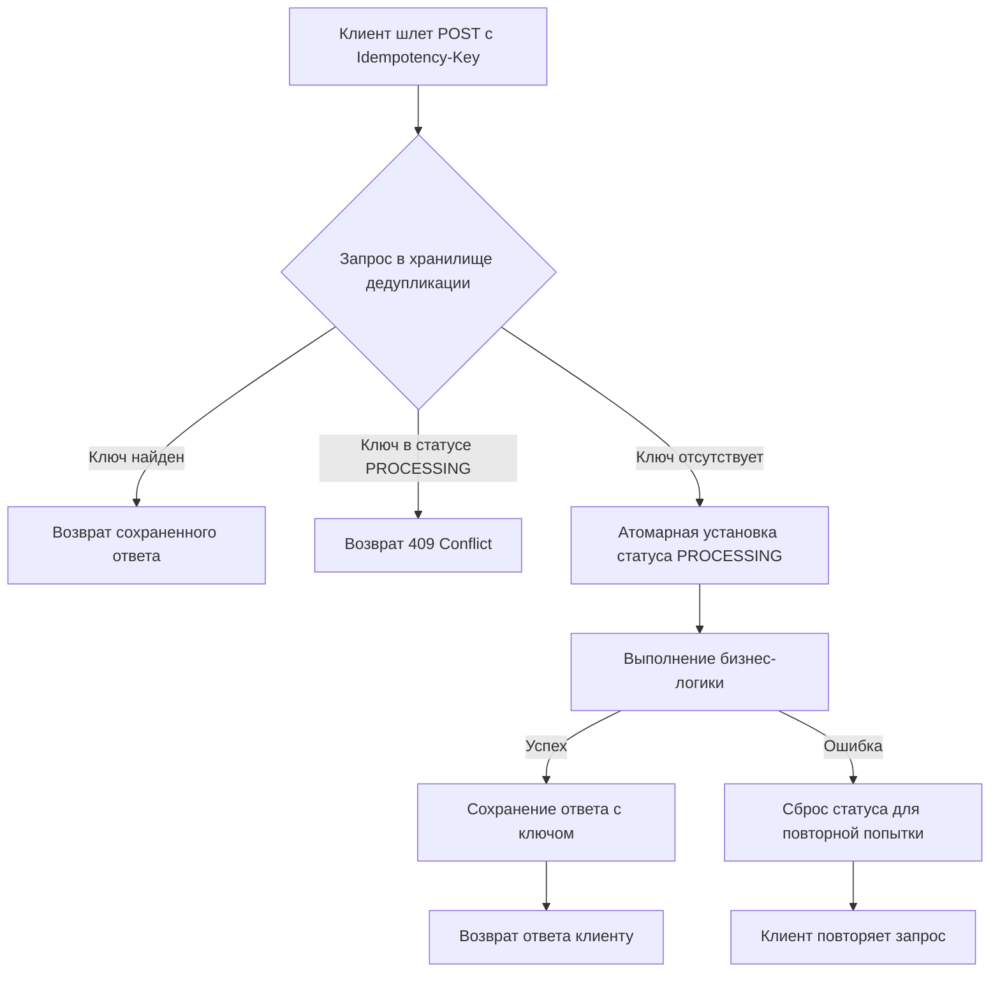

## Философия идемпотентности в распределенных системах

В распределенных сетях надежность передается не протоколами доставки, а архитектурой обработки. Закон Мерфи в действии: сетевые пакеты дублируются, TCP-таймауты перезапускают запросы, брокеры гарантируют доставку как минимум один раз, а мобильные клиенты повторно нажимают кнопку «Оплатить» при плохом сигнале. Без идемпотентности любая транзакция превращается в лотерею, где двойное списание или повторное создание заказа становится нормой.

Идемпотентность — это свойство операции, при котором повторное выполнение с теми же входными данными дает идентичный результат и не изменяет состояние системы сверх первого успешного вызова. В Go это не магическая аннотация, а явный контракт, реализуемый через детерминированные проверки и атомарные операции.

### 1. HTTP-семантика и границы применения

RFC 9110 четко определяет идемпотентные методы: `GET`, `PUT`, `DELETE` и `HEAD`. `POST` и `PATCH` по умолчанию не идемпотентны, так как предполагают создание новых ресурсов или частичное обновление, зависимое от текущего состояния.

В практике бэкенда `PUT` идемпотентен только если содержит полную замену ресурса. `POST` с платежами, созданием сущностей или отправкой сообщений требует явного механизма идемпотентности. Клиент генерирует уникальный ключ (обычно UUIDv4), сервер использует его для дедупликации.

### 2. Паттерн реализации: Ключи и атомарный захват

Базовый паттерн состоит из трех фаз: проверка ключа, атомарный захват, выполнение и сохранение результата. Все фазы должны быть защищены от гонок данных при параллельных ретраях.



```go
package service

import (
    "context"
    "errors"
    "fmt"
    "time"
)

// IdempotencyStore определяет контракт для хранения состояний идемпотентности
type IdempotencyStore interface {
    TryAcquire(ctx context.Context, key string, ttl time.Duration) (bool, error)
    GetResult(ctx context.Context, key string) ([]byte, error)
    StoreResult(ctx context.Context, key string, data []byte) error
    Release(ctx context.Context, key string) error
}

type PaymentProcessor struct {
    store IdempotencyStore
    // другие зависимости...
}

func (p *PaymentProcessor) Charge(ctx context.Context, req *ChargeRequest) (*ChargeResponse, error) {
    if req.IdempotencyKey == "" {
        return nil, errors.New("idempotency key is required for POST operations")
    }

    // 1. Атомарная попытка захвата
    isNew, err := p.store.TryAcquire(ctx, req.IdempotencyKey, 24*time.Hour)
    if err != nil {
        return nil, fmt.Errorf("idempotency check: %w", err)
    }
    if !isNew {
        // Ключ уже обрабатывается или результат готов
        result, err := p.store.GetResult(ctx, req.IdempotencyKey)
        if err != nil {
            // Если ошибка при чтении, считаем, что операция в процессе
            return nil, ErrOperationInProgress
        }
        return deserializeResponse(result)
    }

    // Гарантируем освобождение ключа при панике или отмене контекста
    defer func() {
        if r := recover(); r != nil || ctx.Err() != nil {
            _ = p.store.Release(ctx, req.IdempotencyKey)
        }
    }()

    // 2. Выполнение бизнес-логики
    resp, err := p.executePayment(ctx, req)
    if err != nil {
        // При бизнес-ошибке освобождаем ключ, чтобы клиент мог повторить
        _ = p.store.Release(ctx, req.IdempotencyKey)
        return nil, fmt.Errorf("execute payment: %w", err)
    }

    // 3. Сохранение результата
    serialized, err := serializeResponse(resp)
    if err != nil {
        return nil, fmt.Errorf("serialize response: %w", err)
    }

    if err := p.store.StoreResult(ctx, req.IdempotencyKey, serialized); err != nil {
        // Логирование критично, но не блокируем ответ
        fmt.Printf("failed to store idempotency result: %v", err)
    }

    return resp, nil
}
```

> [!info] Под капотом
> Атомарность `TryAcquire` реализуется на стороне хранилища. В Redis это команда `SET key "PROCESSING" NX EX ttl`. Redis однопоточный, поэтому выполнение `SET NX` гарантированно атомарно: только один клиент получит `1`, остальные `0`. В реляционных БД используется `INSERT INTO idempotency_keys (key, status) VALUES ($1, 'PROCESSING') ON CONFLICT DO NOTHING`, где `key` имеет `UNIQUE INDEX`. Движок БД использует row-level блокировки для сериализации конкурентных вставок.

### 3. Ловушки и антипаттерны

> [!warning] Ловушка / Gotcha
> **Прозрачное буферирование в Middleware**: Попытка реализовать идемпотентность как `http.Handler`, который полностью буферизует `ResponseWriter`, опасна для памяти. Если клиент отправляет запросы с разными ключами или не использует идемпотентность, сервер будет кэшировать огромные ответы в RAM. Идиоматично применять паттерн на уровне сервисов или использовать специализированные прокси с лимитами на размер тела.
> 
> **Вечное хранение ключей**: Без TTL хранилище дедупликации вырастет до бесконечности. Стандартный TTL для платежей — 24-72 часа. Для аналитики или массовых рассылок — до 7 дней. После истечения TTL дубликаты трактуются как новые запросы. Бизнес должен явно определять окно повтора.
> 
> **Игнорирование состояния PROCESSING**: Если два одинаковых запроса приходят одновременно, первый захватывает ключ, второй должен получить `409 Conflict` или `202 Accepted` с ссылкой на статус. Возврат `500` или молчаливое ожидание ломает контракты фронтенда.

### 4. Производительность и Mechanical Sympathy

Каждая проверка идемпотентности добавляет как минимум 1 RTT к хранилищу (БД/Redis) и 2 аллокации на сериализацию. На highload-сервисах это требует оптимизации:

1. **Локальный кэш + Redis**: Использовать `sync.Map` или sharded map для быстрого поиска недавно обработанных ключей. Если ключ отсутствует локально, идти в Redis. Это снижает сетевой overhead на 70-90% при кластерной обработке.
2. **Сжатие ответов**: Хранение `[]byte` JSON-ответов в Redis потребляет память. Для ответов >1 КБ применяйте `snappy` или `zstd`. Компрессия выполняется в User Space за 1-5 тактов на байт, экономия места достигает 3-5х.
3. **Атомарные операции без Lua**: В Redis `SET NX` атомарен сам по себе. Использование сложных Lua-скриптов для идемпотентности излишне блокирует event loop. Простые команды предпочтительнее.
4. **Избегание строк в хот-пути**: `map[string]` использует хэширование строк, которое проходит по всем байтам. Для ключей идемпотентности (128-битные UUID) хэширование занимает ~50-100 тактов. Если использовать `[]byte` или кастомные структуры с фиксированным размером, компилятор может оптимизировать сравнение через `memcmp`.

> [!tip] Собеседование
> **Вопрос:** Чем идемпотентность отличается от exactly-once доставки?
> **Ответ:** Exactly-once — это гарантия брокера или сетевого протокола, математически недостижимая в асинхронных распределенных системах без координации. Идемпотентность — это архитектурный паттерн на стороне потребителя, который делает систему устойчивой к at-least-once доставке. В практике бэкенда именно идемпотентность решает проблему дублей, а не попытки сделать протокол доставки «идеальным».
> 
> **Вопрос:** Что произойдет, если клиент повторит запрос с новым ключом, но теми же данными?
> **Ответ:** Сервер не сможет распознать дубликат. Идемпотентность работает только при неизменном ключе. Это ответственность клиента: генерировать ключ на стороне фронтенда и переиспользовать его при ретраях. На стороне сервера можно внедрить эвристики (хэш тела запроса), но это хрупко из-за различий в сериализации JSON, порядке полей или добавлении служебных заголовков.
> 
> **Вопрос:** Как обеспечить идемпотентность для `POST` без хранения полных ответов?
> **Ответ:** Хранить не ответ, а результат бизнес-операции: статус транзакции, сгенерированный внутренний ID, флаг выполнения. При повторном запросе с тем же ключом сервер возвращает сохраненный внутренний ID и актуальное состояние, которое клиент может использовать для поллинга или отображения.

### 5. Сравнение подходов

| Аспект | PHP / Laravel | Java / Spring | Python / FastAPI | Go |
|---|---|---|---|---|
| Реализация | Middleware с кэшем в Redis/DB | AOP-интерцепторы `@Idempotent` | Декораторы + кэш | Явные сервисные методы + интерфейсы |
| Транзакционность | Зависит от драйвера и конфига | Управляется прокси транзакций | Ручная или async context | `context.Context` + `defer` + явные ошибки |
| Оверхед | Значительный из-за интерпретатора и reflection | Высокий (прокси, bytecode weaving) | Средний (GIL, async switching) | Минимальный (компиляция, встраивание, атомики) |
| Тестируемость | Требует мока глобального состояния | Сложно из-за скрытых зависимостей | Легко, но требует event loop | Тривиально через инъекцию `IdempotencyStore` |

### 6. Итог

1. Идемпотентность — обязательный атрибут любого `POST`/`PATCH`, меняющего состояние в распределенной системе.
2. Реализуется через клиентские `Idempotency-Key` и атомарные операции захвата на сервере (`SET NX`, `ON CONFLICT`).
3. Всегда определяйте TTL для ключей дедупликации, иначе хранилище станет причиной OOM.
4. Обрабатывайте состояние `PROCESSING` явно: возвращайте `409` или `202`, не блокируйте горутины бесконечно.
5. Оптимизируйте хранение: локальный кэш для горячих ключей, сжатие ответов, избегание строк в хот-пути.
6. Идемпотентность не заменяет валидацию входных данных, а дополняет её, делая сервис устойчивым к сетевым аномалиям и клиентским ретраям.

Следующая статья: [[29. Retry и backoff]]