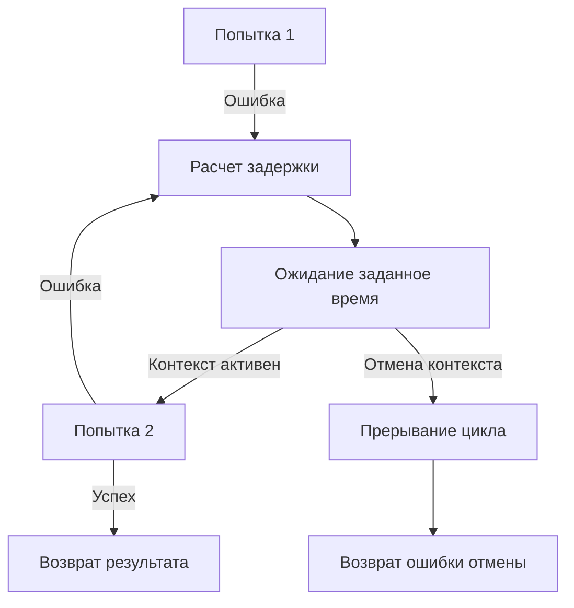

## Философия Retry и Backoff в Go

В распределенных системах временные отказы — не исключение, а норма. Сетевые пакеты теряются, DNS временно не резолвит, пулы соединений БД исчерпаны, внешние API возвращают 503 или 429. Retry — это не попытка пробить стену силой, а стратегическое отступление с паузой, позволяющее инфраструктуре восстановиться. В Go нет магических аннотаций `@Retryable`. Повторы реализуются явно через циклы, контекст отмены и математически просчитанные задержки, что дает полный контроль над трафиком, потреблением ресурсов и поведением при деградации.

1. Классификация отказов: когда повторять, а когда отступать

Слепое повторение любых ошибок превращает временный сбой в каскадный отказ. Все ошибки делятся на две категории:

- **Временные (Transient)**: сетевой таймаут, `connection refused`, `502/503/504`, `context.DeadlineExceeded`, `rate limit exceeded`, временная недоступность БД. Могут исчезнуть сами. Требуют повторной попытки.
- **Постоянные (Permanent)**: `400 Bad Request`, `401 Unauthorized`, `403 Forbidden`, `404 Not Found`, ошибки валидации, синтаксический парсинг. Повтор не поможет, только зря потратит ресурсы. Требуют немедленного возврата клиенту.

В Go классификация реализуется через типизированные ошибки и `errors.Is`. Сервис должен явно маркировать, какие ошибки подлежат ретраю.

```go
func isRetryable(err error) bool {
    if err == nil {
        return false
    }
    if errors.Is(err, context.Canceled) {
        return false // Пользователь или сервер отменил запрос
    }
    if errors.Is(err, context.DeadlineExceeded) {
        return true  // Таймаут часто временный
    }
    
    var httpErr HTTPError
    if errors.As(err, &httpErr) {
        switch httpErr.StatusCode {
        case http.StatusServiceUnavailable, http.StatusTooManyRequests, http.StatusBadGateway:
            return true
        default:
            return false
        }
    }
    
    // Сетевые ошибки ОС часто временные
    if opErr, ok := err.(*net.OpError); ok {
        return opErr.Timeout() || opErr.Temporary()
    }
    
    return false
}
```

2. Математика задержек: Exponential Backoff и Jitter

Простой цикл `for { retry() }` бесполезен. Нужна стратегия роста задержки. Exponential Backoff удваивает паузу между попытками: `100ms → 200ms → 400ms → 800ms`. Но без **Jitter** (случайной добавки) все клиенты синхронизируют повторы, создавая новый всплеск нагрузки (thundering herd).

Формула Full Jitter (рекомендована AWS и Netflix):
`sleep = random(0, min(cap, base * 2^attempt))`



3. Идиоматичная реализация цикла повторов

Продакшн-реализация должна строго проверять контекст, ограничивать максимальное число попыток и использовать `time.Sleep` вместо `time.After`, чтобы избежать лишних аллокаций каналов.

```go
package retry

import (
    "context"
    "fmt"
    "math/rand/v2"
    "time"
)

type Config struct {
    MaxAttempts int
    BaseDelay   time.Duration
    MaxDelay    time.Duration
}

func Do(ctx context.Context, cfg Config, fn func(ctx context.Context) error) error {
    var attempt int
    delay := cfg.BaseDelay

    for {
        attempt++
        err := fn(ctx)
        if err == nil {
            return nil // Успех
        }
        
        if !isRetryable(err) || attempt >= cfg.MaxAttempts {
            return fmt.Errorf("retry failed after %d attempts: %w", attempt, err)
        }

        // Проверка отмены до начала сна
        if err := ctx.Err(); err != nil {
            return err
        }

        // Расчет задержки с full jitter
        jitter := rand.N64(uint64(delay))
        sleepTime := delay + time.Duration(jitter)
        if sleepTime > cfg.MaxDelay {
            sleepTime = cfg.MaxDelay
        }

        select {
        case <-ctx.Done():
            return ctx.Err()
        case <-time.After(sleepTime):
            // Увеличиваем базовую задержку для следующей итерации
            delay *= 2
        }
    }
}
```

> [!info] Под капотом
> `time.After` создает новый `chan time.Time` на каждый вызов. В цикле ретраев это генерирует аллокации в куче, увеличивая давление на GC. Использование `select { case <-time.After(d): }` удобно, но для highload лучше создавать `time.Timer` один раз, вызывать `timer.Reset(d)` и читать из `timer.C`. Это переиспользует внутреннюю структуру рантайма и избегает повторного выделения памяти.

4. Под капотом. Таймеры, планировщик и Mechanical Sympathy

`time.Sleep(d)` не блокирует тред ОС. Он вызывает `runtime·timeSleep`, который:
1. Упаковывает текущую горутину `runtime.g` в структуру `runtime.timer`
2. Вставляет её в глобальную минимальную кучу таймеров (min-heap), отсортированную по времени пробуждения
3. Переводит горутину в состояние `_Gwaiting`, освобождая тред `M` для выполнения других горутин `P`
4. Планировщик периодически проверяет кучу, извлекает истекшие таймеры и переводит горутины обратно в `_Grunnable`

При отмене `context` (или `timer.Stop()`), рантайм извлекает таймер из кучи за `O(log n)` и не выполняет пробуждение. Это критично: при `Graceful Shutdown` тысячи горутин в ретрае немедленно прерываются, не дожидаясь конца сна, что обеспечивает детерминированное завершение процесса.

> [!warning] Ловушка / Gotcha
> **Блокировка в HTTP-обработчике**: Если `retry.Do` вызывается синхронно внутри `http.HandlerFunc`, горутина будет спать, удерживая соединение клиента открытым. Это может привести к таймауту на стороне балансировщика и расходу лимита соединений. Для долгих операций ретрай должен выполняться асинхронно через очереди задач или фоновые воркеры, а клиенту сразу возвращаться `202 Accepted`.

5. Интеграция с идемпотентностью и Graceful Shutdown

Retry без идемпотентности ([28. Idempotency]) опасен. Если операция создает платеж, а сеть обрывается после успешного выполнения на стороне сервиса, но до отправки ответа, клиент повторит запрос. Без ключа идемпотентности будет двойное списание.

При интеграции с [[10. Graceful shutdown]] контекст `main` должен передаваться во все функции ретрая. Это гарантирует, что при получении `SIGTERM` все активные повторы немедленно прервутся, ресурсы освободятся, и сервис корректно завершит работу без зависших горутин.

6. Собеседование и типичные вопросы

> [!tip] Собеседование
> **Вопрос:** Зачем нужен Jitter, если экспоненциальная задержка уже распределяет трафик?
> **Ответ:** Экспоненциальная задержка детерминирована. Если 1000 клиентов получили ошибку одновременно, все они уснут на одинаковое время (100мс, 200мс, 400мс) и синхронно ударят по сервису. Jitter добавляет случайность, размазывая пики запросов во времени и предотвращая thundering herd.
> 
> **Вопрос:** Чем `time.Sleep` отличается от `select { case <-time.After(d): }` с точки зрения планировщика?
> **Ответ:** Оба используют ту же кучу таймеров рантайма. `time.After` аллоцирует канал, `time.Sleep` — нет. С точки зрения планировщика оба переводят горутину в `_Gwaiting`. Разница только в аллокациях и возможности отмены: `time.Sleep` нельзя прервать без горутин, а `time.After` в `select` позволяет комбинировать таймаут с другими каналами (например, `ctx.Done()`).
> 
> **Вопрос:** Когда ретрай превращается в антипаттерн?
> **Ответ:** Когда ошибка не временная (400, 404, валидация), когда сервис уже сигнализирует о перегрузке (429 без `Retry-After` заголовка), когда операция не идемпотентна, или когда ретрай выполняется синхронно в HTTP-обработчике, блокируя ответ клиенту дольше, чем таймаут балансировщика.

7. Итог

8. Повторяйте только временные ошибки. Явно классифицируйте их через `errors.Is` и коды статусов.
9. Используйте Exponential Backoff с Full Jitter для предотвращения синхронных всплесков нагрузки.
10. Всегда проверяйте `ctx.Done()` перед сном и внутри цикла. Ретрай должен уважать отмену.
11. `time.Sleep` предпочтительнее `time.After` в циклах для минимизации аллокаций каналов.
12. Связывайте ретрай с [[28. Idempotency]] для безопасной повторной отправки запросов.
13. При [[10. Graceful shutdown]] контекст отмены должен немедленно прерывать все активные циклы повторов.
14. Не выполняйте долгие ретраи синхронно в HTTP-обработчиках. Используйте асинхронные очереди для фонового восстановления.

Следующая статья: [[30. Circuit breaker]]