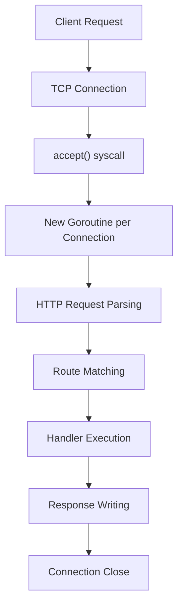

В Go стандартная библиотека `net/http` предоставляет мощный и гибкий HTTP-сервер. Понимание его внутреннего устройства — ключ к написанию производительных и надежных сервисов. Давайте построим HTTP-сервер с нуля, чтобы понять, как всё работает «под капотом».

### Основы: минимальный сервер

Начнем с самого простого примера:

```go
package main

import (
    "fmt"
    "net/http"
)

func main() {
    http.HandleFunc("/", func(w http.ResponseWriter, r *http.Request) {
        fmt.Fprintf(w, "Hello, World!")
    })

    http.ListenAndServe(":8080", nil)
}
```

Этот код создает HTTP-сервер, который слушает порт 8080 и отвечает "Hello, World!" на все запросы. Но за этой простотой скрывается сложная архитектура.

### Под капотом: как работает ListenAndServe

Когда вы вызываете `http.ListenAndServe`, происходят следующие шаги:

1. **Создание listener**: Go вызывает системный вызов `socket()` и `bind()` для открытия порта
2. **Принятие соединений**: через `accept()` сервер получает новые TCP-соединения
3. **Создание горутины**: для каждого соединения Go запускает новую горутину
4. **Парсинг HTTP**: Go парсит HTTP-запрос и вызывает соответствующий обработчик
5. **Отправка ответа**: результат обработки отправляется обратно клиенту

> [!info] Под капотом
> Внутри рантайма Go сервер использует `netpoll` (для Linux это epoll, для macOS это kqueue) для эффективного управления тысячами соединений. Это позволяет Go обрабатывать гораздо больше соединений, чем количество тредов ОС.

### Создание сервера с настройками

```go
package main

import (
    "context"
    "fmt"
    "net/http"
    "time"
)

func main() {
    // Создаем сервер с настройками
    server := &http.Server{
        Addr:           ":8080",
        ReadTimeout:    10 * time.Second,
        WriteTimeout:   10 * time.Second,
        IdleTimeout:    60 * time.Second,
        MaxHeaderBytes: 1 << 20, // 1 MB
    }

    // Настройка маршрутов
    server.HandleFunc("/", func(w http.ResponseWriter, r *http.Request) {
        fmt.Fprintf(w, "Hello, World!")
    })

    // Запуск сервера
    if err := server.ListenAndServe(); err != nil {
        fmt.Printf("Server failed to start: %v\n", err)
    }
}
```

### Собственный HTTP-сервер: разбор по частям

Давайте создадим HTTP-сервер с нуля, используя только `net` и `bufio`:

```go
package main

import (
    "bufio"
    "fmt"
    "net"
    "strings"
)

func main() {
    // Создаем TCP-слушатель
    listener, err := net.Listen("tcp", ":8080")
    if err != nil {
        panic(err)
    }
    defer listener.Close()

    fmt.Println("Server listening on :8080")

    for {
        conn, err := listener.Accept()
        if err != nil {
            fmt.Printf("Accept error: %v\n", err)
            continue
        }

        // Обрабатываем соединение в отдельной горутине
        go handleConnection(conn)
    }
}

func handleConnection(conn net.Conn) {
    defer conn.Close()

    reader := bufio.NewReader(conn)
    request, _ := reader.ReadString('\n')

    // Парсим первый заголовок HTTP-запроса
    parts := strings.Split(request, " ")
    if len(parts) >= 2 {
        method := parts[0]
        path := parts[1]

        response := buildResponse(method, path)
        conn.Write(response)
    }
}

func buildResponse(method, path string) []byte {
    var body string
    switch path {
    case "/":
        body = "<h1>Welcome to our server!</h1>"
    case "/health":
        body = "OK"
    default:
        body = "Not Found"
    }

    response := fmt.Sprintf(
        "HTTP/1.1 200 OK\r\n"+
            "Content-Type: text/html\r\n"+
            "Content-Length: %d\r\n"+
            "\r\n%s",
        len(body), body,
    )

    return []byte(response)
}
```

> [!warning] Ловушка / Gotcha
> Этот код не соответствует production-стандартам. Он не парсит заголовки, не обрабатывает POST-данные и не защищен от атак. Это только демонстрация базового HTTP-протокола.

### Правильная реализация с использованием net/http

Теперь давайте создадим полноценный HTTP-сервер, но с правильной архитектурой:

```go
package main

import (
    "context"
    "fmt"
    "log"
    "net/http"
    "os"
    "os/signal"
    "syscall"
    "time"
)

type Server struct {
    httpServer *http.Server
}

func NewServer(port string, handler http.Handler) *Server {
    return &Server{
        httpServer: &http.Server{
            Addr:         ":" + port,
            Handler:      handler,
            ReadTimeout:  10 * time.Second,
            WriteTimeout: 10 * time.Second,
            IdleTimeout:  60 * time.Second,
        },
    }
}

func (s *Server) Start() error {
    return s.httpServer.ListenAndServe()
}

func (s *Server) Stop(ctx context.Context) error {
    return s.httpServer.Shutdown(ctx)
}

func main() {
    // Создаем маршруты
    mux := http.NewServeMux()
    mux.HandleFunc("/", homeHandler)
    mux.HandleFunc("/health", healthHandler)

    // Создаем сервер
    server := NewServer("8080", mux)

    // Запускаем сервер в отдельной горутине
    go func() {
        if err := server.Start(); err != nil && err != http.ErrServerClosed {
            log.Fatalf("Server failed to start: %v", err)
        }
    }()

    fmt.Println("Server started on :8080")

    // Ждем сигнал остановки
    quit := make(chan os.Signal, 1)
    signal.Notify(quit, syscall.SIGINT, syscall.SIGTERM)
    <-quit

    fmt.Println("Shutting down server...")

    // Корректно завершаем сервер
    ctx, cancel := context.WithTimeout(context.Background(), 30*time.Second)
    defer cancel()

    if err := server.Stop(ctx); err != nil {
        log.Fatalf("Server forced to shutdown: %v", err)
    }

    fmt.Println("Server exited")
}

func homeHandler(w http.ResponseWriter, r *http.Request) {
    w.Header().Set("Content-Type", "text/html")
    fmt.Fprintf(w, "<h1>Welcome to our server!</h1>")
}

func healthHandler(w http.ResponseWriter, r *http.Request) {
    w.WriteHeader(http.StatusOK)
    w.Write([]byte("OK"))
}
```

### Как работает HTTP-сервер под капотом

Внутри `net/http` сервер использует следующую архитектуру:



> [!info] Под капотом
> Внутри Go рантайма есть структура `conn` в пакете `net/http`, которая представляет собой обертку над `net.Conn`. Она содержит:
> - `tlsState` для HTTPS
> - `cancelCtx` для отмены запроса
> - `closeNotifyCh` для уведомлений о закрытии соединения
> - `server` ссылку на сервер
> 
> Когда приходит запрос, Go создает горутину, которая вызывает `serve()` метод соединения. Этот метод парсит HTTP-запрос и вызывает соответствующий обработчик.

### Тонкие настройки сервера

```go
func configureServer() *http.Server {
    return &http.Server{
        Addr:              ":8080",
        Handler:           setupRoutes(),
        
        // Таймауты
        ReadTimeout:       5 * time.Second,
        ReadHeaderTimeout: 2 * time.Second,
        WriteTimeout:      10 * time.Second,
        IdleTimeout:       60 * time.Second,
        
        // Ограничения
        MaxHeaderBytes:    1 << 20, // 1MB
        TLSNextProto:      make(map[string]func(*http.Server, *tls.Conn, http.Handler)),
        
        // Кастомный ConnState callback
        ConnState: func(conn net.Conn, state http.ConnState) {
            log.Printf("Connection state changed: %v for %v", state, conn.RemoteAddr())
        },
        
        // Кастомный ErrorLog
        ErrorLog: log.New(os.Stderr, "http: ", log.LstdFlags),
    }
}
```

### Производительность и ограничения

HTTP-сервер в Go использует следующие механизмы для производительности:

1. **Goroutines**: каждое соединение обрабатывается в отдельной горутине
2. **netpoll**: эффективное управление тысячами соединений
3. **Connection pooling**: повторное использование соединений
4. **Buffering**: буферизация чтения и записи

> [!tip] Собеседование
> **Вопрос**: Сколько соединений может обрабатывать Go HTTP-сервер?
> **Ответ**: Теоретически — до лимита ОС на количество файловых дескрипторов (обычно 65535). Практически — зависит от памяти и CPU. Go эффективно использует `epoll/kqueue` через `netpoll`, что позволяет обрабатывать десятки тысяч соединений с минимальным количеством тредов ОС.

### Заключение

Понимание внутреннего устройства HTTP-сервера в Go позволяет:
- Правильно настраивать таймауты и ограничения
- Оптимизировать производительность
- Диагностировать проблемы с соединениями
- Писать более надежный код

> [!note]
> Go HTTP-сервер — это не только простота, но и мощь. Он использует современные подходы к обработке соединений и может масштабироваться до тысяч RPS даже на скромном железе.

Следующая статья: [[4. Роутинг. ServeMux, gin, chi, gorilla mux]]