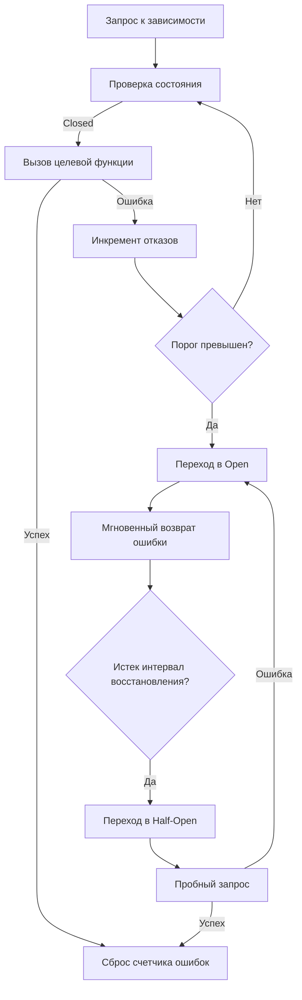

## Философия Circuit Breaker

В распределенных системах временный отказ внешней зависимости (БД, внешний API, кеш) не должен превращаться в полный крах вашего сервиса. Без защитных механизмов горутины накапливаются, пулы соединений исчерпываются, а латентность растет экспоненциально. Circuit Breaker (автоматический выключатель) решает эту проблему через принцип **fast-fail**: если зависимость стабильно отвечает ошибками, вызовы немедленно прерываются, давая инфраструктуре время на восстановление и предотвращая каскадный отказ.

В Go Circuit Breaker — это не внешний прокси или тяжелый AOP-интерцептор, а легковесная машина состояний, работающая в памяти процесса. Она использует атомарные счетчики, контексты отмены и неблокирующие переходы, что минимизирует накладные расходы на CPU и планировщик.

## 1. Машина состояний и переходы

Классический Circuit Breaker оперирует тремя состояниями:
- **Closed**: Нормальная работа. Запросы проходят к целевой зависимости. Ошибки учитываются.
- **Open**: Защита активна. Запросы мгновенно прерываются с ошибкой без обращения к сети. Запускается таймер восстановления.
- **Half-Open**: Пробный режим. Разрешается ограниченное число запросов для проверки здоровья зависимости. Успех возвращает в Closed, отказ — обратно в Open.



> [!info] Под капотом
> Переходы между состояниями должны быть атомарными. В реализации `github.com/sony/gobreaker` используется `sync.Mutex` для защиты переходов, но в высоконагруженных hot-path это создает contention. Оптимизированные реализации применяют `atomic.CompareAndSwap(int32)` для смены состояний `Closed` → `Open` → `Half-Open`. Это компилируется в инструкцию `cmpxchg` на x86-64, выполняется за 1-2 такта CPU в User Space и не требует перевода горутин в `_Gwaiting`.

## 2. Идиоматичная интеграция в Go

Использование готовой библиотеки предпочтительнее самописной реализации из-за тонкостей работы с таймерами, метриками и гонками состояний. Ниже пример интеграции с `gobreaker` в HTTP-обработчик с учетом контекста.

```go
package client

import (
    "context"
    "fmt"
    "net/http"
    "time"

    "github.com/sony/gobreaker"
)

type ExternalClient struct {
    cb       *gobreaker.CircuitBreaker
    httpClient *http.Client
}

func NewExternalClient() *ExternalClient {
    cb := gobreaker.NewCircuitBreaker(gobreaker.Settings{
        Name:        "payment-api",
        MaxRequests: 3,        // Сколько запросов пропустить в Half-Open
        Interval:    60*time.Second, // Окно сбора статистики
        Timeout:     10*time.Second, // Время в Open перед переходом в Half-Open
        ReadyToTrip: func(counts gobreaker.Counts) bool {
            // Переход в Open при 50% ошибок в последних 100 запросах
            failureRatio := float64(counts.ConsecutiveFailures) / float64(counts.Requests)
            return counts.Requests >= 10 && failureRatio >= 0.5
        },
    })

    return &ExternalClient{
        cb:         cb,
        httpClient: &http.Client{Timeout: 5 * time.Second},
    }
}

func (c *ExternalClient) Call(ctx context.Context, payload []byte) error {
    // Execute оборачивает вызов и управляет состояниями
    _, err := c.cb.Execute(func() (interface{}, error) {
        // Контекст прокидывается внутрь для корректной отмены
        req, _ := http.NewRequestWithContext(ctx, http.MethodPost, "https://api.example.com/pay", nil)
        resp, err := c.httpClient.Do(req)
        if err != nil {
            return nil, err
        }
        defer resp.Body.Close()
        
        if resp.StatusCode >= 500 {
            return nil, fmt.Errorf("server error: %d", resp.StatusCode)
        }
        return nil, nil
    })
    
    if err == gobreaker.ErrOpenState {
        return fmt.Errorf("circuit breaker is open: %w", err)
    }
    return err
}
```

## 3. Механика работы и Mechanical Sympathy

Circuit Breaker работает на границе сетевого вызова и бизнес-логики. Его производительность напрямую влияет на latency:

- **Счетчики ошибок**: Должны быть атомарными или шардированными. При 10 000 RPS обновление глобального счетчика через `sync.Mutex` вызывает contention на кэш-линиях (cache line bouncing). Использование `atomic.AddInt64` решает проблему, но при экстремальных нагрузках применяют локальные счетчики на горутину с периодическим агрегированием.
- **Таймер восстановления**: Переход `Open` → `Half-Open` не должен использовать `time.Sleep` в отдельной горутине. Это расходуется память стека и ресурс планировщика. Идиоматично проверять `time.Since(lastStateChange)` при входе в `Execute()` или использовать `sync.Timer` с однократным срабатыванием.
- **Escape Analysis**: Функция, передаваемая в `cb.Execute()`, является замыканием. Компилятор часто вынужден размещать захваченные переменные (`ctx`, `payload`, `c.httpClient`) в куче. Для минимизации аллокаций передавайте данные через аргументы или используйте `sync.Pool` для структур запросов.
- **Влияние на GC**: Каждый неудачный вызов создает `error`, который сохраняется для статистики. При частых переходах в `Open` и обратно возникает микро-волна аллокаций. Настройка `Interval` и `MaxRequests` должна соответствовать профилю трафика.

> [!warning] Ловушка / Gotcha
> **Circuit Breaker + Retry**: Комбинация без координации смертельна. Если CB перешел в `Open`, а клиентский код тут же делает `retry` с экспоненциальной задержкой, все повторы будут блокироваться горутинами, ожидающими сна. Это истощает пул горутин и память. Правильный порядок: сначала проверяйте CB, если `Open` → немедленно возврат ошибки. Ретрай применяется только если CB в `Closed` и ошибка классифицирована как временная.
> **Thundering Herd в Half-Open**: Если в `Half-Open` разрешить сотни запросов одновременно, успешная, но перегруженная зависимость снова упадет. Всегда ограничивайте `MaxRequests` в `Half-Open` до 1-3 запросов. Остальные запросы должны возвращать ошибку или ставиться в очередь.

## 4. Сравнение с другими экосистемами

| Аспект | Java (Resilience4j / Hystrix) | PHP (Envoy / Nginx Proxy) | Python (pybreaker) | Go (gobreaker / hystrix-go) |
|---|---|---|---|---|
| Модель выполнения | Thread-pool isolation, тяжелые прокси | Внешний sidecar, нулевой оверхед в коде | Синхронный, блокирующий | In-process, горутинный, неблокирующий |
| Управление состоянием | Атомарные счетчики + Volatile переменные | Shared memory / Redis в прокси | Локальный map + мьютекс | `atomic` + lock-free переходы |
| Изоляция сбоев | Отдельный пул тредов на зависимость | Нет (зависит от прокси) | Нет (блокирует процесс) | Отказ на уровне вызова, горутины не блокируются |
| Оверхед | Высокий (контекст тредов, GC pressure) | Нулевой (на уровне сети) | Низкий, но синхронный | Минимальный (атомарные операции, компиляция) |

## 5. Собеседование и типичные вопросы

> [!tip] Собеседование
> **Вопрос:** Чем Circuit Breaker отличается от Retry с backoff?
> **Ответ:** Retry пытается преодолеть временный отказ, повторяя запрос. CB признает устойчивый отказ и прекращает попытки, защищая систему от накопления горутин и исчерпания ресурсов. Они дополняют друг друга: CB отключает зависимость глобально, Retry работает на уровне единичного запроса при локальных сетевых аномалиях.
> 
> **Вопрос:** Как избежать гонки состояний при одновременных переходах из Half-Open в Open/Closed?
> **Ответ:** Использовать атомарные операции `CompareAndSwap` или один `sync.Mutex` строго на блок перехода. В `gobreaker` используется мьютекс, но его критическая секция минимальна (только смена флага и сброс счетчиков). Конкурентные запросы в `Half-Open` сериализуются через счетчик `MaxRequests`, а не через блокировку состояния.
> 
> **Вопрос:** Что делать, если зависимость возвращает медленные ответы, но не ошибки (латентность растет, статус 200)?
> **Ответ:** Стандартный CB считает только ошибки. Для защиты от медленных запросов нужно интегрировать таймауты на уровне `context.Context` и засчитывать `context.DeadlineExceeded` как отказ в счетчике CB. Альтернатива — использовать таймер-метрики и динамически менять порог `ReadyToTrip` на основе p99 latency.

## 6. Итог

1. Circuit Breaker защищает от каскадных отказов через быстрое отключение неисправных зависимостей.
2. Состояния `Closed` → `Open` → `Half-Open` должны переключаться атомарно, избегая блокировок на hot-path.
3. Никогда не комбинируйте CB и Retry без координации: проверяйте состояние выключателя до начала цикла повторов.
4. Ограничивайте `MaxRequests` в `Half-Open` до минимума (1-3), чтобы не перегрузить восстанавливающуюся систему.
5. Учитывайте латентность как отказ: засчитывайте таймауты контекста в счетчик ошибок выключателя.
6. В Go CB реализуется через легковесные библиотеки (`gobreaker`), использующие атомики и минимальные аллокации, что соответствует философии языка.

Следующая статья: [[31. Таймауты и SLA]]