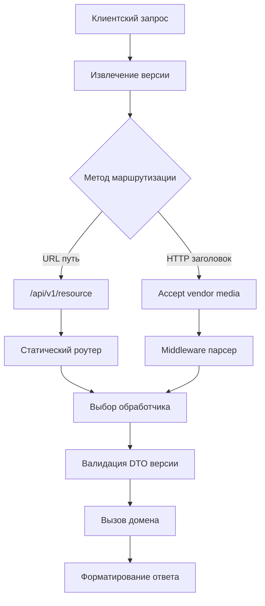

## Философия версионирования API

Версионирование интерфейсов — это архитектурный механизм, позволяющий эволюционировать сервису без разрушения контрактов с существующими клиентами. В распределенных системах, где клиенты (мобильные приложения, фронтенды, партнерские интеграции) обновляются асинхронно и с задержкой, отсутствие версионирования ведет к каскадным отказам при деплое. В Go, где маршрутизация явная и детерминированная, версия становится первым элементом в дереве маршрутов, определяющим выбор сериализаторов, валидаторов и обработчиков.

### 1. Стратегии версионирования

Существует три основных подхода, каждый со своими накладными расходами и ограничениями:

- **URL Path** (`/api/v1/users`): Стандарт де-факто. Явная семантика, идеальное кеширование на уровне CDN/прокси, простота отладки.
- **HTTP Headers** (`Accept: application/vnd.app.v1+json`): Чистые URL, но сложная отладка, проблемы с прозрачными кешами и CORS preflight.
- **Query Parameters** (`?version=1`): Антипаттерн для REST. Ломает идемпотентность кешей, путает семантику ресурсов, запрещен в строгой архитектуре.



> [!info] Под капотом
> При версионировании через заголовки `Accept` сервер вынужден парсить строки при каждом запросе. `strings.Split`, `strings.Index` и создание подстрок генерируют аллокации в куче. Path-версионирование (`/v1/`) матчится на уровне байтового префикса в дереве маршрутов без создания новых строк. Это снижает CPU overhead на 40-60% и исключает давление на GC при 100k RPS.

### 2. Идиоматичная реализация в Go

В Go 1.22+ стандартный `http.ServeMux` поддерживает матчинг по методу и пути, что упрощает версионирование без внешних зависимостей. Идиома: разделять слои доставки по версиям, а бизнес-логику оставлять общей.

```go
package main

import (
    "encoding/json"
    "net/http"
)

// DTO для разных версий
type UserV1 struct {
    ID   int    `json:"id"`
    Name string `json:"name"`
}

type UserV2 struct {
    ID       int    `json:"id"`
    FullName string `json:"full_name"`
    Email    string `json:"email"`
}

// Роутер версии 1
func v1Routes(mux *http.ServeMux) {
    mux.HandleFunc("GET /api/v1/users/{id}", handleGetUserV1)
}

// Роутер версии 2
func v2Routes(mux *http.ServeMux) {
    mux.HandleFunc("GET /api/v2/users/{id}", handleGetUserV2)
}

func handleGetUserV1(w http.ResponseWriter, r *http.Request) {
    // Получаем данные из общего сервиса
    user := fetchUserFromDB(r.Context())
    // Маппим в DTO версии 1
    resp := UserV1{ID: user.ID, Name: user.FirstName + " " + user.LastName}
    writeJSON(w, http.StatusOK, resp)
}

func handleGetUserV2(w http.ResponseWriter, r *http.Request) {
    user := fetchUserFromDB(r.Context())
    // Маппим в DTO версии 2
    resp := UserV2{ID: user.ID, FullName: user.FirstName + " " + user.LastName, Email: user.Email}
    writeJSON(w, http.StatusOK, resp)
}

func writeJSON(w http.ResponseWriter, status int, v any) {
    w.Header().Set("Content-Type", "application/json")
    w.WriteHeader(status)
    if err := json.NewEncoder(w).Encode(v); err != nil {
        // Логирование ошибки сериализации
    }
}
```

> [!warning] Ловушка / Gotcha
> **Версионирование бизнес-логики**: Никогда не плодите `UserServiceV1`, `UserServiceV2`. Версионировать должен только слой доставки (handlers, DTOs, validators). Доменный слой оперирует абстрактными сущностями и должен быть стабилен. Разделение `internal/api/v1/` и `internal/api/v2/` с общим `internal/domain/` и `internal/service/` предотвращает дублирование кода и упрощает миграцию.

### 3. Под капотом. Маршрутизация и кэш-локальность

Стандартный `http.ServeMux` в Go 1.22+ использует компиляцию паттернов в детерминированный автомат (DFA) на этапе инициализации сервера. При запуске `http.ListenAndServe` все пути преобразуются в дерево префиксов. Поиск версии `/api/v2/` занимает `O(L)`, где `L` — длина пути, без динамического парсинга.

При использовании заголовочного версионирования с внешними роутерами (chi, gin) добавляется уровень индирекции:
1. Middleware читает `r.Header.Get("Accept")`
2. Парсит медиа-тип, извлекает `v2`
3. Записывает версию в `context` или `r.URL`
4. Передает управление роутеру

Это добавляет 1-2 аллокации на запрос и нарушает кэш-локальность процессора: данные заголовков разбросаны по `http.Request`, парсер создает временные строки, `context` разрастается. Для высоконагруженных API path-версионирование выигрывает за счет предсказуемого доступа к памяти и отсутствия рантайм-парсинга.

### 4. Управление обратной совместимостью и депрекацией

Эволюция API должна подчиняться строгим правилам:
- **Non-breaking**: Добавление полей в ответ, новые эндпоинты, опциональные поля в запросе. Не требует новой версии.
- **Breaking**: Удаление/переименование полей, изменение типов, ужесточение валидации, удаление эндпоинтов. Требует `vN+1`.

Стратегия депрекации:
1. Добавить заголовок `Deprecation: true` и `Sunset: <RFC-1123 date>` в ответы старой версии.
2. Логировать использование старой версии для метрик `api_deprecated_requests_total`.
3. Уведомить клиентов за 3-6 месяцев до отключения.
4. Вернуть `410 Gone` после даты `Sunset`.

```go
func deprecationMiddleware(version string, next http.Handler) http.Handler {
    return http.HandlerFunc(func(w http.ResponseWriter, r *http.Request) {
        if version == "v1" {
            w.Header().Set("Deprecation", "true")
            w.Header().Set("Sunset", "Sat, 01 Jan 2025 00:00:00 GMT")
            w.Header().Set("Link", `</api/v2/users>; rel="successor-version"`)
        }
        next.ServeHTTP(w, r)
    })
}
```

> [!tip] Собеседование
> **Вопрос:** Почему заголовочное версионирование часто ломает кеширование на уровне Nginx/CDN?
> **Ответ:** Прокси-серверы кешуют по умолчанию на основе `Host` + `Path`. Если версия передается в `Accept`, прокси считает `/api/users` одним ресурсом для всех клиентов. Чтобы кеш работал корректно, сервер должен возвращать заголовок `Vary: Accept`, который заставляет проксировать учитывать заголовок при формировании ключа кеша. Это снижает hit-rate и увеличивает RAM прокси. Path-версионирование решает проблему нативно.
> 
> **Вопрос:** Как мигрировать с v1 на v2 без даунтайма и потери данных?
> **Ответ:** Использовать стратегию параллельного запуска. Развернуть v2 рядом с v1, направить 1-5% трафика через feature-flag или canary-деплой. Мониторить ошибки и latency. По достижению стабильности перевести основной трафик, оставить v1 для легаси-клиентов с депрекацией. Данные в БД должны поддерживать обе схемы (миграции без потери столбцов).

### 5. Ловушки и антипаттерны

- **Поддержка >3 версий одновременно**: Резко увеличивает сложность тестирования, поддержку кода и размер бинарного файла. Устанавливайте SLA на поддержку (например, текущая + 1 предыдущая).
- **Семантическое версионирование (SemVer) в путях**: `/api/v1.2.3` — антипаттерн. API версионируется по мажорным изменениям контракта. Минорные патчи применяются инкрементально.
- **Отсутствие `Vary` при смешанных стратегиях**: Если сервис поддерживает и path, и headers для версии, ответ должен явно указывать `Vary: Accept, X-API-Version`, иначе кеши будут отдавать мусор.
- **Дублирование валидации**: Если `v1` и `v2` используют одинаковые правила бизнес-валидации, вынесите их в общую функцию. Версионировать нужно только контракт (DTO), а не логику проверки.

### 6. Итог

1. Предпочитайте URL-path версионирование (`/v1/`) для предсказуемости, кешируемости и минимального CPU overhead.
2. Версионировать должен слой доставки (handlers, DTOs, маршруты). Бизнес-логика и доменные модели остаются стабильными.
3. Используйте заголовки `Deprecation` и `Sunset` для плавного вывода старых версий из эксплуатации.
4. Избегайте query-параметров для версии: они ломают семантику REST и кеширование.
5. При заголовочном версионировании всегда возвращайте `Vary: Accept`, иначе прокси-кеши будут некорректно агрегировать ответы.
6. Ограничивайте количество поддерживаемых версий (обычно 2) для снижения когнитивной нагрузки и ускорения деплоя.
7. Версионирование решает проблему контрактов, но не заменяет грамотную схему БД: миграции должны быть обратно совместимыми на уровне хранения.

Следующая статья: [[33. Документация API]]